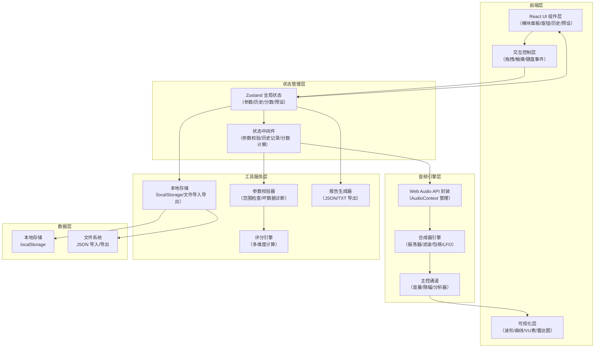

## 1. 架构设计



---

## 2. 技术描述

### 2.1 技术栈选择

| 层级 | 技术选型 | 版本 | 说明 |
|------|----------|------|------|
| 前端框架 | React | 18.x | 函数式组件 + Hooks |
| 构建工具 | Vite | 5.x | 快速开发构建 |
| 状态管理 | Zustand | 4.x | 轻量级状态管理，支持中间件 |
| 样式方案 | Tailwind CSS | 3.x | 原子化CSS + 自定义主题 |
| 音频引擎 | Web Audio API | - | 浏览器原生API，无需额外库 |
| 可视化 | Canvas API / Recharts | 2.10.x | 波形绘制用Canvas，图表用Recharts |
| 语言 | TypeScript | 5.x | 类型安全 |
| 图标 | Lucide React | 0.344.x | 现代图标库 |

### 2.2 关键技术决策

1. **Web Audio API 原生实现**：不使用第三方音频库（如Tone.js），直接封装原生API以获得更好的性能控制和更深入的学习体验
2. **Zustand 状态管理**：轻量且支持中间件，便于实现参数校验、历史记录等横切关注点
3. **Canvas 波形绘制**：高性能实时波形渲染，避免DOM操作的性能瓶颈
4. **Tailwind CSS 自定义主题**：通过CSS变量实现霓虹复古风格，兼顾开发效率和设计独特性

---

## 3. 目录结构

```
src/
├── types/              # 类型定义
│   └── synth.ts        # 合成器相关类型
├── store/              # 状态管理
│   ├── useSynthStore.ts    # 合成器状态
│   └── middleware/         # 状态中间件
│       ├── validation.ts   # 参数校验中间件
│       ├── history.ts      # 历史记录中间件
│       └── scoring.ts      # 分数计算中间件
├── engine/             # 音频引擎
│   ├── AudioEngine.ts      # Web Audio 封装
│   ├── Synthesizer.ts      # 合成器核心
│   └── nodes/              # 音频节点
│       ├── Oscillator.ts   # 振荡器
│       ├── Filter.ts       # 滤波器
│       ├── Envelope.ts     # 包络生成器
│       └── LFO.ts          # LFO
├── components/         # React 组件
│   ├── ui/                 # 基础UI组件
│   │   ├── Knob.tsx            # 旋钮组件
│   │   ├── Slider.tsx          # 滑块组件
│   │   ├── Button.tsx          # 按钮组件
│   │   └── LedDisplay.tsx      # LED数字显示
│   ├── modules/            # 合成器模块
│   │   ├── OscillatorPanel.tsx
│   │   ├── FilterPanel.tsx
│   │   ├── EnvelopePanel.tsx
│   │   └── LFOPanel.tsx
│   ├── visualizers/        # 可视化组件
│   │   ├── Waveform.tsx        # 波形显示
│   │   ├── VUMeter.tsx         # 音量表
│   │   ├── EnvelopeGraph.tsx   # 包络曲线
│   │   └── FilterResponse.tsx  # 滤波响应
│   ├── layout/             # 布局组件
│   │   ├── Header.tsx          # 顶部状态栏
│   │   ├── Sidebar.tsx         # 侧边栏
│   │   └── Workspace.tsx       # 主工作区
│   ├── presets/            # 预设管理
│   │   ├── PresetList.tsx
│   │   ├── PresetImport.tsx
│   │   └── BadDataDialog.tsx
│   ├── history/            # 历史记录
│   │   ├── HistoryTimeline.tsx
│   │   └── HistoryItem.tsx
│   ├── report/             # 结算报告
│   │   ├── ReportPage.tsx
│   │   ├── ScoreRadar.tsx
│   │   └── AnalysisSection.tsx
│   └── keyboard/           # 键盘组件
│       └── PianoKeyboard.tsx
├── hooks/              # 自定义 Hooks
│   ├── useAudioEngine.ts
│   ├── useKnobDrag.ts
│   └── usePresetIO.ts
├── utils/              # 工具函数
│   ├── validator.ts        # 参数校验与坏数据诊断
│   ├── scoring.ts          # 评分计算
│   ├── export.ts           # 报告导出
│   └── audio.ts            # 音频工具函数
├── data/               # 静态数据
│   ├── presets.ts          # 内置预设
│   └── scales.ts           # 音阶数据
├── styles/             # 样式
│   └── index.css           # 全局样式 + Tailwind
├── App.tsx
└── main.tsx
```

---

## 4. 核心数据类型定义

```typescript
// 合成器参数
interface SynthParams {
  oscillator: {
    waveform: 'sine' | 'square' | 'sawtooth' | 'triangle';
    frequency: number;      // 20-20000 Hz
    detune: number;         // -100 to 100 cents
  };
  filter: {
    type: 'lowpass' | 'highpass' | 'bandpass' | 'notch';
    cutoff: number;         // 20-20000 Hz
    resonance: number;      // 0-20
    envelopeAmount: number; // 0-1
  };
  envelope: {
    attack: number;         // 0.001-5s
    decay: number;          // 0.001-5s
    sustain: number;        // 0-1
    release: number;        // 0.001-10s
  };
  lfo: {
    waveform: 'sine' | 'square' | 'sawtooth' | 'triangle';
    rate: number;           // 0.1-20 Hz
    depth: number;          // 0-1
    target: 'volume' | 'pitch' | 'filter';
  };
  master: {
    volume: number;         // 0-1
  };
}

// 历史记录项
interface HistoryItem {
  id: string;
  timestamp: number;
  type: 'parameter' | 'preset_load' | 'preset_save' | 'import' | 'warning';
  module: string;
  param: string;
  oldValue: any;
  newValue: any;
  scoreImpact: {
    dimension: string;
    delta: number;
  } | null;
  warning: Warning | null;
  source: 'user' | 'import' | 'preset';
}

// 警告信息
interface Warning {
  type: 'out_of_range' | 'clipping' | 'extreme_value' | 'self_oscillation';
  message: string;
  severity: 'low' | 'medium' | 'high';
  param: string;
  value: number;
  correctedValue?: number;
}

// 预设
interface Preset {
  id: string;
  name: string;
  createdAt: number;
  params: SynthParams;
  description?: string;
}

// 会话
interface Session {
  id: string;
  createdAt: number;
  updatedAt: number;
  params: SynthParams;
  history: HistoryItem[];
  presets: Preset[];
  currentScore: Score;
}

// 评分
interface Score {
  total: number;
  dimensions: {
    richness: number;      // 音色丰富度
   合理性: number;        // 参数合理性
    fluency: number;       // 操作流畅度
    exploration: number;   // 探索广度
    riskControl: number;   // 风险控制
  };
  stats: ScoreStats;
}

interface ScoreStats {
  totalOperations: number;
  warningsCount: number;
  paramsTouched: Set<string>;
  waveformsUsed: Set<string>;
  filterTypesUsed: Set<string>;
  lfoTargetsUsed: Set<string>;
  extremeValueUses: number;
}

// 坏数据诊断结果
interface ValidationResult {
  valid: boolean;
  errors: ValidationError[];
  correctedParams?: SynthParams;
}

interface ValidationError {
  type: 'json_parse' | 'missing_field' | 'type_mismatch' | 'out_of_range' | 'logic_conflict';
  message: string;
  line?: number;
  column?: number;
  field?: string;
  value?: any;
  expected?: string;
  actual?: string;
  source?: string;  // 原始内容片段
}
```

---

## 5. 状态管理与中间件

### 5.1 Zustand Store 结构

```typescript
// useSynthStore.ts
interface SynthState {
  // 核心状态
  params: SynthParams;
  history: HistoryItem[];
  presets: Preset[];
  currentScore: Score;
  sessionId: string;
  warnings: Warning[];
  isPlaying: boolean;
  
  // Actions
  setParam: (module: string, param: string, value: any, source?: string) => void;
  savePreset: (name: string) => { success: boolean; error?: string };
  loadPreset: (id: string) => void;
  deletePreset: (id: string) => void;
  importConfig: (jsonString: string) => ValidationResult;
  exportConfig: () => string;
  exportSession: () => string;
  importSession: (jsonString: string) => ValidationResult;
  generateReport: () => ReportData;
  clearWarnings: () => void;
}
```

### 5.2 中间件执行顺序

每次参数变更时按以下顺序执行中间件：

1. **参数校验中间件**：检查数值范围、自动修正越界值、生成警告
2. **历史记录中间件**：记录操作、计算变化、标记来源
3. **分数计算中间件**：根据操作更新各维度分数
4. **音频同步中间件**：将参数变更同步到音频引擎

---

## 6. API 定义（纯前端，无后端）

### 6.1 本地存储接口

| 功能 | 存储键 | 格式 |
|------|--------|------|
| 保存会话 | `synth_session_{id}` | JSON 字符串 |
| 保存预设列表 | `synth_presets` | JSON 数组 |
| 保存全局设置 | `synth_settings` | JSON 对象 |

### 6.2 文件导入导出接口

| 功能 | 文件格式 | 内容说明 |
|------|----------|----------|
| 导出配置 | `.json` | 仅包含 `params` 字段 |
| 导出会话 | `.synthlab` | 完整 Session 对象（含历史、分数、预设） |
| 导出报告 | `.txt` / `.json` | 结算报告数据 |
| 导入配置 | `.json` | 同上，需通过完整校验 |
| 导入会话 | `.synthlab` | 同上，需通过完整校验 |

---

## 7. 核心算法

### 7.1 评分算法

```typescript
// 音色丰富度 (0-25)
richness = (uniqueWaveforms / 4 * 8) 
         + (uniqueFilterTypes / 4 * 8) 
         + (uniqueLFOTargets / 3 * 9);

// 参数合理性 (0-25)
合理性 = 25 - (extremeValueCount * 2) - (warningCount * 1.5);

// 操作流畅度 (0-20)
fluency = Math.min(20, (effectiveOperations / totalTime) * 30);
// 扣分项：同一参数短时间反复调整
fluency -= redundantAdjustments * 0.5;

// 探索广度 (0-20)
exploration = (touchedParamsCount / totalParamsCount) * 20;

// 风险控制 (0-10)
riskControl = warningCount === 0 ? 10 : Math.max(0, 10 - warningCount * 2);

// 总分
total = richness + 合理性 + fluency + exploration + riskControl;
```

### 7.2 坏数据逐行诊断算法

```
1. 尝试 JSON.parse，捕获 SyntaxError
   - 从错误信息中提取行号和列号
   - 截取错误位置附近的原始内容
   
2. 遍历所有必填字段，检查存在性
   - 记录缺失字段名和路径
   
3. 检查每个字段的类型
   - 对比期望类型和实际类型
   - 记录不匹配字段
   
4. 检查数值参数范围
   - 对每个数值参数比对 min/max
   - 记录越界值和正确范围
   
5. 逻辑完整性校验
   - 检查组合参数的合理性
   - 例如：Attack > 5s + Release > 8s 可能产生冲突
```
