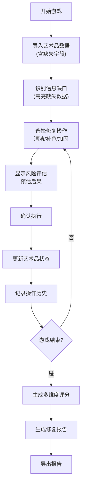

## 1. 产品概述

艺术品修复抉择局是一款专业场景模拟游戏，玩家扮演文物修复师，通过每一步的技术选择（清洁、补色、加固）影响艺术品最终状态和评分。游戏强调识别数据缺口、保留操作历史、承担修复风险的真实工作流程，而非理想化的完美修复。

- **核心目标**：模拟艺术品修复的真实决策过程，让玩家体验信息不完整、风险不可控的专业工作场景
- **目标用户**：文物修复专业学生、博物馆从业者、对文化遗产保护感兴趣的大众
- **市场价值**：填补专业修复领域教学模拟工具的空白，提供低成本低风险的决策训练

## 2. 核心特性

### 2.1 用户角色

| 角色 | 登录方式 | 核心权限 |
|------|----------|----------|
| 修复师玩家 | 直接进入 | 进行修复操作、查看状态、导出报告 |

### 2.2 功能模块

1. **游戏主界面**：艺术品状态展示、操作面板、信息面板
2. **修复操作模块**：清洁、补色、加固三大类操作选择
3. **状态追踪模块**：污渍程度、颜料层状况、结构强度、时间预算实时显示
4. **历史记录模块**：每一步操作及其影响的完整时间线
5. **风险反馈模块**：操作前风险提示、操作后结果反馈
6. **评分系统**：基于多维度的最终修复质量评分
7. **报告导出模块**：生成可下载的修复报告

### 2.3 页面详情

| 页面名称 | 模块名称 | 功能描述 |
|----------|----------|----------|
| 游戏主界面 | 艺术品可视化区 | 显示艺术品当前状态（颜色、破损、污渍可视化） |
| 游戏主界面 | 操作选择区 | 清洁/补色/加固三类操作，每类含多种具体方法 |
| 游戏主界面 | 状态仪表板 | 污渍值、颜料层完整性、结构强度、剩余时间预算 |
| 游戏主界面 | 信息缺口提示 | 高亮显示缺失的数据项，提示玩家注意不确定性 |
| 游戏主界面 | 历史时间线 | 可追溯的操作记录和状态变化列表 |
| 游戏主界面 | 风险预览 | 操作前显示预估风险等级和可能后果 |
| 结局界面 | 评分面板 | 多维度评分和综合评级 |
| 结局界面 | 报告预览 | 完整修复报告预览 |
| 结局界面 | 导出功能 | 导出JSON/文本格式的修复报告 |

## 3. 核心流程

### 3.1 主游戏流程

玩家进入游戏 → 获得初始艺术品（含不完整数据）→ 识别信息缺口 → 选择修复操作（清洁/补色/加固）→ 系统反馈结果并更新状态 → 记录操作历史 → 循环直至完成或失败 → 生成评分和修复报告 → 导出报告

### 3.2 流程图示

## 4. 用户界面设计

### 4.1 设计风格

- **主色调**：深褐色系（#2C1810 主背景）搭配仿古纸张米色（#F5E6D3），营造博物馆专业氛围
- **点缀色**：青铜绿（#4A7C59 安全）、赭石红（#B5651D 警告）、朱砂红（#8B0000 危险）
- **按钮风格**：圆角矩形，轻微浮雕效果，悬停时有微妙阴影变化
- **字体**：标题用「思源宋体」体现专业感，正文用「Inter」保证可读性
- **布局风格**：三栏布局，左侧状态面板、中央艺术品展示、右侧操作与历史
- **视觉元素**：羊皮纸纹理背景、细线分隔、铜色边框、适度的做旧效果

### 4.2 页面设计概览

| 页面名称 | 模块名称 | UI 元素 |
|----------|----------|---------|
| 游戏主界面 | 艺术品展示区 | 大幅画布，状态变化有颜色/纹理过渡动画 |
| 游戏主界面 | 状态仪表板 | 四个半圆仪表盘，指针随数值平滑过渡，颜色编码状态 |
| 游戏主界面 | 操作面板 | 卡片式操作选项，悬停显示风险详情，禁用状态灰显 |
| 游戏主界面 | 信息缺口标识 | 橙色问号图标，点击显示推测信息和置信度 |
| 游戏主界面 | 历史时间线 | 竖向时间轴，每项操作可展开查看详细参数 |
| 结局界面 | 评分面板 | 雷达图展示多维度得分，综合评级动画显示 |
| 结局界面 | 报告区域 | 可滚动文本预览，分章节格式化展示 |

### 4.3 响应式设计

- 桌面端三栏布局为主要设计目标
- 平板端折叠为两栏（状态+操作合并，历史下移）
- 移动端单列流式布局，核心操作优先展示

### 4.4 动效设计

- 艺术品状态变化使用淡入淡出+颜色渐变过渡（800ms）
- 仪表盘指针使用缓动动画（ease-out, 600ms）
- 操作按钮点击有微缩放+波纹反馈
- 历史记录新增项使用滑入动画
- 结局评分使用数字滚动递增效果

## 5. 游戏规则与机制

### 5.1 艺术品状态属性

| 属性 | 范围 | 说明 |
|------|------|------|
| 污渍程度 | 0-100 | 0=无污渍，100=完全覆盖 |
| 颜料层完整性 | 0-100 | 0=完全脱落，100=完好 |
| 结构强度 | 0-100 | 0=完全损坏，100=坚固 |
| 时间预算 | 0-N | 每次操作消耗时间，耗尽则强制结束 |

### 5.2 修复操作类型

| 类别 | 操作 | 风险 | 效果 | 耗时 |
|------|------|------|------|------|
| 清洁 | 干式清洁 | 低 | 轻度去渍，可能磨损颜料层 | 短 |
| 清洁 | 溶剂清洁 | 中 | 中度去渍，可能损伤颜料层 | 中 |
| 清洁 | 激光清洁 | 高 | 深度去渍，控制不当会灼伤 | 中 |
| 补色 | 水性颜料 | 低 | 补色自然，耐久性一般 | 中 |
| 补色 | 油性颜料 | 中 | 耐久性好，可能与原层反应 | 长 |
| 补色 | 矿物颜料 | 中 | 色准好，材料稀缺成本高 | 长 |
| 加固 | 表面喷涂 | 低 | 轻度加固，可能改变光泽 | 短 |
| 加固 | 衬纸修复 | 中 | 中度加固，需匹配纸张纤维 | 长 |
| 加固 | 重装裱 | 高 | 完全加固，不可逆操作 | 很长 |

### 5.3 信息缺口机制

- 每件艺术品随机存在1-3个未知数据项（如"颜料成分未知"、"创作年代不确定"）
- 缺口用橙色标识，玩家可选择忽略或使用时间预算进行检测
- 忽略缺口可能导致操作风险升高（材料不兼容、过度清洁等）
- 检测可消除缺口，但消耗时间预算

### 5.4 评分维度

| 维度 | 权重 | 说明 |
|------|------|------|
| 外观修复 | 30% | 污渍去除程度、补色准确性 |
| 结构保存 | 30% | 颜料层完整性、结构强度 |
| 材料兼容 | 20% | 修复材料与原作的兼容性 |
| 时间效率 | 10% | 时间预算使用效率 |
| 风险控制 | 10% | 操作风险规避情况 |
