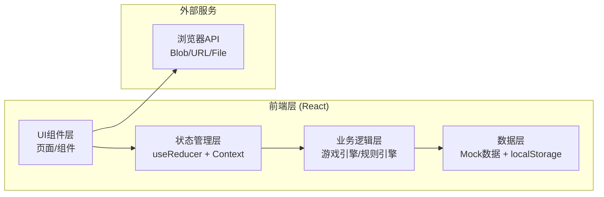
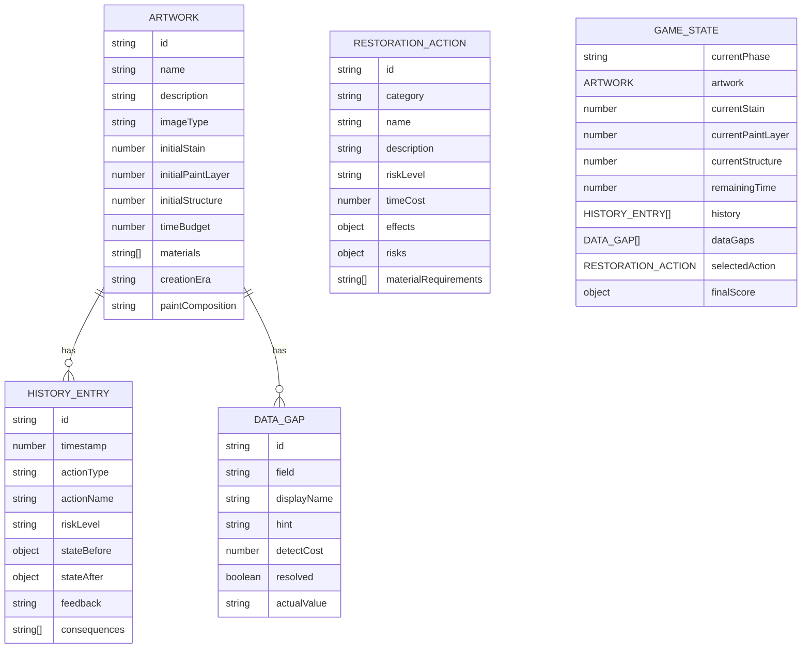

## 1. 架构设计

本项目为纯前端React应用，采用单页面架构，所有游戏逻辑、状态管理、数据存储均在客户端完成，无需后端服务。



## 2. 技术栈描述

- **前端框架**: React 18 + TypeScript
- **构建工具**: Vite 5
- **样式方案**: Tailwind CSS 3
- **状态管理**: React useReducer + Context API
- **图标**: Lucide React
- **图表**: Recharts (雷达图)
- **动画**: Framer Motion
- **数据持久化**: localStorage
- **包管理**: npm

## 3. 路由定义

| 路由 | 页面 | 说明 |
|------|------|------|
| / | 首页/开始页面 | 游戏介绍、选择艺术品、开始游戏 |
| /game | 游戏主界面 | 核心游戏玩法界面 |
| /result | 结局页面 | 评分展示、报告预览、导出功能 |

## 4. 数据模型

### 4.1 核心数据结构



### 4.2 TypeScript 类型定义

```typescript
// 艺术品接口
interface Artwork {
  id: string;
  name: string;
  description: string;
  imageType: 'canvas' | 'paper' | 'scroll';
  initialStain: number;
  initialPaintLayer: number;
  initialStructure: number;
  timeBudget: number;
  materials: string[];
  creationEra: string;
  paintComposition: string;
}

// 数据缺口接口
interface DataGap {
  id: string;
  field: keyof Artwork;
  displayName: string;
  hint: string;
  detectCost: number;
  resolved: boolean;
  actualValue: string;
}

// 修复操作接口
interface RestorationAction {
  id: string;
  category: 'cleaning' | 'retouching' | 'reinforcing';
  name: string;
  description: string;
  riskLevel: 'low' | 'medium' | 'high';
  timeCost: number;
  effects: {
    stainDelta?: number;
    paintLayerDelta?: number;
    structureDelta?: number;
  };
  risks: {
    materialIncompatibility?: string[];
    overCleaningChance?: number;
    paintDamageChance?: number;
  };
  materialRequirements: string[];
}

// 历史记录接口
interface HistoryEntry {
  id: string;
  timestamp: number;
  actionType: string;
  actionName: string;
  riskLevel: string;
  stateBefore: {
    stain: number;
    paintLayer: number;
    structure: number;
    remainingTime: number;
  };
  stateAfter: {
    stain: number;
    paintLayer: number;
    structure: number;
    remainingTime: number;
  };
  feedback: string;
  consequences: string[];
}

// 评分结果接口
interface FinalScore {
  appearance: number;
  structure: number;
  materialCompatibility: number;
  timeEfficiency: number;
  riskControl: number;
  total: number;
  grade: 'S' | 'A' | 'B' | 'C' | 'D' | 'F';
}

// 游戏状态接口
interface GameState {
  currentPhase: 'intro' | 'playing' | 'result';
  selectedArtwork: Artwork | null;
  currentStain: number;
  currentPaintLayer: number;
  currentStructure: number;
  remainingTime: number;
  history: HistoryEntry[];
  dataGaps: DataGap[];
  selectedAction: RestorationAction | null;
  finalScore: FinalScore | null;
  usedMaterials: string[];
  riskEvents: string[];
}
```

## 5. 核心模块设计

### 5.1 游戏状态管理模块

- **位置**: `src/store/gameReducer.ts`
- **职责**: 管理全局游戏状态，处理所有状态变更动作
- **核心动作类型**:
  - `START_GAME` - 开始游戏，初始化状态
  - `SELECT_ACTION` - 选择修复操作
  - `EXECUTE_ACTION` - 执行修复操作
  - `DETECT_GAP` - 检测数据缺口
  - `FINISH_GAME` - 结束游戏，计算评分
  - `RESET_GAME` - 重置游戏

### 5.2 游戏引擎模块

- **位置**: `src/engine/gameEngine.ts`
- **职责**: 封装核心游戏规则和计算逻辑
- **核心函数**:
  - `calculateActionResult()` - 计算操作结果，包含风险判定
  - `checkMaterialCompatibility()` - 检查材料兼容性
  - `calculateFinalScore()` - 计算最终评分
  - `generateReport()` - 生成修复报告

### 5.3 数据模块

- **位置**: `src/data/`
- **文件**:
  - `artworks.ts` - 艺术品演示数据
  - `actions.ts` - 修复操作定义
  - `presets.ts` - 预设游戏流程（顺利/困难）

### 5.4 组件层级

```
src/
├── components/
│   ├── layout/
│   │   └── GameLayout.tsx
│   ├── game/
│   │   ├── ArtworkDisplay.tsx
│   │   ├── StatusDashboard.tsx
│   │   ├── ActionPanel.tsx
│   │   ├── HistoryTimeline.tsx
│   │   ├── DataGapIndicator.tsx
│   │   └── RiskPreview.tsx
│   ├── result/
│   │   ├── ScoreRadarChart.tsx
│   │   ├── ReportPreview.tsx
│   │   └── ExportButtons.tsx
│   └── common/
│       ├── GaugeMeter.tsx
│       └── RiskBadge.tsx
├── pages/
│   ├── IntroPage.tsx
│   ├── GamePage.tsx
│   └── ResultPage.tsx
```

## 6. 核心算法设计

### 6.1 操作结果计算算法

```typescript
function calculateActionResult(
  action: RestorationAction,
  currentState: GameState,
  dataGaps: DataGap[]
): {
  newState: Partial<GameState>;
  feedback: string;
  consequences: string[];
  riskOccurred: boolean;
} {
  // 1. 基础效果计算
  let stainDelta = action.effects.stainDelta || 0;
  let paintDelta = action.effects.paintLayerDelta || 0;
  let structureDelta = action.effects.structureDelta || 0;
  
  // 2. 数据缺口影响（未解决的缺口增加风险）
  const unresolvedGaps = dataGaps.filter(g => !g.resolved);
  const riskMultiplier = 1 + unresolvedGaps.length * 0.2;
  
  // 3. 材料兼容性检查
  const compatibility = checkMaterialCompatibility(
    action.materialRequirements,
    currentState.selectedArtwork?.materials || []
  );
  if (!compatibility.compatible) {
    paintDelta -= 15;
    structureDelta -= 10;
  }
  
  // 4. 风险事件判定（概率触发）
  const consequences: string[] = [];
  if (action.risks.overCleaningChance) {
    if (Math.random() < action.risks.overCleaningChance * riskMultiplier) {
      paintDelta -= 20;
      consequences.push('过度清洁导致颜料层损伤');
    }
  }
  if (action.risks.paintDamageChance) {
    if (Math.random() < action.risks.paintDamageChance * riskMultiplier) {
      paintDelta -= 15;
      consequences.push('颜料层出现剥落');
    }
  }
  
  // 5. 边界限制（0-100）
  const newStain = Math.max(0, Math.min(100, currentState.currentStain + stainDelta));
  const newPaint = Math.max(0, Math.min(100, currentState.currentPaintLayer + paintDelta));
  const newStructure = Math.max(0, Math.min(100, currentState.currentStructure + structureDelta));
  const newTime = currentState.remainingTime - action.timeCost;
  
  return {
    newState: {
      currentStain: newStain,
      currentPaintLayer: newPaint,
      currentStructure: newStructure,
      remainingTime: newTime,
    },
    feedback: generateFeedback(consequences, compatibility),
    consequences,
    riskOccurred: consequences.length > 0,
  };
}
```

### 6.2 评分算法

```typescript
function calculateFinalScore(state: GameState): FinalScore {
  // 外观修复分 (30%) - 污渍去除程度
  const stainImprovement = state.selectedArtwork!.initialStain - state.currentStain;
  const appearance = Math.min(100, (stainImprovement / state.selectedArtwork!.initialStain) * 100) * 0.3;
  
  // 结构保存分 (30%) - 颜料层和结构强度的综合
  const structure = ((state.currentPaintLayer + state.currentStructure) / 2) * 0.3;
  
  // 材料兼容分 (20%) - 基于使用材料与原作的匹配度
  const materialCompatibility = calculateMaterialScore(state.usedMaterials, state.selectedArtwork!) * 0.2;
  
  // 时间效率分 (10%) - 时间预算使用效率
  const timeEfficiency = state.remainingTime > 0 ? 100 : 0;
  
  // 风险控制分 (10%) - 风险事件发生次数
  const riskControl = Math.max(0, 100 - state.riskEvents.length * 25);
  
  const total = appearance + structure + materialCompatibility + timeEfficiency + riskControl;
  
  return {
    appearance,
    structure,
    materialCompatibility,
    timeEfficiency,
    riskControl,
    total,
    grade: getGrade(total),
  };
}
```

## 7. 报告导出机制

### 7.1 导出格式

- **JSON格式**: 完整游戏状态序列化，包含所有历史记录
- **文本格式**: 格式化的修复报告，适合打印和存档

### 7.2 实现方式

使用浏览器 `Blob` API 生成文件，通过 `URL.createObjectURL()` 创建下载链接。

```typescript
function exportReport(report: RestorationReport, format: 'json' | 'text'): void {
  let content: string;
  let mimeType: string;
  let filename: string;
  
  if (format === 'json') {
    content = JSON.stringify(report, null, 2);
    mimeType = 'application/json';
    filename = `修复报告_${report.artworkName}_${Date.now()}.json`;
  } else {
    content = formatReportAsText(report);
    mimeType = 'text/plain';
    filename = `修复报告_${report.artworkName}_${Date.now()}.txt`;
  }
  
  const blob = new Blob([content], { type: mimeType });
  const url = URL.createObjectURL(blob);
  const a = document.createElement('a');
  a.href = url;
  a.download = filename;
  a.click();
  URL.revokeObjectURL(url);
}
```

## 8. 演示数据设计

### 8.1 顺利流程演示数据

- **艺术品**: 清代山水画（纸张）
- **初始状态**: 污渍45，颜料层85，结构75，时间预算100
- **数据缺口**: 1个（颜料成分未知）
- **推荐操作**: 干式清洁 → 检测缺口 → 水性颜料补色 → 表面喷涂加固
- **预期结果**: 评分A级，无重大风险事件

### 8.2 困难流程演示数据（真实卡住场景）

- **艺术品**: 文艺复兴油画（画布）
- **初始状态**: 污渍70，颜料层60，结构50，时间预算80
- **数据缺口**: 3个（颜料成分未知、创作年代不确定、底材材质不明）
- **难点**: 
  - 时间紧张，检测缺口会消耗大量时间
  - 任何高风险操作都可能导致颜料层崩溃
  - 材料兼容性难以判断
- **常见陷阱**: 急于使用激光清洁导致颜料灼伤、使用不兼容加固剂导致颜料脱落
