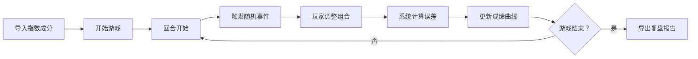

## 1. 产品概述
"指数基金复制挑战"是一款投教游戏，让用户在模拟环境中学习指数基金管理。通过处理现金管理、停牌股票替代、跟踪误差控制等真实场景，帮助投教新人深入理解指数基金运作机制。
- 核心目标：通过游戏化方式教授指数复制技术，解决"现金过多、停牌替代错误、误差积累"等实操问题
- 目标用户：投教新人、基金从业者入门学习者

## 2. 核心功能

### 2.1 用户角色
| 角色 | 注册方式 | 核心权限 |
|------|----------|----------|
| 玩家 | 无需注册，直接进入游戏 | 导入指数成分、进行组合调整、查看跟踪误差、导出复盘报告 |

### 2.2 功能模块
1. **游戏主界面**: 指数成分展示、当前持仓、现金管理、实时跟踪误差仪表盘
2. **回合事件系统**: 申赎事件、停牌事件、市场波动事件
3. **成绩面板**: 成绩曲线、误差趋势图
4. **复盘报告**: 操作日志导出
### 2.3 页面详情
| 页面名称 | 模块名称 | 功能描述 |
|----------|----------|----------|
| 游戏主界面 | 指数成分导入 | 支持CSV导入指数成分股数据（代码、名称、权重、价格、是否停牌） |
| 游戏主界面 | 组合调整面板 | 买入/卖出股票、调整现金比例 |
| 游戏主界面 | 实时监控仪表盘 | 现金比例监控、停牌替代监控、跟踪误差实时计算
| 事件回合 | 事件触发 | 随机触发申赎事件、停牌事件，要求玩家在限定时间内调整组合
| 成绩面板 | 成绩曲线 | 跟踪误差随回合变化曲线图、累计收益率对比
| 复盘报告 | 报告生成 | 导出操作日志、误差分析、问题总结的HTML/CSV报告
## 3. 核心流程
玩家导入指数成分数据 → 开始游戏 → 每回合处理事件（申赎/停牌）→ 调整投资组合 → 系统计算跟踪误差 → 查看成绩曲线 → 游戏结束导出复盘报告

## 4. 用户界面设计
### 4.1 设计风格
- **主色调**: 深蓝色 (#0F172A) 专业金融感
- **辅助色**: 绿色 (#10B981) 表示正常、红色 (#EF4444) 表示警告/错误
- **按钮风格**: 直角硬朗，轻微阴影，悬停放大效果
- **字体**: JetBrains Mono 等宽字体展示数据，Inter 展示文字
- **布局风格**: 仪表盘式布局，数据卡片式模块
- **图标**: FontAwesome 金融数据图标，强调数据可视化
### 4.2 页面设计概览
| 页面名称 | 模块名称 | UI 元素 |
|----------|----------|----------|
| 游戏主界面 | 顶部导航 | 游戏标题、回合数、剩余时间、暂停/重置按钮 |
| 游戏主界面 | 左侧持仓面板 | 指数成分列表、导入按钮、搜索筛选 |
| 游戏主界面 | 中间操作区 | 买卖操作、数量输入、确认按钮 |
| 游戏主界面 | 右侧仪表盘 | 现金比例仪表盘、跟踪误差仪表盘、停牌替代提示 |
| 成绩面板 | 图表区 | 误差趋势图、收益对比图 |
| 复盘报告 | 报告区 | 操作日志表格、问题总结、导出按钮 |
### 4.3 响应性
- 桌面端优先设计，支持平板自适应
- 移动端简化布局，保证数据表格滚动
### 4.4 动效设计
- 误差超限时仪表盘红色脉冲动画
- 事件触发时弹窗滑入动画
- 数据更新时数字滚动动画
- 图表曲线绘制动画
