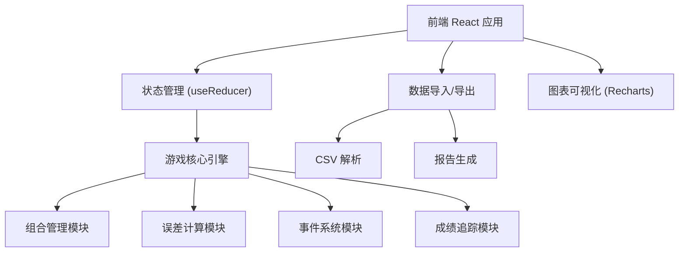

## 1. 架构设计


## 2. 技术描述
- **前端框架**: React@18 + TypeScript + Vite
- **样式方案**: TailwindCSS@3
- **图表库**: Recharts
- **状态管理**: React useReducer + Context (本地状态)
- **数据持久化**: LocalStorage 存储游戏进度
- **文件处理**: PapaParse (CSV解析)
- **日期处理**: Day.js

## 3. 路由定义
| 路由 | 页面 | 功能 |
|------|------|------|
| / | 游戏首页 | 游戏介绍、开始游戏、导入数据入口 |
| /game | 游戏主界面 | 核心游戏操作、仪表盘、事件处理 |
| /report | 复盘报告 | 成绩曲线、操作日志、报告导出 |

## 4. 核心数据模型
### 4.1 TypeScript 类型定义

```typescript
// 指数成分股
interface IndexComponent {
  code: string;
  name: string;
  weight: number;
  price: number;
  isSuspended: boolean;
  suspendedReason?: string;
}

// 持仓
interface Holding {
  code: string;
  name: string;
  quantity: number;
  avgCost: number;
  currentPrice: number;
  isSuspended: boolean;
}

// 游戏状态
interface GameState {
  round: number;
  maxRounds: number;
  cash: number;
  totalAssets: number;
  holdings: Holding[];
  indexComponents: IndexComponent[];
  trackingError: number;
  trackingErrorHistory: number[];
  netValueHistory: number[];
  indexValueHistory: number[];
  currentEvent: GameEvent | null;
  operationLogs: OperationLog[];
  warnings: Warning[];
  gameStatus: 'idle' | 'playing' | 'paused' | 'ended';
}

// 游戏事件
interface GameEvent {
  id: string;
  type: 'subscription' | 'redemption' | 'suspension' | 'marketMove';
  title: string;
  description: string;
  amount?: number;
  affectedStock?: string;
  priceChange?: number;
  timeLimit: number;
}

// 操作日志
interface OperationLog {
  round: number;
  timestamp: number;
  type: 'buy' | 'sell' | 'eventHandle';
  stockCode?: string;
  stockName?: string;
  quantity?: number;
  price?: number;
  description: string;
  trackingErrorImpact: number;
}

// 警告
interface Warning {
  id: string;
  type: 'cash_excess' | 'suspension_mismatch' | 'error_accumulation';
  severity: 'warning' | 'critical';
  message: string;
  suggestion: string;
  timestamp: number;
}
```

### 4.2 核心算法

**跟踪误差计算**:
```typescript
// 计算组合收益率与指数收益率的偏差标准差
function calculateTrackingError(
  portfolioReturns: number[],
  indexReturns: number[]
): number {
  const diffs = portfolioReturns.map((r, i) => r - indexReturns[i]);
  const mean = diffs.reduce((a, b) => a + b, 0) / diffs.length;
  const variance = diffs.reduce((a, b) => a + Math.pow(b - mean, 2), 0) / diffs.length;
  return Math.sqrt(variance) * Math.sqrt(252); // 年化
}
```

**现金比例监控**:
```typescript
function checkCashWarning(cash: number, totalAssets: number): Warning | null {
  const cashRatio = cash / totalAssets;
  if (cashRatio > 0.1) {
    return {
      id: Date.now().toString(),
      type: 'cash_excess',
      severity: cashRatio > 0.2 ? 'critical' : 'warning',
      message: `现金比例过高: ${(cashRatio * 100).toFixed(1)}%`,
      suggestion: '建议将现金投入成分股以减小跟踪误差',
      timestamp: Date.now()
    };
  }
  return null;
}
```

## 5. 目录结构
```
src/
├── components/
│   ├── game/
│   │   ├── Dashboard.tsx        # 仪表盘组件
│   │   ├── HoldingTable.tsx     # 持仓表格
│   │   ├── TradePanel.tsx       # 交易面板
│   │   ├── EventModal.tsx       # 事件弹窗
│   │   └── WarningList.tsx      # 警告列表
│   ├── report/
│   │   ├── PerformanceChart.tsx # 成绩曲线
│   │   ├── OperationLog.tsx     # 操作日志
│   │   └── ReportExport.tsx     # 报告导出
│   └── common/
│       ├── GaugeChart.tsx       # 仪表盘图表
│       └── FileUpload.tsx       # 文件上传
├── hooks/
│   ├── useGameState.ts          # 游戏状态管理
│   ├── useTrackingError.ts      # 误差计算
│   └── useEventSystem.ts        # 事件系统
├── utils/
│   ├── csvParser.ts             # CSV解析
│   ├── reportGenerator.ts       # 报告生成
│   └── calculations.ts          # 计算工具
├── types/
│   └── index.ts                 # 类型定义
├── data/
│   └── sampleIndex.ts           # 示例指数数据
├── App.tsx
└── main.tsx
```

## 6. 游戏核心流程实现
1. **初始化**: 导入指数成分 → 设置初始现金 → 生成初始持仓
2. **回合循环**: 
   - 触发随机事件（申赎/停牌）
   - 玩家调整组合
   - 更新股票价格
   - 计算跟踪误差
   - 检查警告（现金过多、停牌替代错误等）
   - 记录操作日志
3. **结束**: 计算最终成绩 → 生成复盘报告 → 导出

## 7. 导入导出格式
### CSV 导入格式（指数成分）
```csv
code,name,weight,price,isSuspended
600519,贵州茅台,15.5,1800.00,false
601318,中国平安,8.2,45.50,false
000858,五粮液,6.8,168.00,true
```

### 导出报告包含
- 基本信息：游戏时长、回合数、最终跟踪误差
- 成绩曲线：跟踪误差变化图、净值对比图
- 操作日志：每回合操作明细
- 问题总结：现金过多次数、停牌处理情况、误差来源分析
- 学习建议：针对操作问题的改进建议
