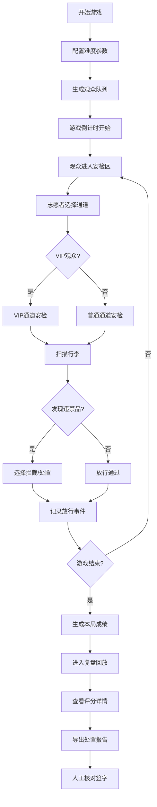

## 1. 产品概述
"演唱会安检排队局"是一款面向演出公司志愿者培训的游戏模拟工具，通过沉浸式安检场景模拟，帮助志愿者掌握安检流程、风险识别和应急处置能力。
- 解决问题：VIP拥堵、违禁品漏拦、开演前积压等安检痛点，工具自动记录关键事件
- 核心价值：规则反馈优先，数据三源一致（导出表/页面统计/单条详情），支持复盘学习

## 2. 核心 Features

### 2.1 用户角色
| 角色 | 登录方式 | 核心权限 |
|------|----------|----------|
| 培训志愿者 | 直接进入 | 进行安检模拟、查看个人成绩、导出处置报告 |
| 培训讲师 | 密码登录 | 配置游戏参数、查看多人成绩对比、批量导出报告 |

### 2.2 Feature Module
1. **游戏主界面**：观众队列实时显示、安检口操作区、VIP通道状态、倒计时计时器
2. **安检操作台**：观众信息面板、行李扫描、违禁品判定、人工复核区
3. **队列调度系统**：普通通道/VIP通道分配、拥堵预警、通道临时增减
4. **复盘回放模块**：时间轴回放、关键事件标记、评分详情、错误分析
5. **报告导出系统**：单局成绩单、事件明细、统计汇总、人工核对待办项

### 2.3 页面详情
| 页面名称 | 模块名称 | Feature 描述 |
|-----------|-------------|---------------------|
| 游戏主界面 | 观众队列区 | 动态显示排队观众，携带物品图标、优先级标记、表情反馈 |
| 游戏主界面 | 安检操作区 | 扫描按钮、放行/拦截选择、VIP通道切换、人工核对输入框 |
| 游戏主界面 | 状态监控面板 | 开演倒计时、各通道排队长度、VIP拥堵度、违禁品拦截率实时数据 |
| 游戏主界面 | 事件日志区 | 实时记录每个处置动作，支持点击查看详情，异常高亮 |
| 复盘页面 | 时间轴回放 | 可拖动进度条回放整局，关键事件节点标记，可暂停/倍速 |
| 复盘页面 | 评分详情 | 按维度评分（速度/准确率/应急处置），扣分点逐项列出 |
| 复盘页面 | 统计面板 | 与导出报告数据一致的图表：通过率、违禁品漏检、VIP等待时间 |
| 报告页面 | 导出预览 | 表格形式展示所有事件，留人工核对列，支持Excel导出 |

## 3. 核心流程

## 4. 交互规则设计

### 4.1 核心机制
- **时间压力**：开演倒计时（10分钟），临近结束观众激增，超时积压扣分
- **风险判定**：违禁品分等级（高危/普通/误报），不同处置对应不同分值
- **VIP拥堵**：VIP通道排队超过3人触发预警，超过5人自动扣分
- **队列调度**：可临时开放/关闭通道，每次调度有时间成本
- **人工核对**：每场至少5个强制人工核对点，需手动输入确认

### 4.2 评分维度
| 维度 | 权重 | 评分规则 |
|------|------|----------|
| 安检准确率 | 40% | 违禁品漏检-5分/件，误拦-2分/件 |
| 通行效率 | 25% | 平均等待时间＜30秒满分，每超10秒-2分 |
| VIP服务 | 20% | VIP等待＜15秒满分，拥堵预警每次-3分 |
| 应急处置 | 15% | 正确处理特殊事件加分，处置不当扣分 |

### 4.3 事件类型
| 事件类型 | 触发条件 | 系统行为 |
|----------|----------|----------|
| 违禁品漏拦 | 高危物品放行 | 记录事件，-5分，标记复盘高亮 |
| VIP拥堵 | VIP队列＞5人 | 红色预警，-3分，建议调度 |
| 开演积压 | 最后1分钟队列＞10人 | 持续扣分，每10秒-1分 |
| 人工核对 | 系统随机触发 | 暂停计时，等待输入确认 |
| 特殊观众 | 老人/小孩/残疾人 | 需特殊处理，正确+3分 |

## 5. 用户界面设计

### 5.1 设计风格
- **主色调**：深海军蓝 (#0A2463) 代表专业严谨，警示红 (#E63946) 突出风险
- **辅助色**：安全绿 (#2A9D8F) 放行通过，警戒橙 (#F4A261) VIP状态
- **字体**：标题使用 "Noto Sans SC" 粗体，数据表格使用等宽字体 "JetBrains Mono"
- **布局**：信息密度高的仪表盘风格，三栏布局（队列区-操作区-监控区）
- **图标风格**：线性简约图标，关键状态使用emoji增强辨识度（⚠️🚨✅❌）

### 5.2 页面设计概述
| 页面名称 | 模块名称 | UI Elements |
|-----------|-------------|-------------|
| 游戏主界面 | 队列显示区 | 卡片式观众列表，携带物品悬浮显示，VIP金色边框，滚动动画 |
| 游戏主界面 | 安检操作台 | 大按钮设计，扫描动画效果，违禁品红框高亮，人工输入框突出 |
| 游戏主界面 | 状态面板 | 大号数字倒计时，进度条显示拥堵度，环形图显示拦截率 |
| 复盘页面 | 时间轴 | 横向时间线，事件节点可点击，颜色区分事件类型 |
| 复盘页面 | 评分卡片 | 雷达图展示多维度得分，扣分列表可展开查看详情 |
| 报告页面 | 数据表格 | 斑马纹表格，可排序筛选，人工核对列为空白待填写 |

### 5.3 响应式
- 桌面端优先，1280px以上最佳体验
- 平板端调整为上下布局，保留核心操作区
- 手机端简化显示，仅支持查看报告，不支持游戏操作

### 5.4 动效设计
- 观众入场：从左侧滑入，有轻微弹跳效果
- 安检扫描：行李图标放大+扫描线动画，持续1秒
- 风险预警：红色边框闪烁+震动效果，持续提醒
- 游戏结束：结果面板淡入，评分数字滚动动画
- 时间轴回放：进度条拖动时预览关键帧

## 6. 数据一致性设计

### 6.1 单一数据源原则
所有展示数据均来自 `gameSession.events` 数组，确保：
- 页面统计数字 = 导出报告汇总数
- 单条事件详情 = 事件日志条目 = 报告表格行
- 复盘回放节点 = 事件时间戳一一对应

### 6.2 人工核对机制
- 报告中预留 `人工核对` 列，初始为空
- 系统标记 `建议核对` 的事件行高亮显示
- 讲师可在线填写核对意见，同步保存到本地存储

## 7. 非功能性需求
- **离线可用**：纯前端实现，无网络依赖
- **数据持久化**：LocalStorage保存最近10局游戏记录
- **性能**：60fps流畅动画，无明显卡顿
- **可访问性**：关键操作支持键盘快捷键
