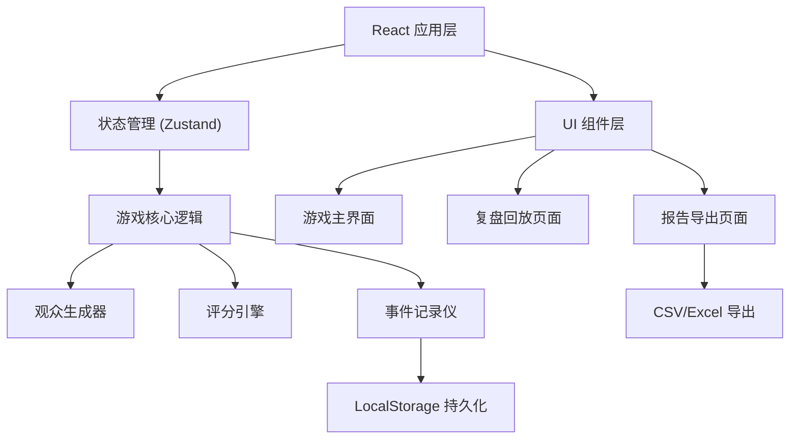

## 1. 架构设计



## 2. 技术选型说明
- **前端框架**: React@18 + TypeScript
- **构建工具**: Vite@5
- **样式方案**: TailwindCSS@3
- **状态管理**: Zustand（轻量级，适合游戏状态）
- **图表库**: Recharts（统计图表）
- **图标**: Lucide React
- **后端**: 无（纯前端应用，数据本地存储）
- **数据库**: LocalStorage（保存游戏记录）

## 3. 目录结构

```
src/
├── components/          # 组件层
│   ├── game/           # 游戏相关组件
│   │   ├── QueuePanel.tsx      # 观众队列面板
│   │   ├── SecurityStation.tsx # 安检操作台
│   │   ├── StatusMonitor.tsx   # 状态监控面板
│   │   └── EventLog.tsx        # 事件日志
│   ├── replay/         # 复盘相关组件
│   │   ├── Timeline.tsx        # 时间轴回放
│   │   ├── ScoreCard.tsx       # 评分卡片
│   │   └── StatsPanel.tsx      # 统计面板
│   └── report/         # 报告相关组件
│       ├── ReportTable.tsx     # 报告表格
│       └── ExportButton.tsx    # 导出按钮
├── store/              # 状态管理
│   └── useGameStore.ts         # 游戏全局状态
├── game/               # 游戏核心逻辑
│   ├── types.ts               # 类型定义
│   ├── audienceGenerator.ts   # 观众生成器
│   ├── scoringEngine.ts       # 评分引擎
│   └── eventRecorder.ts       # 事件记录器
├── utils/              # 工具函数
│   ├── export.ts              # 导出功能
│   └── storage.ts             # 本地存储
├── pages/              # 页面
│   ├── GamePage.tsx           # 游戏主页面
│   ├── ReplayPage.tsx         # 复盘页面
│   └── ReportPage.tsx         # 报告页面
└── App.tsx             # 应用入口
```

## 4. 路由定义
| Route | 页面 | 功能 |
|-------|------|------|
| `/` | 首页 | 游戏开始、难度选择、历史记录入口 |
| `/game` | 游戏页面 | 安检模拟主界面 |
| `/replay/:sessionId` | 复盘页面 | 时间轴回放、评分详情 |
| `/report/:sessionId` | 报告页面 | 事件明细、导出功能 |

## 5. 数据模型

### 5.1 核心类型定义

```typescript
// 观众类型
interface Audience {
  id: string;
  name: string;
  avatar: string;
  isVIP: boolean;
  isSpecial: boolean; // 老人/小孩/残疾人
  items: Item[];
  enterTime: number;
  queueStartTime: number;
  channel: 'normal' | 'vip';
}

// 物品类型
interface Item {
  id: string;
  name: string;
  icon: string;
  riskLevel: 'safe' | 'low' | 'medium' | 'high';
  isContraband: boolean;
  description: string;
}

// 事件类型
interface GameEvent {
  id: string;
  timestamp: number;
  type: 'scan' | 'pass' | 'block' | 'warning' | 'check' | 'dispatch';
  audienceId?: string;
  audienceName?: string;
  itemId?: string;
  itemName?: string;
  channel: 'normal' | 'vip';
  scoreChange: number;
  description: string;
  needReview: boolean; // 需要人工核对
  reviewed: boolean;
  reviewNote: string;
}

// 游戏会话
interface GameSession {
  id: string;
  startTime: number;
  endTime: number;
  duration: number; // 游戏时长（秒）
  difficulty: 'easy' | 'normal' | 'hard';
  totalAudience: number;
  events: GameEvent[];
  scores: ScoreBreakdown;
  finalScore: number;
}

// 评分明细
interface ScoreBreakdown {
  accuracy: number;    // 安检准确率
  efficiency: number;  // 通行效率
  vipService: number;  // VIP服务
  emergency: number;   // 应急处置
}
```

### 5.2 违禁品配置

```typescript
const contrabandItems = [
  { name: '打火机', risk: 'high', icon: '🔥' },
  { name: '瓶装水', risk: 'medium', icon: '💧' },
  { name: '管制刀具', risk: 'high', icon: '🔪' },
  { name: '酒精饮料', risk: 'medium', icon: '🍺' },
  { name: '烟花爆竹', risk: 'high', icon: '🎆' },
  { name: '自拍杆', risk: 'low', icon: '📸' },
  { name: '专业相机', risk: 'low', icon: '📷' },
];

const safeItems = [
  { name: '手机', icon: '📱' },
  { name: '钱包', icon: '👛' },
  { name: '门票', icon: '🎫' },
  { name: '雨伞', icon: '☂️' },
  { name: '外套', icon: '🧥' },
];
```

## 6. 游戏状态管理

### 6.1 Zustand Store 结构

```typescript
interface GameState {
  // 游戏状态
  phase: 'idle' | 'playing' | 'paused' | 'ended';
  currentTime: number; // 游戏内时间（秒）
  remainingTime: number; // 剩余时间
  
  // 队列状态
  waitingQueue: Audience[];
  normalChannelQueue: Audience[];
  vipChannelQueue: Audience[];
  currentAudience: Audience | null;
  
  // 当前安检状态
  isScanning: boolean;
  scanProgress: number;
  
  // 事件系统
  events: GameEvent[];
  pendingReviewCount: number;
  
  // 统计数据
  stats: {
    totalScanned: number;
    totalPassed: number;
    totalBlocked: number;
    contrabandFound: number;
    contrabandMissed: number;
    avgWaitTime: number;
    vipAvgWaitTime: number;
    warnings: number;
  };
  
  // Actions
  startGame: (difficulty: string) => void;
  pauseGame: () => void;
  resumeGame: () => void;
  endGame: () => void;
  
  selectChannel: (audienceId: string, channel: 'normal' | 'vip') => void;
  startScan: () => void;
  passAudience: () => void;
  blockAudience: (reason: string) => void;
  addReviewNote: (eventId: string, note: string) => void;
}
```

## 7. 评分引擎逻辑

```typescript
class ScoringEngine {
  // 基础分值
  private readonly BASE_SCORE = 100;
  
  // 准确率评分
  calculateAccuracy(events: GameEvent[]): number {
    const missed = events.filter(e => e.type === 'pass' && e.needReview).length;
    const falsePositive = events.filter(e => e.type === 'block' && !e.needReview).length;
    return Math.max(0, 100 - missed * 10 - falsePositive * 5);
  }
  
  // 效率评分
  calculateEfficiency(avgWaitTime: number): number {
    if (avgWaitTime <= 30) return 100;
    return Math.max(0, 100 - Math.floor((avgWaitTime - 30) / 10) * 5);
  }
  
  // VIP服务评分
  calculateVIPService(vipAvgWaitTime: number, warnings: number): number {
    const waitScore = vipAvgWaitTime <= 15 ? 100 : Math.max(0, 100 - vipAvgWaitTime * 2);
    return Math.max(0, waitScore - warnings * 10);
  }
  
  // 计算总分
  calculateFinalScore(breakdown: ScoreBreakdown): number {
    return Math.round(
      breakdown.accuracy * 0.4 +
      breakdown.efficiency * 0.25 +
      breakdown.vipService * 0.2 +
      breakdown.emergency * 0.15
    );
  }
}
```

## 8. 导出功能设计

### 8.1 CSV 导出格式

```csv
序号,时间,观众姓名,通道类型,事件类型,物品,分值变化,描述,建议核对,人工核对
1,00:05,张三,普通,放行,-,-,✅ 正常通过,否,
2,00:12,李四,VIP,拦截,打火机,-5,⛔ 拦截高危物品,是,
3,00:18,王五,普通,警告,-,-3,⚠️ VIP通道拥堵,是,
```

### 8.2 导出工具函数

```typescript
// 生成CSV内容
function generateCSV(session: GameSession): string {
  const headers = ['序号', '时间', '观众姓名', '通道类型', '事件类型', '物品', '分值变化', '描述', '建议核对', '人工核对'];
  const rows = session.events.map((e, i) => [
    i + 1,
    formatTime(e.timestamp),
    e.audienceName || '-',
    e.channel === 'vip' ? 'VIP' : '普通',
    getEventTypeName(e.type),
    e.itemName || '-',
    e.scoreChange,
    e.description,
    e.needReview ? '是' : '否',
    e.reviewNote || ''
  ]);
  return [headers.join(','), ...rows.map(r => r.join(','))].join('\n');
}

// 下载文件
function downloadCSV(content: string, filename: string) {
  const blob = new Blob(['\ufeff' + content], { type: 'text/csv;charset=utf-8' });
  const url = URL.createObjectURL(blob);
  const a = document.createElement('a');
  a.href = url;
  a.download = filename;
  a.click();
}
```

## 9. 性能优化点

1. **虚拟滚动**：观众队列使用虚拟列表，避免大量DOM节点
2. **事件节流**：高频更新的统计数据使用 requestAnimationFrame
3. **状态批量更新**：减少不必要的重渲染
4. **动画优化**：使用 CSS transform 替代 top/left 动画

## 10. 数据一致性保证

1. **单一数据源**：所有统计从 events 数组计算得出，不维护重复状态
2. **事件溯源**：通过事件重放可精确复现游戏过程
3. **计算属性**：使用 Zustand 的 selectors 派生计算状态
4. **导出前校验**：导出时再次比对统计数据和事件列表
