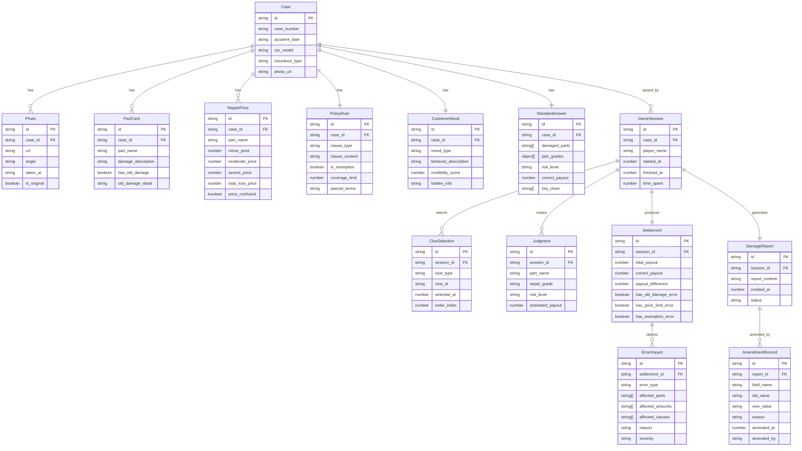

## 1. 架构设计

```mermaid
graph TB
    subgraph "前端层"
        "React SPA" --> "页面路由"
        "页面路由" --> "案例开场页"
        "页面路由" --> "线索选择台"
        "页面路由" --> "规则判定台"
        "页面路由" --> "赔付结算页"
        "页面路由" --> "错因回放页"
        "页面路由" --> "定损报告页"
        "页面路由" --> "月底复盘页"
    end
    subgraph "状态管理层"
        "Zustand Store" --> "案例数据Store"
        "Zustand Store" --> "游戏进度Store"
        "Zustand Store" --> "修正记录Store"
        "Zustand Store" --> "错因回放Store"
    end
    subgraph "数据层"
        "Mock数据" --> "事故照片数据"
        "Mock数据" --> "部位卡数据"
        "Mock数据" --> "维修价目数据"
        "Mock数据" --> "保单规则数据"
        "Mock数据" --> "客户情绪数据"
        "Mock数据" --> "标准答案数据"
    end
    "React SPA" --> "Zustand Store"
    "Zustand Store" --> "Mock数据"
```

## 2. 技术说明

- 前端：React@18 + TypeScript + Tailwind CSS@3 + Vite
- 初始化工具：vite-init
- 后端：无（纯前端项目，使用 Mock 数据）
- 数据库：无（使用 Zustand 状态管理 + localStorage 持久化）

## 3. 路由定义

| 路由 | 用途 |
|------|------|
| / | 首页，案例列表与培训场次选择 |
| /case/:id | 案例开场页，展示事故照片和基本信息 |
| /case/:id/clues | 线索选择台，四类线索卡片选择 |
| /case/:id/judge | 规则判定台，部位/等级/风险判定 |
| /case/:id/settle | 赔付结算页，金额计算与规则校验 |
| /case/:id/replay | 错因回放页，误判时间线与影响展开 |
| /case/:id/report | 定损报告页，汇总与导出 |
| /review | 月底复盘页，讲师视角统计与修正追溯 |

## 4. 数据模型

### 4.1 数据模型定义



### 4.2 核心数据结构（TypeScript）

```typescript
type RepairGrade = "轻微" | "中度" | "重度" | "报废"
type RiskLevel = "低" | "中" | "高"
type ErrorType = "旧伤误判" | "价格超限" | "免责条款漏看"
type ClueType = "部位卡" | "维修价目" | "保单条款" | "客户情绪"

interface AmendmentRecord {
  id: string
  reportId: string
  fieldName: string
  oldValue: string
  newValue: string
  reason: string
  amendedAt: number
  amendedBy: string
}

interface ErrorImpact {
  id: string
  settlementId: string
  errorType: ErrorType
  affectedParts: string[]
  affectedAmounts: string[]
  affectedClauses: string[]
  reason: string
  severity: "高" | "中" | "低"
}
```

## 5. 核心规则引擎设计

### 5.1 线索选择规则

- 每轮限时 3 分钟，最多选择 5 张线索卡
- 四类线索卡各有侧重：部位卡揭示损伤详情，维修价目提供价格参考，保单条款决定赔付边界，客户情绪暗示信息可信度
- 未选择的线索卡信息在判定时不可见（模拟真实定损中信息不完全的场景）

### 5.2 规则判定规则

- 部位判定：必须从已选部位卡中勾选，未选则无法勾选该部位
- 等级判定：每个已勾选部位需选择维修等级，对应不同价格
- 风险判定：综合部位和等级评估赔付风险

### 5.3 赔付结算规则

- 金额计算：各部位维修等级 × 对应价格，求和
- 旧伤误判检测：若部位卡含旧伤标记但玩家未识别，触发误判
- 价格超限检测：若总赔付金额超过保单限额，触发超限
- 免责条款漏看检测：若存在相关免责条款但玩家未选择查看，触发漏看

### 5.4 错因回放规则

- 每个误判项列出：误判类型、影响到的部位/金额/条款、具体原因、严重程度
- 按操作时间线排列，支持逐条展开
- 同时展示正确答案供对比学习

### 5.5 修正审计规则

- 所有修正追加写入 AmendmentRecord，不覆盖原始数据
- 修正时必须填写修改理由
- 报告展示时：删除线标注旧值，绿色标注新值，灰色注释修改理由
- 月底复盘可按任意维度筛选修正记录
