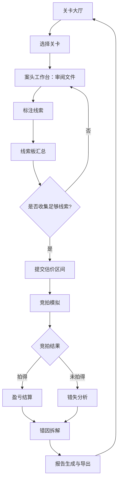

## 1. 产品概述

拍卖行估价闯关是一款面向艺术市场课程学生的沉浸式练习工具。学生在模拟拍卖场景中，通过审阅来源证明、品相报告、流派鉴定和买家偏好等原始材料，对拍品给出合理估价区间。估价偏差将直接影响竞拍结果——出价过高导致亏损，出价过低则拍品旁落。

- 核心目标：训练学生从混乱的真实材料中识别关键线索、发现来源缺口与品相扣分项、纠正买家偏好误判，形成独立估价能力
- 目标用户：艺术市场课程在读学生、拍卖行实习人员

## 2. 核心功能

### 2.1 用户角色

| 角色 | 注册方式 | 核心权限 |
|------|----------|----------|
| 学生 | 无需注册，本地创建档案 | 选择关卡、审阅材料、提交估价、查看反馈、导出报告 |
| 教师（可选） | 预设密码 | 查看全班数据统计（本期不做） |

### 2.2 功能模块

1. **关卡大厅**：展示可选拍品关卡，显示完成状态和得分
2. **案头工作台**：模拟拍卖行分析师桌面，散落各类文件供翻阅、标注
3. **估价提交**：提交估价区间并进入竞拍模拟
4. **竞拍反馈**：模拟拍卖现场，展示竞拍过程和结果
5. **错因分析**：逐项拆解估价偏差来源，对比正确分析路径
6. **报告导出**：生成本关练习报告，支持导出

### 2.3 页面详情

| 页面名称 | 模块名称 | 功能描述 |
|----------|----------|----------|
| 关卡大厅 | 关卡卡片列表 | 展示拍品缩略图、名称、难度标签、完成状态、历史最高分 |
| 关卡大厅 | 档案管理 | 创建/切换学生档案，数据持久化到 localStorage |
| 案头工作台 | 文件散布区 | 模拟桌面，各类材料（拍品卡、来源证明、品相报告、买家偏好、估价参考）以卡片/文件夹形式散布，支持拖拽排列、点击展开 |
| 案头工作台 | 线索标注面板 | 对已阅材料中的关键信息进行标注（高亮/标签），已标注线索自动汇总到线索板 |
| 案头工作台 | 线索板 | 汇总已收集线索，按来源/品相/流派/买家四维度分类，实时更新收集进度 |
| 估价提交 | 估价区间输入 | 输入最低估价和最高估价，展示参考提示（基于已收集线索） |
| 估价提交 | 信心指数 | 滑块选择信心等级，影响竞拍策略 |
| 竞拍反馈 | 竞拍模拟动画 | 模拟拍卖师叫价过程，其他竞拍者依次出价，玩家决定是否跟价 |
| 竞拍反馈 | 结果面板 | 展示成交价、玩家出价、盈亏结果、估价偏差百分比 |
| 错因分析 | 偏差拆解 | 逐项对比：来源缺口是否识别、品相扣分是否遗漏、流派判断是否正确、买家偏好是否误判 |
| 错因分析 | 正确路径 | 展示专业估价师的分析思路和正确估价逻辑 |
| 报告导出 | 报告生成 | 包含拍品信息、材料审阅记录、线索收集情况、估价区间、竞拍结果、偏差分析、改进建议 |
| 报告导出 | 导出按钮 | 支持 JSON 格式导出，可重新导入恢复 |

## 3. 核心流程

学生进入关卡 → 审阅散布的各类文件材料（存在来源缺口、品相漏算、买家误判等陷阱） → 标注关键线索 → 线索板实时汇总收集进度 → 提交估价区间和信心指数 → 进入竞拍模拟（叫价攀升，决定是否跟价） → 竞拍结果揭晓 → 错因逐项拆解 → 生成报告 → 返回关卡大厅

## 4. 用户界面设计

### 4.1 设计风格

- **主色调**：深木色（#2C1810）+ 羊皮纸色（#F5E6C8）+ 金色点缀（#C9A84C），模拟拍卖行古典奢华感
- **辅助色**：墨绿（#2D4A3E）用于品相良好标记，暗红（#8B2500）用于警告/来源缺口
- **字体**：标题使用衬线体（Playfair Display），正文使用优雅无衬线体（Cormorant Garamond），中文回退到 Noto Serif SC
- **布局**：桌面散布式 + 侧栏面板，模拟真实分析师案头环境
- **按钮风格**：金色描边、微浮雕质感，hover 时金光流动
- **图标风格**：古典线条风，lucide-react 图标库

### 4.2 页面设计概览

| 页面名称 | 模块名称 | UI 元素 |
|----------|----------|----------|
| 关卡大厅 | 关卡卡片 | 木纹背景卡片、拍品缩略图、金色边框、完成度进度条、难度星标 |
| 案头工作台 | 文件散布区 | 羊皮纸质感文件卡片、微微旋转的随机角度、投影层次感、可拖拽排列 |
| 案头工作台 | 线索板 | 右侧固定面板、四维度 Tab 切换、线索卡片带颜色标签 |
| 估价提交 | 估价输入 | 双滑块区间选择器、金色高亮当前区间、参考标记线 |
| 竞拍反馈 | 竞拍动画 | 拍卖槌动画、价格攀升数字翻牌、竞拍者头像、紧张音效提示 |
| 错因分析 | 偏差拆解 | 四维度对比表格、红绿标记正误、展开详情折叠面板 |
| 报告导出 | 报告页面 | 正式文档排版、水印底纹、导出按钮 |

### 4.3 响应式设计

- 桌面优先设计，最小支持 1024px 宽度
- 案头工作台在小屏幕下文件改为列表视图
- 侧栏面板可折叠

### 4.4 数据陷阱设计（核心差异化）

为模拟真实材料混乱情况，每个关卡的材料中刻意嵌入以下陷阱类型：

| 陷阱类型 | 描述 | 示例 |
|----------|------|------|
| 来源缺口 | 来源链中缺失关键环节，但文件措辞掩盖 | "传承有序"但实际缺1950-1980年记录 |
| 品相扣分漏算 | 品相报告用专业术语轻描淡写严重问题 | "局部修复"实际为大面积补笔 |
| 流派误标 | 流派鉴定文件与实际不符 | 标注"印象派"但笔法实为后印象派 |
| 买家偏好误导 | 买家偏好报告过时或偏向性描述 | 偏好报告说"市场冷淡"但近期同流派成交火爆 |
| 估价参考锚定 | 参考估价故意偏高或偏低 | 提供的参考价来自非权威来源 |

## 5. 拍品关卡示例

### 关卡1：清乾隆青花缠枝莲纹瓶（难度：★☆☆）

- 来源：有完整清宫造办处记录至民国流出，但1949-1985年间记录空白
- 品相：口沿微磕，底部有窑缝（品相报告轻描"口沿微瑕"）
- 流派：官窑青花，确认无误
- 买家偏好：当前官窑市场火热，但偏好报告引用了去年数据
- 正确估价：180-220万，参考价锚定在300万（偏高）

### 关卡2：张大千泼墨山水图（难度：★★☆）

- 来源：标注"家属提供"，但无出版记录和展览记录
- 品相：画面整体良好，但背面有潮气痕迹（品相报告未提及背面）
- 流派：标注"泼墨泼彩晚期风格"，但实际为中早期传统泼墨
- 买家偏好：张大千作品近期成交价持续走高
- 正确估价：350-450万，参考价锚定在200万（偏低）

### 关卡3：明黄花梨四出头官帽椅（难度：★★★）

- 来源：标注"重要私人收藏"，但来源链完全缺失
- 品相：搭脑和扶手为后配（品相报告仅注"局部修复"，未说明修复范围）
- 流派：标注"明式"，但实为清早期仿明式
- 买家偏好：古典家具市场分化严重，明式远高于清仿
- 正确估价：80-120万，参考价锚定在200万（严重偏高）
