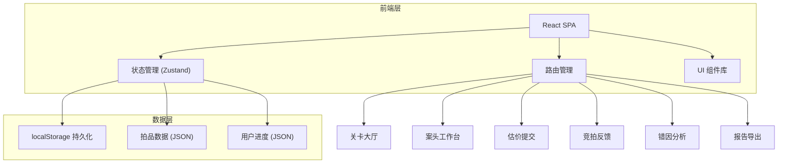
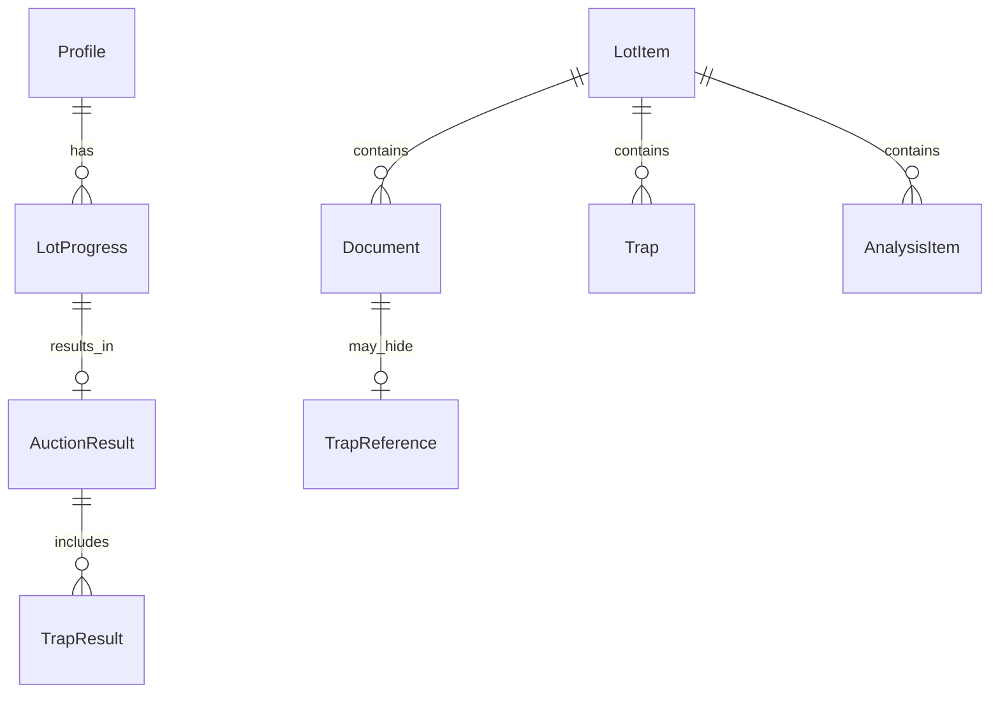

## 1. 架构设计



纯前端应用，所有数据存储在 localStorage，无需后端服务。

## 2. 技术说明

- 前端：React@18 + TypeScript + Tailwind CSS@3 + Vite
- 初始化工具：vite-init (react-ts 模板)
- 状态管理：Zustand（含 persist 中间件实现 localStorage 持久化）
- 路由：react-router-dom
- 后端：无
- 数据库：无（localStorage 替代）

## 3. 路由定义

| 路由 | 用途 |
|------|------|
| `/` | 关卡大厅：关卡列表、档案管理 |
| `/case/:id` | 案头工作台：文件审阅、线索标注 |
| `/case/:id/valuate` | 估价提交：输入估价区间和信心指数 |
| `/case/:id/auction` | 竞拍模拟：拍卖现场模拟动画 |
| `/case/:id/analysis` | 错因分析：偏差拆解与正确路径 |
| `/case/:id/report` | 报告导出：生成与下载报告 |

## 4. API 定义

无后端 API，所有数据通过 Zustand store + localStorage 管理。

### 4.1 核心 TypeScript 类型定义

```typescript
interface LotItem {
  id: string
  name: string
  difficulty: 1 | 2 | 3
  thumbnail: string
  correctValuation: { low: number; high: number }
  referencePrice: number
  finalPrice: number
  documents: Document[]
  traps: Trap[]
  analysis: AnalysisItem[]
}

interface Document {
  id: string
  type: 'lot_card' | 'provenance' | 'condition' | 'school' | 'buyer_preference' | 'valuation_ref'
  title: string
  content: DocumentContent
  position: { x: number; y: number; rotation: number }
  isRead: boolean
}

interface DocumentContent {
  summary: string
  details: Section[]
  trap?: TrapReference
}

interface Section {
  heading: string
  text: string
  isKeyClue: boolean
  clueType?: 'provenance_gap' | 'condition_deduction' | 'school_mislabel' | 'buyer_misjudge' | 'price_anchor'
}

interface Trap {
  id: string
  type: 'provenance_gap' | 'condition_deduction' | 'school_mislabel' | 'buyer_misjudge' | 'price_anchor'
  description: string
  documentId: string
  severity: 'low' | 'medium' | 'high'
  points: number
}

interface TrapReference {
  trapId: string
  disguise: string
}

interface AnalysisItem {
  dimension: 'provenance' | 'condition' | 'school' | 'buyer'
  correctAnalysis: string
  commonMistake: string
  impactOnPrice: number
}

interface PlayerProgress {
  profileId: string
  profileName: string
  currentLotId: string | null
  lotProgress: Record<string, LotProgress>
  totalScore: number
  createdAt: number
  updatedAt: number
}

interface LotProgress {
  lotId: string
  readDocuments: string[]
  collectedClues: string[]
  valuation: { low: number; high: number } | null
  confidence: number
  auctionResult: AuctionResult | null
  completedAt: number | null
  score: number
}

interface AuctionResult {
  playerBid: number
  finalPrice: number
  won: boolean
  profitLoss: number
  valuationDeviation: number
  trapResults: TrapResult[]
}

interface TrapResult {
  trapId: string
  identified: boolean
  pointsEarned: number
  pointsPossible: number
}

interface ExportReport {
  profileName: string
  lotName: string
  documents: { title: string; read: boolean }[]
  clues: { type: string; description: string; collected: boolean }[]
  valuation: { low: number; high: number } | null
  confidence: number
  auctionResult: AuctionResult | null
  analysis: AnalysisItem[]
  generatedAt: string
}
```

## 5. 数据模型



## 6. 持久化策略

- 使用 Zustand `persist` 中间件，自动同步到 localStorage
- 存储键：`auction-valuation-profiles`（所有档案数据）
- 导出格式：JSON，包含完整 PlayerProgress + LotItem 摘要
- 导入时合并数据，以 profileId + lotId 去重
- 页面刷新、关闭浏览器、重启服务后数据均保留
