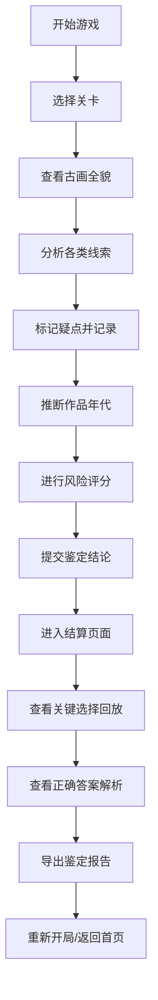

# 古画鉴定线索局 - 产品需求文档 (PRD)

## 1. 产品概述

"古画鉴定线索局"是一款博物馆教育类推理小游戏，玩家通过分析古画的纸张、印章、题跋、修复痕迹等线索进行文物鉴定推理，学习古画鉴定知识。

- 核心目的：以游戏化方式传播古画鉴定知识，提升博物馆教育互动性
- 目标用户：博物馆参观者、文化爱好者、学生群体
- 产品价值：将专业鉴定知识转化为可交互的推理体验，寓教于乐

## 2. 核心功能

### 2.1 用户角色

| 角色 | 注册方式 | 核心权限 |
|------|----------|----------|
| 玩家 | 无需注册 | 进行游戏、查看回放、导出报告 |

### 2.2 功能模块

1. **游戏首页**：游戏介绍、开始游戏、历史回放入口
2. **鉴定主界面**：古画展示区、线索分析面板、疑点标记系统
3. **关卡流程**：线索拼接 → 年代推断 → 风险评分 → 结论提交
4. **结算回放页**：关键选择回顾、正确答案解析、得分详情
5. **报告导出**：人读摘要 + 结构化明细双格式导出

### 2.3 页面详情

| 页面名称 | 模块名称 | 功能描述 |
|----------|----------|----------|
| 游戏首页 | Hero区域 | 游戏标题、主题插画、核心玩法介绍 |
| 游戏首页 | 功能入口 | 开始新局、继续游戏、历史回放 |
| 鉴定主界面 | 古画展示 | 高清古画展示、放大缩小、区域切换 |
| 鉴定主界面 | 线索分类 | 纸张/印章/题跋/修复痕迹/鉴定报告五大专栏 |
| 鉴定主界面 | 疑点标记 | 点击线索标记疑点、添加推理笔记 |
| 鉴定主界面 | 年代推断 | 根据线索选择年代区间、填写推理依据 |
| 鉴定主界面 | 风险评分 | 对各疑点进行风险评级、综合得分计算 |
| 结算回放页 | 选择回顾 | 时间线展示关键选择节点 |
| 结算回放页 | 答案说明 | 正确疑点解析、专家鉴定结论 |
| 结算回放页 | 得分详情 | 推理准确度、线索发现率、逻辑分 |
| 报告导出 | 人读摘要 | 游戏过程摘要、学习要点总结 |
| 报告导出 | 结构化明细 | JSON格式完整数据、便于后续分析 |

## 3. 核心流程

## 4. 用户界面设计

### 4.1 设计风格

- **主色调**：宣纸米白 (#F5F0E6)、古墨深棕 (#2C1810)、印章朱红 (#C41E3A)
- **辅助色**：青金石蓝 (#2E5A88)、铜绿 (#4A7C59)
- **按钮风格**：圆角矩形、轻微浮雕效果、悬停时印章盖下动画
- **字体**：标题使用书法风格字体，正文使用优雅衬线体
- **布局风格**：卷轴式布局、古书画装裱风格边框、印章装饰元素
- **图标风格**：水墨风线条图标、融入印章、毛笔、卷轴等文化元素

### 4.2 页面设计概览

| 页面名称 | 模块名称 | UI元素 |
|----------|----------|--------|
| 游戏首页 | Hero区域 | 卷轴展开动画、书法标题、水墨背景纹理 |
| 鉴定主界面 | 古画展示 | 画框装饰、放大镜交互、线索热区高亮 |
| 鉴定主界面 | 线索面板 | 扇面式标签切换、笔记竹简效果 |
| 结算回放页 | 时间线 | 水墨晕染进度条、节点印章标记 |
| 报告导出 | 摘要卡片 | 宣纸纹理、朱砂印鉴认证效果 |

### 4.3 响应式设计

- 桌面端优先，采用卷轴式主布局
- 平板端适配：线索面板改为底部抽屉式
- 移动端：简化操作，改为滑动切换线索卡片

### 4.4 动效设计

- 页面加载：卷轴徐徐展开动画
- 线索发现：朱砂圈出、墨韵扩散效果
- 疑点标记：印章盖下的弹跳动画
- 年代推断：时间轴滑动的水墨流动效果
- 结算出现：画卷从底部升起的呈现效果
