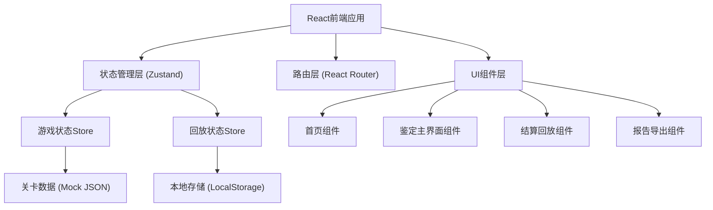
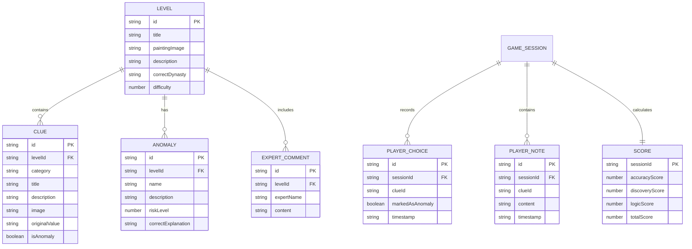

# 古画鉴定线索局 - 技术架构文档

## 1. 架构设计



## 2. 技术描述

- **前端框架**：React@18 + TypeScript
- **构建工具**：Vite@5
- **样式方案**：TailwindCSS@3 + CSS Modules
- **状态管理**：Zustand（轻量级状态管理）
- **路由管理**：React Router@6
- **图标方案**：React Icons（自定义水墨风格图标）
- **动画方案**：Framer Motion
- **数据持久化**：LocalStorage（存储游戏进度和回放历史）
- **后端**：无（纯前端应用，Mock数据内置）

## 3. 路由定义

| 路由 | 页面 | 用途 |
|------|------|------|
| `/` | 首页 | 游戏介绍、开始新局、历史回放入口 |
| `/game/:levelId` | 鉴定主界面 | 古画展示、线索分析、疑点标记 |
| `/game/:levelId/conclusion` | 结算回放页 | 关键选择回顾、答案说明、得分详情 |
| `/replay/:sessionId` | 回放界面 | 重放历史游戏过程 |

## 4. 数据模型

### 4.1 实体关系图



### 4.2 TypeScript 类型定义

```typescript
// 关卡数据类型
interface Level {
  id: string;
  title: string;
  paintingImage: string;
  description: string;
  correctDynasty: string;
  difficulty: 1 | 2 | 3;
  clues: Clue[];
  anomalies: Anomaly[];
  expertComments: ExpertComment[];
}

// 线索类型
interface Clue {
  id: string;
  category: 'paper' | 'seal' | 'calligraphy' | 'restoration' | 'report';
  title: string;
  description: string;
  image?: string;
  originalValue: string;
  isAnomaly: boolean;
  anomalyId?: string;
  position?: { x: number; y: number };
}

// 疑点类型
interface Anomaly {
  id: string;
  name: string;
  description: string;
  riskLevel: 1 | 2 | 3;
  correctExplanation: string;
  relatedClueIds: string[];
}

// 玩家选择记录
interface PlayerChoice {
  id: string;
  clueId: string;
  markedAsAnomaly: boolean;
  riskRating?: number;
  timestamp: number;
}

// 玩家笔记
interface PlayerNote {
  id: string;
  clueId: string;
  content: string;
  timestamp: number;
}

// 游戏会话
interface GameSession {
  id: string;
  levelId: string;
  startTime: number;
  endTime?: number;
  status: 'playing' | 'completed' | 'abandoned';
  playerChoices: PlayerChoice[];
  playerNotes: PlayerNote[];
  dynastyGuess?: string;
  reasoningNotes?: string;
  score?: Score;
}

// 得分详情
interface Score {
  accuracyScore: number;
  discoveryScore: number;
  logicScore: number;
  totalScore: number;
  grade: 'S' | 'A' | 'B' | 'C' | 'D';
}

// 专家点评
interface ExpertComment {
  id: string;
  expertName: string;
  avatar?: string;
  content: string;
}

// 导出报告格式
interface ExportReport {
  summary: {
    levelTitle: string;
    playTime: number;
    totalScore: number;
    grade: string;
    keyFindings: string[];
    learningPoints: string[];
  };
  details: GameSession & {
    levelData: Level;
    timestamp: number;
  };
}
```

## 5. 核心模块设计

### 5.1 游戏状态管理 (Zustand Store)

```typescript
interface GameStore {
  currentSession: GameSession | null;
  currentLevel: Level | null;
  selectedClueId: string | null;
  // Actions
  startNewGame: (levelId: string) => void;
  markClue: (clueId: string, isAnomaly: boolean) => void;
  addNote: (clueId: string, content: string) => void;
  setDynastyGuess: (dynasty: string, reasoning: string) => void;
  setRiskRating: (clueId: string, rating: number) => void;
  submitConclusion: () => void;
  calculateScore: () => Score;
}
```

### 5.2 回放状态管理

```typescript
interface ReplayStore {
  replaySessions: GameSession[];
  currentReplayIndex: number;
  isPlaying: boolean;
  // Actions
  loadSession: (sessionId: string) => void;
  play: () => void;
  pause: () => void;
  seekTo: (choiceIndex: number) => void;
  exportReport: (sessionId: string) => ExportReport;
}
```

## 6. 关键实现要点

### 6.1 数据校验机制
- 印章年代校验：比对印章风格与声称年代的匹配度
- 题跋矛盾检测：检查多条题跋之间的时间线一致性
- 修复痕迹识别：标记被遗漏的修复痕迹为推理扣分点

### 6.2 原始值保留策略
- 所有线索的 `originalValue` 字段永久保存，不随玩家操作修改
- 玩家操作记录与原始数据分离存储
- 导出报告中同时包含原始值和玩家分析

### 6.3 回放系统实现
- 基于时间戳的操作序列记录
- 支持逐帧回放和跳转到关键节点
- 回放状态与游戏状态隔离，互不干扰

### 6.4 报告导出功能
- 人读摘要：Markdown 格式，包含关键发现和学习要点
- 结构化明细：JSON 格式，完整游戏数据，便于后续分析处理
