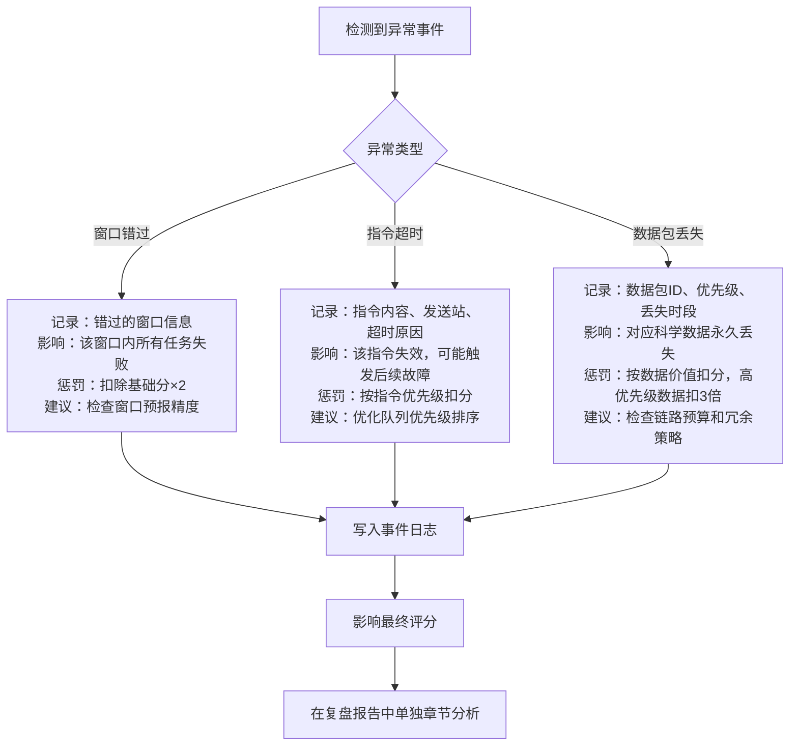
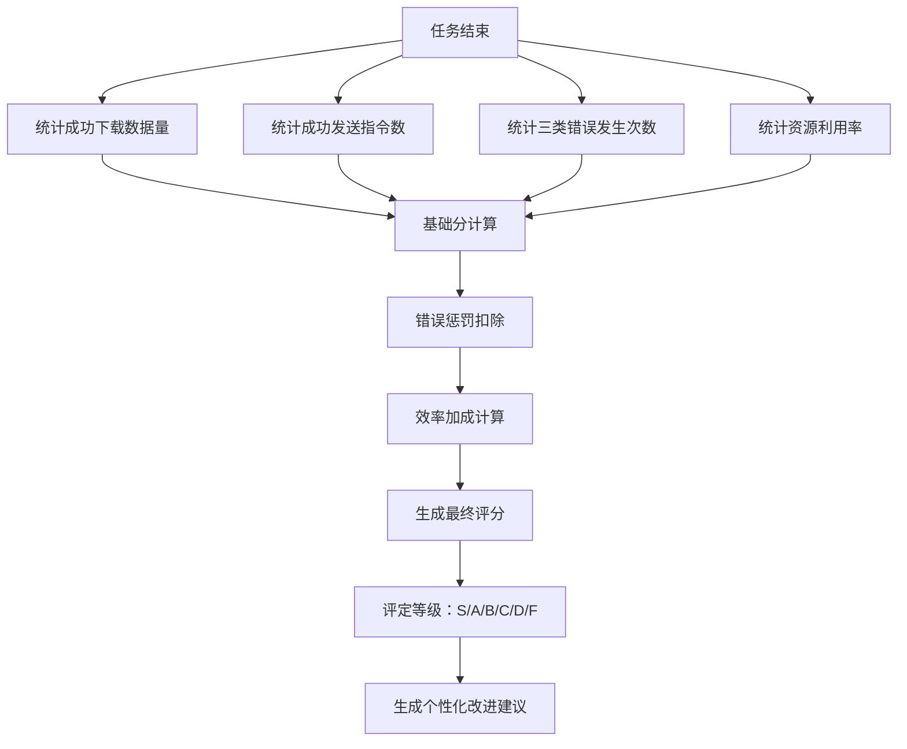

## 1. 产品概述

航天测控窗口赛是一款面向航天科普营学生的模拟测控游戏，玩家通过调度地面站资源，在探测器可见窗口内完成数据下载和指令补发任务，体验真实航天测控工作的复杂性。游戏通过详细的复盘系统让学生理解测控调度中的关键决策点和错误后果。

### 1.1 产品目标
- 让学生理解航天测控中"窗口"概念和时间调度的重要性
- 模拟真实测控工作中的压力和决策权衡
- 通过复盘系统提供深度教学反馈，而非简单的胜负判定
- 培养系统思维和多任务优先级调度能力

### 1.2 目标用户
- 航天科普营中学生（12-18岁）
- 对航天测控感兴趣的初学者
- 需要可量化考核的科普活动组织者

---

## 2. 核心功能

### 2.1 核心实体定义
| 实体 | 描述 | 关键属性 |
|------|------|----------|
| 地面站 | 分布在全球的测控站点，每个站有独立的设备能力 | 坐标、频段、工作状态、数据带宽 |
| 探测器 | 在轨运行的航天器，按轨道周期飞行 | 轨道参数、数据存储量、指令缓冲区 |
| 可见窗口 | 探测器进入地面站可见范围的时间段 | 开始时间、结束时间、最大仰角、可用频段 |
| 数据包 | 探测器存储的科学/工程数据，需在窗口内下载 | 优先级、数据量、截止时间、丢失惩罚 |
| 指令队列 | 需上发给探测器的控制指令，按优先级排序 | 优先级、指令长度、超时时间、失败影响 |
| 测控报告 | 游戏结束后的完整复盘文档 | 事件时间线、错误分析、得分明细、改进建议 |

### 2.2 功能模块
1. **主游戏界面**：时间轴调度器、地面站状态面板、探测器轨道可视化、指令队列管理
2. **实时测控面板**：窗口倒计时、数据下载进度、指令发送状态、异常告警
3. **错误处理系统**：窗口错过、指令超时、数据包丢失三类核心错误的独立处理逻辑
4. **复盘系统**：时间线回放、事件溯源、得分拆解、测控报告导出
5. **评分系统**：多维度评分模型，影响最终评级和复盘建议

### 2.3 页面详情
| 页面名称 | 模块名称 | 功能描述 |
|---------|----------|----------|
| 开始页面 | 任务简报 | 显示本次任务背景、目标参数、难度说明、可选择的地面站配置 |
| 游戏主界面 | 时间轴调度器 | 可视化时间轴，可拖拽安排任务，显示各地面站的可见窗口预测 |
| 游戏主界面 | 测控控制台 | 实时显示各站工作状态、数据下载进度条、指令发送队列 |
| 游戏主界面 | 轨道可视化 | 简化的探测器轨道动画，直观显示当前可见性 |
| 游戏主界面 | 告警面板 | 实时推送异常事件，每个错误类型有独立的视觉和音效提示 |
| 复盘页面 | 时间线回放 | 可拖动进度条回放整个任务过程，支持倍速和关键事件跳转 |
| 复盘页面 | 测控报告 | 结构化的报告，包含得分明细、错误分析、决策评价、改进建议 |
| 复盘页面 | 数据导出 | 支持导出JSON格式的完整任务记录，用于进一步分析 |

---

## 3. 核心流程

### 3.1 游戏主流程
玩家进入任务简报 → 了解本次任务目标和约束 → 进入游戏主界面 → 在时间轴上预调度任务 → 实时运行中调整调度 → 处理突发异常 → 任务结束 → 查看完整复盘 → 导出测控报告

### 3.2 错误处理流程

### 3.3 评分决策流程

---

## 4. 用户界面设计

### 4.1 设计风格
- **主色调**：深空蓝 (#0a1628) 作为背景，搭配航天金 (#d4af37) 作为强调色，警戒红 (#e74c3c) 用于错误提示，成功绿 (#27ae60) 用于正常状态
- **视觉风格**：赛博朋克航天风格，深色背景配合荧光边框、扫描线效果、数据可视化动效
- **字体**：标题使用 Orbitron（科技感等宽字体），正文使用 JetBrains Mono（等宽字体，便于显示数据和代码）
- **按钮风格**：带有发光边框的矩形按钮，hover时有扫描线动画，按下时有凹陷效果
- **图标风格**：线性风格的航天主题图标，带有轻微发光效果

### 4.2 页面设计要点
| 页面名称 | 模块名称 | UI 元素 |
|---------|----------|----------|
| 开始页面 | 任务简报 | 大号倒计时器、任务目标卡片、难度选择滑块、开始按钮（脉冲动画） |
| 游戏主界面 | 时间轴调度器 | 横向时间轴，每个地面站一行，可见窗口用渐变色块标注，任务块可拖拽，冲突检测红色高亮 |
| 游戏主界面 | 测控控制台 | 三列布局：地面站状态（带信号强度动画）、数据下载进度（环形进度条）、指令队列（优先级排序，可拖拽调整） |
| 游戏主界面 | 告警面板 | 右上角浮动面板，新告警时有抖动动画和音效，不同错误类型用不同颜色边框 |
| 复盘页面 | 时间线回放 | 底部时间轴带关键事件标记，播放控制按钮，速度调节（0.5x/1x/2x/4x） |
| 复盘页面 | 测控报告 | 卡片式布局，每个分析模块独立卡片，错误分析用红色边框高亮，得分明细用表格展示 |

### 4.3 失败路径设计（真实工作场景）
1. **窗口错过**：
   - 场景1：调度了任务但选错了地面站（该站在此窗口不可见）
   - 场景2：前一个任务超时，占用了下一个窗口的开始时间
   - 场景3：没有预留足够的天线指向调整时间（天线从一个目标转向另一个需要时间）
   - 场景4：窗口预报有误，实际窗口比预报短30秒

2. **指令超时**：
   - 场景1：高优先级指令排在队列后面，窗口结束时未能发送
   - 场景2：指令长度过长，传输时间超过窗口剩余时间
   - 场景3：信道误码率过高，需要重传导致超时
   - 场景4：探测器进入日凌区，通信中断

3. **数据包丢失**：
   - 场景1：数据量超过窗口带宽能力，末尾数据被截断
   - 场景2：链路雨衰导致信噪比不足，高优先级数据也未能正确解调
   - 场景3：探测器存储溢出，新数据覆盖了旧的未下载数据
   - 场景4：地面站存储故障，已下载的数据未能写入磁盘

### 4.4 响应式设计
- **桌面端优先**：复杂的时间轴和多面板布局需要大屏幕展示
- **平板适配**：将多面板改为可折叠的标签页，保留核心时间轴功能
- **移动端**：简化为只显示当前任务和告警，完整功能仅在桌面端提供

---

## 5. 非功能需求

### 5.1 性能要求
- 时间轴帧率 ≥ 30fps，拖拽操作无明显卡顿
- 复盘回放支持 4x 倍速流畅播放
- 测控报告生成时间 ≤ 1秒

### 5.2 数据存储
- 所有游戏数据本地存储，支持多次游戏记录保留
- 导出的 JSON 文件包含完整的事件时间线，可用于教学分析

### 5.3 可访问性
- 颜色对比度符合 WCAG 2.1 AA 标准
- 所有操作支持键盘快捷键
- 重要状态变化有语音提示
