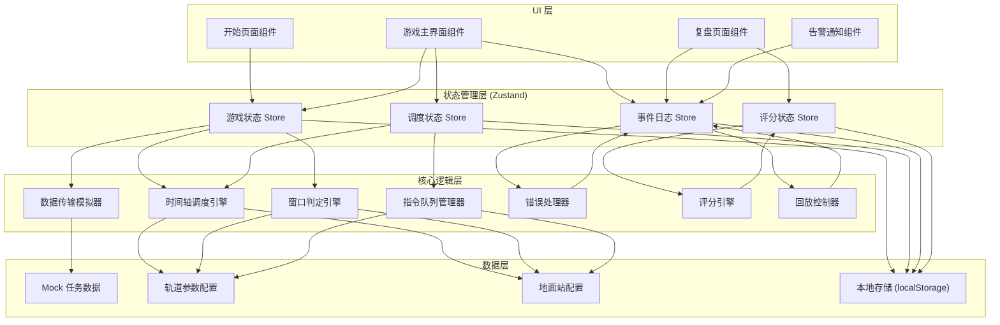
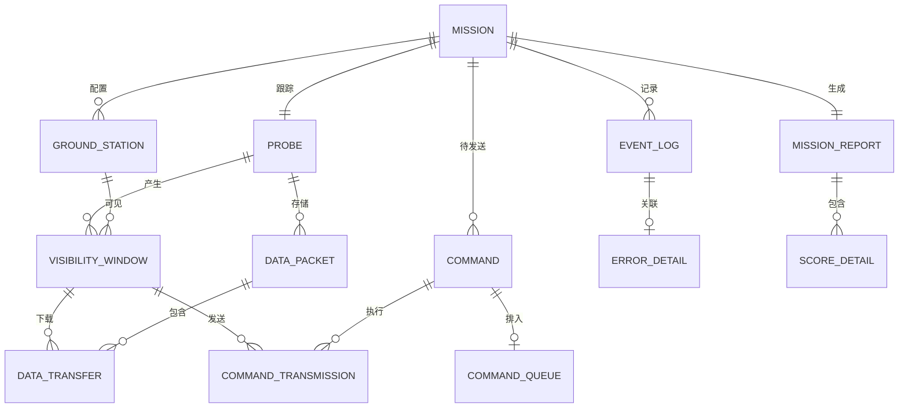

## 1. 架构设计



---

## 2. 技术描述

### 2.1 技术栈选择
- **前端框架**：React 18 + TypeScript
- **构建工具**：Vite 5
- **样式方案**：Tailwind CSS 3
- **状态管理**：Zustand（轻量级，适合游戏状态管理）
- **图标库**：Lucide React（线性风格，符合航天科技感）
- **动画库**：Framer Motion（复杂动画和交互）
- **数据可视化**：自定义 Canvas/SVG（时间轴和轨道可视化）

### 2.2 目录结构
```
src/
├── types/              # TypeScript 类型定义
│   └── mission.ts      # 核心实体类型
├── store/              # Zustand 状态管理
│   ├── gameStore.ts    # 游戏主状态
│   ├── scheduleStore.ts # 调度状态
│   ├── eventStore.ts   # 事件日志
│   └── scoreStore.ts   # 评分状态
├── engine/             # 核心逻辑引擎
│   ├── timelineEngine.ts   # 时间轴调度
│   ├── windowEngine.ts     # 窗口判定
│   ├── queueEngine.ts      # 队列优先级
│   ├── transmissionEngine.ts # 数据传输模拟
│   ├── errorHandler.ts     # 错误处理
│   ├── scoreEngine.ts      # 评分引擎
│   └── replayEngine.ts     # 回放控制
├── data/               # 配置和Mock数据
│   ├── groundStations.ts   # 地面站配置
│   ├── orbits.ts           # 轨道参数
│   └── missions/           # 任务数据
│       └── mission1.ts     # 示例任务
├── hooks/              # 自定义 Hooks
│   ├── useGameLoop.ts      # 游戏主循环
│   ├── useTimeline.ts      # 时间轴交互
│   └── useReplay.ts        # 回放控制
├── components/         # React 组件
│   ├── layout/            # 布局组件
│   ├── mission/           # 任务相关组件
│   ├── timeline/          # 时间轴组件
│   ├── console/           # 测控台组件
│   ├── alert/             # 告警组件
│   └── report/            # 复盘报告组件
├── pages/              # 页面组件
│   ├── StartPage.tsx       # 开始页面
│   ├── GamePage.tsx        # 游戏主页面
│   └── ReportPage.tsx      # 复盘页面
├── utils/              # 工具函数
│   ├── time.ts             # 时间计算
│   ├── orbit.ts            # 轨道计算
│   └── export.ts           # 导出功能
├── App.tsx
├── main.tsx
└── index.css
```

---

## 3. 路由定义

| 路由 | 页面 | 描述 |
|------|------|------|
| `/` | 开始页面 | 任务简报、难度选择、开始游戏 |
| `/game` | 游戏主页面 | 时间轴调度、实时测控、告警处理 |
| `/report/:missionId` | 复盘页面 | 时间线回放、测控报告、数据导出 |

---

## 4. 数据模型

### 4.1 核心实体 ER 图



### 4.2 TypeScript 类型定义

```typescript
// 核心实体类型
export interface GroundStation {
  id: string;
  name: string;
  location: { lat: number; lng: number };
  bandwidth: number; // Mbps
  bands: string[];
  antennaSlewTime: number; // 天线转向时间（秒）
  status: 'idle' | 'active' | 'slewing' | 'error';
}

export interface Probe {
  id: string;
  name: string;
  orbitParams: {
    semiMajorAxis: number;
    eccentricity: number;
    inclination: number;
    raan: number;
  };
  dataStorage: number; // MB
  commandBufferSize: number;
  currentDataUsage: number;
}

export interface VisibilityWindow {
  id: string;
  groundStationId: string;
  probeId: string;
  startTime: number; // 时间戳
  endTime: number;
  maxElevation: number;
  predictedDuration: number; // 预测时长
  actualDuration?: number; // 实际时长
  bands: string[];
  status: 'predicted' | 'active' | 'completed' | 'missed';
}

export interface DataPacket {
  id: string;
  probeId: string;
  priority: 'critical' | 'high' | 'medium' | 'low';
  size: number; // MB
  dataType: 'science' | 'engineering' | 'telemetry';
  deadline: number; // 截止时间
  createdAt: number;
  isDownloaded: boolean;
  downloadWindowId?: string;
  lossPenalty: number; // 丢失惩罚分数
}

export interface Command {
  id: string;
  name: string;
  priority: 1 | 2 | 3 | 4 | 5; // 1最高
  size: number; // bytes
  timeout: number; // 超时时间
  description: string;
  failureImpact: string;
  isSent: boolean;
  sentTime?: number;
  windowId?: string;
  status: 'pending' | 'queued' | 'transmitting' | 'success' | 'timeout' | 'failed';
}

export interface CommandQueue {
  groundStationId: string;
  commands: string[]; // command id 列表，按优先级排序
  currentIndex: number;
}

// 事件和错误类型
export type EventType = 
  | 'window_start'
  | 'window_end'
  | 'window_missed'
  | 'command_sent'
  | 'command_timeout'
  | 'command_failed'
  | 'data_download_start'
  | 'data_download_complete'
  | 'data_packet_lost'
  | 'ground_station_error'
  | 'storage_overflow'
  | 'link_degradation';

export interface EventLog {
  id: string;
  timestamp: number;
  type: EventType;
  severity: 'info' | 'warning' | 'error' | 'critical';
  message: string;
  relatedEntityId?: string;
  errorDetail?: ErrorDetail;
}

export interface ErrorDetail {
  errorType: 'window_missed' | 'command_timeout' | 'data_packet_lost';
  windowMissed?: {
    windowId: string;
    reason: 'wrong_station' | 'previous_overrun' | 'insufficient_slew_time' | 'prediction_error';
    scheduledTasks: string[];
  };
  commandTimeout?: {
    commandId: string;
    windowId: string;
    reason: 'queue_position' | 'size_too_large' | 'retransmission_needed' | 'solar_conjunction';
    queuePosition: number;
    transmittedPercent: number;
  };
  dataPacketLost?: {
    packetId: string;
    windowId: string;
    reason: 'bandwidth_exceeded' | 'rain_fade' | 'storage_overflow' | 'ground_storage_failure';
    recoveredPercent: number;
  };
}

// 评分和报告类型
export interface ScoreDetail {
  category: string;
  maxScore: number;
  earnedScore: number;
  description: string;
  breakdown: {
    label: string;
    value: number;
    maxValue: number;
  }[];
}

export interface MissionReport {
  missionId: string;
  missionName: string;
  startTime: number;
  endTime: number;
  finalScore: number;
  maxScore: number;
  grade: 'S' | 'A' | 'B' | 'C' | 'D' | 'F';
  scoreDetails: ScoreDetail[];
  eventSummary: {
    totalEvents: number;
    errorsByType: Record<string, number>;
    criticalErrors: string[];
  };
  performanceMetrics: {
    dataDownloadRate: number; // 百分比
    commandSuccessRate: number;
    windowUtilization: number;
    resourceEfficiency: number;
  };
  recommendations: string[];
  timelineData: EventLog[];
}

// 游戏状态
export interface GameState {
  missionId: string;
  status: 'idle' | 'running' | 'paused' | 'completed' | 'failed';
  currentTime: number; // 游戏内时间
  speed: number; // 1x, 2x, 4x
  groundStations: GroundStation[];
  probe: Probe;
  visibilityWindows: VisibilityWindow[];
  dataPackets: DataPacket[];
  commands: Command[];
  queues: Record<string, CommandQueue>;
}
```

---

## 5. 核心引擎设计

### 5.1 时间轴调度引擎 (timelineEngine.ts)
```typescript
// 核心功能：
// 1. 计算可见窗口时间线
// 2. 任务块拖拽调度
// 3. 冲突检测与解决
// 4. 天线转向时间预留计算

export interface ScheduleBlock {
  id: string;
  windowId: string;
  stationId: string;
  startTime: number;
  endTime: number;
  type: 'download' | 'command';
  taskIds: string[];
}

// 调度算法：检查是否有足够时间完成任务
export function canScheduleTask(
  window: VisibilityWindow,
  taskType: 'download' | 'command',
  dataSize: number,
  bandwidth: number
): boolean {
  const requiredTime = (dataSize * 8) / (bandwidth * 1024); // 秒
  return requiredTime <= (window.endTime - window.startTime) / 1000;
}

// 冲突检测：检查两个调度块是否冲突（考虑天线转向时间）
export function hasConflict(
  block1: ScheduleBlock,
  block2: ScheduleBlock,
  slewTime: number
): boolean {
  const adjustedStart = block2.startTime - slewTime * 1000;
  return block1.endTime > adjustedStart && block1.startTime < block2.endTime;
}
```

### 5.2 窗口判定引擎 (windowEngine.ts)
```typescript
// 核心功能：
// 1. 实时窗口可见性判定
// 2. 窗口预报误差模拟
// 3. 窗口错过检测

// 简化的可见性计算（基于仰角）
export function isVisible(
  probePosition: { x: number; y: number; z: number },
  stationPosition: { lat: number; lng: number },
  minElevation: number = 5
): boolean {
  // 计算仰角
  const elevation = calculateElevation(probePosition, stationPosition);
  return elevation >= minElevation;
}

// 窗口错过检测
export function detectMissedWindow(
  window: VisibilityWindow,
  scheduledBlocks: ScheduleBlock[],
  currentTime: number
): ErrorDetail | null {
  if (window.status !== 'predicted') return null;
  if (currentTime < window.endTime) return null;
  
  const hasTasks = scheduledBlocks.some(b => b.windowId === window.id);
  if (!hasTasks) return null;
  
  // 检查是否有任务实际执行
  const executedTasks = scheduledBlocks.filter(
    b => b.windowId === window.id && b.startTime <= currentTime
  );
  
  if (executedTasks.length === 0) {
    return {
      errorType: 'window_missed',
      windowMissed: {
        windowId: window.id,
        reason: determineMissReason(window, scheduledBlocks),
        scheduledTasks: scheduledBlocks.filter(b => b.windowId === window.id).map(b => b.id),
      },
    };
  }
  
  return null;
}

function determineMissReason(
  window: VisibilityWindow,
  blocks: ScheduleBlock[]
): 'wrong_station' | 'previous_overrun' | 'insufficient_slew_time' | 'prediction_error' {
  // 智能判断错过原因
  // ... 具体实现
}
```

### 5.3 指令队列引擎 (queueEngine.ts)
```typescript
// 核心功能：
// 1. 多优先级队列管理
// 2. 队列排序与调整
// 3. 超时检测

// 优先级排序算法
export function sortCommandsByPriority(commands: Command[]): Command[] {
  return [...commands].sort((a, b) => {
    // 先按优先级排序
    if (a.priority !== b.priority) return a.priority - b.priority;
    // 同优先级按超时时间排序
    return a.timeout - b.timeout;
  });
}

// 计算指令传输时间
export function calculateTransmissionTime(
  command: Command,
  bandwidth: number
): number {
  // 加上协议开销和校验时间
  return (command.size * 8) / (bandwidth * 1024) + 0.5; // 秒
}

// 检测指令超时
export function detectCommandTimeout(
  command: Command,
  window: VisibilityWindow,
  currentTime: number,
  queuePosition: number,
  transmittedPercent: number
): ErrorDetail | null {
  if (command.status !== 'transmitting' && command.status !== 'queued') return null;
  if (currentTime < window.endTime) return null;
  
  if (transmittedPercent < 100) {
    return {
      errorType: 'command_timeout',
      commandTimeout: {
        commandId: command.id,
        windowId: window.id,
        reason: determineTimeoutReason(command, window, queuePosition, transmittedPercent),
        queuePosition,
        transmittedPercent,
      },
    };
  }
  
  return null;
}
```

### 5.4 错误处理器 (errorHandler.ts)
```typescript
// 核心功能：
// 1. 三类错误的独立处理口径
// 2. 错误影响评估
// 3. 分数惩罚计算

export function handleError(
  errorDetail: ErrorDetail,
  currentScore: number
): { event: EventLog; scoreDeduction: number; impact: string } {
  switch (errorDetail.errorType) {
    case 'window_missed':
      return handleWindowMissed(errorDetail, currentScore);
    case 'command_timeout':
      return handleCommandTimeout(errorDetail, currentScore);
    case 'data_packet_lost':
      return handleDataPacketLost(errorDetail, currentScore);
  }
}

function handleWindowMissed(
  detail: ErrorDetail,
  _currentScore: number
): { event: EventLog; scoreDeduction: number; impact: string } {
  const basePenalty = 100;
  const reasonMultipliers: Record<string, number> = {
    wrong_station: 2,
    previous_overrun: 1.5,
    insufficient_slew_time: 1.2,
    prediction_error: 0.8,
  };
  
  const reason = detail.windowMissed!.reason;
  const deduction = Math.floor(basePenalty * reasonMultipliers[reason]);
  
  const reasonDescriptions: Record<string, string> = {
    wrong_station: '调度了错误的地面站，该站在此窗口不可见',
    previous_overrun: '前一个任务超时，占用了本窗口开始时间',
    insufficient_slew_time: '未预留足够的天线转向时间',
    prediction_error: '窗口预报存在误差，实际可用时间缩短',
  };
  
  return {
    event: {
      id: generateId(),
      timestamp: Date.now(),
      type: 'window_missed',
      severity: 'error',
      message: `窗口错过：${reasonDescriptions[reason]}`,
      relatedEntityId: detail.windowMissed!.windowId,
      errorDetail: detail,
    },
    scoreDeduction: deduction,
    impact: `该窗口内所有调度任务失败，扣除 ${deduction} 分`,
  };
}

function handleCommandTimeout(
  detail: ErrorDetail,
  _currentScore: number
): { event: EventLog; scoreDeduction: number; impact: string } {
  const cmd = detail.commandTimeout!;
  const basePenalty = cmd.queuePosition <= 1 ? 50 : 30;
  const priorityMultiplier = 6 - cmd.queuePosition; // 队列越靠前惩罚越重
  
  const deduction = Math.floor(basePenalty * priorityMultiplier);
  
  const reasonDescriptions: Record<string, string> = {
    queue_position: '指令在队列中优先级过低，未能及时发送',
    size_too_large: '指令长度过长，传输时间超过窗口剩余时间',
    retransmission_needed: '信道误码率过高，需要重传导致超时',
    solar_conjunction: '探测器进入日凌区，通信中断',
  };
  
  return {
    event: {
      id: generateId(),
      timestamp: Date.now(),
      type: 'command_timeout',
      severity: cmd.queuePosition <= 1 ? 'critical' : 'warning',
      message: `指令超时：${reasonDescriptions[cmd.reason]}（已传输 ${cmd.transmittedPercent}%）`,
      relatedEntityId: cmd.commandId,
      errorDetail: detail,
    },
    scoreDeduction: deduction,
    impact: `指令 ${cmd.commandId} 发送失败，扣除 ${deduction} 分`,
  };
}

function handleDataPacketLost(
  detail: ErrorDetail,
  _currentScore: number
): { event: EventLog; scoreDeduction: number; impact: string } {
  const pkt = detail.dataPacketLost!;
  const basePenalty = pkt.recoveredPercent < 50 ? 80 : 40;
  const priorityMultiplier = 3; // 数据包丢失惩罚更重
  
  const deduction = Math.floor(basePenalty * priorityMultiplier);
  
  const reasonDescriptions: Record<string, string> = {
    bandwidth_exceeded: '数据量超过窗口带宽能力，末尾数据被截断',
    rain_fade: '链路雨衰导致信噪比不足，数据未能正确解调',
    storage_overflow: '探测器存储溢出，新数据覆盖了未下载的旧数据',
    ground_storage_failure: '地面站存储故障，已下载数据未能写入磁盘',
  };
  
  return {
    event: {
      id: generateId(),
      timestamp: Date.now(),
      type: 'data_packet_lost',
      severity: 'error',
      message: `数据包丢失：${reasonDescriptions[pkt.reason]}（已恢复 ${pkt.recoveredPercent}%）`,
      relatedEntityId: pkt.packetId,
      errorDetail: detail,
    },
    scoreDeduction: deduction,
    impact: `数据包 ${pkt.packetId} 永久丢失，扣除 ${deduction} 分`,
  };
}
```

### 5.5 评分引擎 (scoreEngine.ts)
```typescript
// 核心功能：
// 1. 多维度评分计算
// 2. 等级评定
// 3. 改进建议生成

export function calculateFinalScore(
  gameState: GameState,
  events: EventLog[]
): MissionReport {
  const maxScore = 1000;
  let earnedScore = 0;
  
  const scoreDetails: ScoreDetail[] = [];
  
  // 1. 数据下载得分（400分）
  const downloadScore = calculateDownloadScore(gameState);
  scoreDetails.push(downloadScore);
  earnedScore += downloadScore.earnedScore;
  
  // 2. 指令发送得分（300分）
  const commandScore = calculateCommandScore(gameState);
  scoreDetails.push(commandScore);
  earnedScore += commandScore.earnedScore;
  
  // 3. 资源利用得分（200分）
  const efficiencyScore = calculateEfficiencyScore(gameState);
  scoreDetails.push(efficiencyScore);
  earnedScore += efficiencyScore.earnedScore;
  
  // 4. 错误惩罚（倒扣）
  const errorPenalty = calculateErrorPenalty(events);
  scoreDetails.push(errorPenalty);
  earnedScore += errorPenalty.earnedScore; // 负数
  
  // 5. 效率加成（最高100分）
  const bonusScore = calculateBonusScore(gameState, events);
  scoreDetails.push(bonusScore);
  earnedScore += bonusScore.earnedScore;
  
  earnedScore = Math.max(0, Math.min(maxScore, earnedScore));
  
  const grade = determineGrade(earnedScore, maxScore);
  const recommendations = generateRecommendations(scoreDetails, events);
  
  return {
    missionId: gameState.missionId,
    missionName: '探测器测控任务',
    startTime: gameState.visibilityWindows[0]?.startTime || 0,
    endTime: Date.now(),
    finalScore: earnedScore,
    maxScore,
    grade,
    scoreDetails,
    eventSummary: generateEventSummary(events),
    performanceMetrics: calculateMetrics(gameState),
    recommendations,
    timelineData: events,
  };
}

function determineGrade(score: number, maxScore: number): 'S' | 'A' | 'B' | 'C' | 'D' | 'F' {
  const percentage = (score / maxScore) * 100;
  if (percentage >= 95) return 'S';
  if (percentage >= 85) return 'A';
  if (percentage >= 75) return 'B';
  if (percentage >= 65) return 'C';
  if (percentage >= 50) return 'D';
  return 'F';
}

function generateRecommendations(
  scoreDetails: ScoreDetail[],
  events: EventLog[]
): string[] {
  const recommendations: string[] = [];
  const errors = events.filter(e => e.errorDetail);
  
  const windowMisses = errors.filter(e => e.errorDetail?.errorType === 'window_missed');
  const timeouts = errors.filter(e => e.errorDetail?.errorType === 'command_timeout');
  const packetLosses = errors.filter(e => e.errorDetail?.errorType === 'data_packet_lost');
  
  if (windowMisses.length > 0) {
    recommendations.push(`本次任务错过 ${windowMisses.length} 个窗口，建议优化预调度时的窗口预报精度检查`);
    const reasons = [...new Set(windowMisses.map(e => e.errorDetail!.windowMissed!.reason))];
    reasons.forEach(r => {
      const tips: Record<string, string> = {
        wrong_station: '• 调度前请核对每个窗口对应的地面站是否正确',
        previous_overrun: '• 任务间请预留足够的缓冲时间，避免前序任务超时影响后续窗口',
        insufficient_slew_time: '• 天线转向需要时间，请在相邻任务间预留至少30秒转向时间',
        prediction_error: '• 考虑预报误差，不要把任务排满整个窗口，预留10%余量',
      };
      recommendations.push(tips[r]);
    });
  }
  
  if (timeouts.length > 0) {
    recommendations.push(`有 ${timeouts.length} 条指令超时，建议重新评估队列优先级排序`);
    const queueIssues = timeouts.filter(e => e.errorDetail!.commandTimeout!.reason === 'queue_position');
    if (queueIssues.length > 0) {
      recommendations.push('• 高优先级指令请提前排到队列前面，避免窗口结束时才轮到发送');
    }
  }
  
  if (packetLosses.length > 0) {
    recommendations.push(`丢失 ${packetLosses.length} 个数据包，建议优化链路预算和冗余策略`);
    const bandwidthIssues = packetLosses.filter(e => e.errorDetail!.dataPacketLost!.reason === 'bandwidth_exceeded');
    if (bandwidthIssues.length > 0) {
      recommendations.push('• 计算窗口带宽能力，不要安排超过传输能力的数据量');
    }
  }
  
  if (recommendations.length === 0) {
    recommendations.push('任务执行完美！建议挑战更高难度的任务配置。');
  }
  
  return recommendations;
}
```

---

## 6. 状态管理设计

### 6.1 游戏主状态 (gameStore.ts)
```typescript
import { create } from 'zustand';
import { GameState, GroundStation, Probe, VisibilityWindow, DataPacket, Command, CommandQueue } from '../types/mission';

interface GameStore extends GameState {
  setMission: (missionId: string) => void;
  startGame: () => void;
  pauseGame: () => void;
  resumeGame: () => void;
  endGame: () => void;
  setSpeed: (speed: number) => void;
  updateTime: (delta: number) => void;
  updateGroundStation: (id: string, updates: Partial<GroundStation>) => void;
  updateWindow: (id: string, updates: Partial<VisibilityWindow>) => void;
  updatePacket: (id: string, updates: Partial<DataPacket>) => void;
  updateCommand: (id: string, updates: Partial<Command>) => void;
  addToQueue: (stationId: string, commandId: string) => void;
  removeFromQueue: (stationId: string, commandId: string) => void;
  reorderQueue: (stationId: string, fromIndex: number, toIndex: number) => void;
  resetGame: () => void;
}

export const useGameStore = create<GameStore>((set, get) => ({
  // ... 初始状态和方法实现
}));
```

### 6.2 事件日志 Store (eventStore.ts)
```typescript
import { create } from 'zustand';
import { EventLog, ErrorDetail } from '../types/mission';
import { handleError } from '../engine/errorHandler';

interface EventStore {
  events: EventLog[];
  addEvent: (event: Omit<EventLog, 'id'>) => void;
  addError: (errorDetail: ErrorDetail) => { scoreDeduction: number; impact: string };
  clearEvents: () => void;
}

export const useEventStore = create<EventStore>((set, get) => ({
  events: [],
  addEvent: (event) => {
    const newEvent: EventLog = {
      ...event,
      id: generateId(),
    };
    set(state => ({ events: [...state.events, newEvent] }));
  },
  addError: (errorDetail) => {
    const { event, scoreDeduction, impact } = handleError(errorDetail, 0);
    set(state => ({ events: [...state.events, event] }));
    return { scoreDeduction, impact };
  },
  clearEvents: () => set({ events: [] }),
}));
```

---

## 7. 游戏主循环设计

使用 `useGameLoop` Hook 实现游戏主循环：

```typescript
function useGameLoop() {
  const { status, speed, updateTime, currentTime } = useGameStore();
  const { detectMissedWindows } = useWindowEngine();
  const { detectTimeouts } = useQueueEngine();
  const { detectPacketLoss } = useTransmissionEngine();
  
  useEffect(() => {
    if (status !== 'running') return;
    
    const interval = setInterval(() => {
      const delta = 1000 * speed; // 游戏时间增量
      
      // 1. 更新游戏时间
      updateTime(delta);
      
      const newTime = currentTime + delta;
      
      // 2. 检测窗口错过
      detectMissedWindows(newTime);
      
      // 3. 检测指令超时
      detectTimeouts(newTime);
      
      // 4. 检测数据包丢失
      detectPacketLoss(newTime);
      
      // 5. 处理正在进行的传输
      processActiveTransmissions(newTime);
      
    }, 1000 / speed); // 每秒更新
    
    return () => clearInterval(interval);
  }, [status, speed, currentTime]);
}
```

---

## 8. 复盘回放设计

### 8.1 回放引擎 (replayEngine.ts)
```typescript
export class ReplayEngine {
  private events: EventLog[];
  private currentIndex: number;
  private speed: number;
  private onEvent: (event: EventLog) => void;
  private timer: number | null;
  
  constructor(events: EventLog[], onEvent: (event: EventLog) => void) {
    this.events = events.sort((a, b) => a.timestamp - b.timestamp);
    this.currentIndex = 0;
    this.speed = 1;
    this.onEvent = onEvent;
    this.timer = null;
  }
  
  play(): void {
    if (this.currentIndex >= this.events.length) return;
    
    const playNext = () => {
      if (this.currentIndex >= this.events.length) {
        this.stop();
        return;
      }
      
      const event = this.events[this.currentIndex];
      this.onEvent(event);
      this.currentIndex++;
      
      if (this.currentIndex < this.events.length) {
        const nextEvent = this.events[this.currentIndex];
        const delay = (nextEvent.timestamp - event.timestamp) / this.speed;
        this.timer = window.setTimeout(playNext, delay);
      }
    };
    
    playNext();
  }
  
  pause(): void {
    if (this.timer) {
      clearTimeout(this.timer);
      this.timer = null;
    }
  }
  
  seekTo(timestamp: number): void {
    this.pause();
    this.currentIndex = this.events.findIndex(e => e.timestamp >= timestamp);
    if (this.currentIndex < 0) this.currentIndex = this.events.length;
  }
  
  getProgress(): number {
    if (this.events.length === 0) return 0;
    return this.currentIndex / this.events.length;
  }
}
```

### 8.2 数据导出
```typescript
export function exportMissionReport(report: MissionReport): string {
  const dataStr = JSON.stringify(report, null, 2);
  const blob = new Blob([dataStr], { type: 'application/json' });
  const url = URL.createObjectURL(blob);
  
  const link = document.createElement('a');
  link.href = url;
  link.download = `mission-report-${report.missionId}.json`;
  link.click();
  
  URL.revokeObjectURL(url);
  
  return url;
}
```
