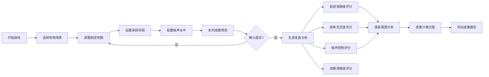

## 1. 产品概述
合成孔径雷达（SAR）拼图教育游戏，面向遥感课堂学生，通过调整航迹和采样参数完成地物图像合成，提供深度复盘分析而非简单胜负判定。
- 核心目标：让学习者理解SAR成像原理、参数影响、误差来源
- 市场价值：交互式教学工具，填补遥感理论与实践之间的鸿沟

## 2. 核心功能

### 2.1 用户角色
| 角色 | 注册方式 | 核心权限 |
|------|----------|----------|
| 学生玩家 | 无需注册，直接开始 | 游戏游玩、参数调整、复盘分析、报告导出 |

### 2.2 功能模块
1. **游戏主界面**：航迹调整、采样控制、实时回波显示、成像预览
2. **参数控制面板**：航迹偏移调节、采样间隔设置、噪声水平模拟
3. **成像合成引擎**：基于参数实时计算成像结果
4. **深度复盘系统**：分维度分析、误差溯源、计算过程展示
5. **报告导出模块**：生成完整成像报告，支持下载

### 2.3 页面详情
| 页面名称 | 模块名称 | 功能描述 |
|----------|----------|----------|
| 游戏主界面 | 航迹绘制区 | 可视化显示飞机航迹，支持拖拽调整偏移量 |
| 游戏主界面 | 回波显示区 | 实时显示雷达回波信号波形，标注采样点 |
| 游戏主界面 | 地物目标区 | 显示真实地物目标参考图（隐藏，结算时对比） |
| 游戏主界面 | 参数控制区 | 滑块调整采样间隔、航迹偏移、噪声强度 |
| 游戏主界面 | 成像预览区 | 实时预览当前参数下的合成图像 |
| 复盘分析页 | 分项评分卡片 | 航迹准确度、采样充足度、噪声控制、成像清晰度各维度 |
| 复盘分析页 | 误差溯源模块 | 采样不足/航迹偏移/噪声过高分别显示影响计算过程 |
| 复盘分析页 | 可视化对比 | 航迹对比图、回波采样对比、成像结果vs真实地物 |
| 复盘分析页 | 计算过程展示 | 显示各评分项计算公式和关键中间值 |
| 成像报告页 | 完整报告 | 整合所有数据，支持PDF导出 |

## 3. 核心流程
用户进入游戏 → 选择地物目标场景 → 调整航迹位置 → 设置采样间隔 → 添加模拟噪声 → 执行成像合成 → 查看实时预览 → 确认提交结果 → 进入深度复盘 → 浏览分项分析 → 查看计算过程 → 导出成像报告

## 4. 用户界面设计
### 4.1 设计风格
- **主色调**：深空蓝（#0A192F）配科技青（#64FFDA），体现遥感探测科技感
- **辅助色**：警报黄（#FFB703）用于采样不足提示，误差红（#FF6B6B）用于航迹偏移警告
- **按钮风格**：微立体设计，圆角4px，hover时有发光效果
- **字体**：标题使用Orbitron（科技感等宽字体），正文使用JetBrains Mono（代码字体，便于显示数值）
- **布局风格**：左中右三栏仪表盘布局，左侧参数控制、中间可视化区、右侧实时预览
- **图标风格**：线性科技风图标，配合雷达扫描动画

### 4.2 页面设计概览
| 页面名称 | 模块名称 | UI元素 |
|----------|----------|--------|
| 游戏主界面 | 航迹绘制区 | Canvas画布、飞机图标、航迹线、网格参考线、拖拽控制点 |
| 游戏主界面 | 回波显示区 | 波形图、采样点标记、时间轴、信号强度刻度 |
| 游戏主界面 | 参数控制区 | 滑块组件、数值显示框、单位标签、重置按钮 |
| 游戏主界面 | 成像预览区 | 图像画布、加载动画、质量指示器、对比切换按钮 |
| 复盘分析页 | 分项评分卡片 | 环形进度图、得分数值、维度标签、等级徽章 |
| 复盘分析页 | 计算过程区 | 公式块、中间值表格、计算步骤展开/折叠 |
| 复盘分析页 | 误差溯源模块 | 错误类型标签、影响程度热力图、改进建议 |
| 成像报告页 | 报告预览区 | A4比例布局、页眉页脚、章节标题、数据图表 |

### 4.3 响应式
- Desktop-first设计，优先适配1920×1080分辨率
- 平板端转为上下布局，控制区移至顶部
- 移动端简化显示，保留核心参数调节和结果查看

### 4.4 交互动效
- 雷达扫描动画：回波显示区有周期性扫描线效果
- 航迹调整：拖拽时有实时辅助线和距离数值显示
- 成像过程：有逐行扫描合成的动画效果
- 评分展示：数字滚动动画，环形图填充动画
- 错误提示：采样不足时显示脉冲闪烁效果
