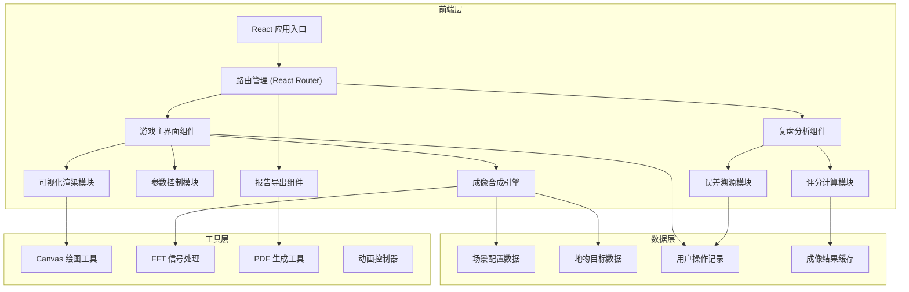

## 1. 架构设计


## 2. 技术描述
- **前端框架**: React@18 + TypeScript@5
- **构建工具**: Vite@5
- **样式方案**: TailwindCSS@3 + CSS Variables
- **状态管理**: React Context + useReducer (轻量级方案)
- **可视化**: Canvas API 原生实现 (无需引入图表库)
- **信号处理**: 自定义 FFT 实现 (简化版，用于教学演示)
- **报告导出**: jsPDF@2 + html2canvas
- **动画**: CSS Keyframes + requestAnimationFrame

## 3. 路由定义
| Route | 页面 | 主要功能 |
|-------|------|----------|
| / | 游戏主界面 | 参数调整、实时预览、成像合成 |
| /review | 复盘分析页 | 分项评分、误差溯源、计算过程展示 |
| /report | 成像报告页 | 完整报告预览、PDF导出 |

## 4. 核心数据模型
### 4.1 游戏参数模型
```typescript
interface GameParams {
  // 航迹参数
  flightPath: {
    offsetX: number;      // 横向偏移 (像素)
    offsetY: number;      // 纵向偏移 (像素)
    curvature: number;    // 航迹弯曲度
  };
  
  // 采样参数
  sampling: {
    interval: number;     // 采样间隔 (ms)
    count: number;        // 采样点数
    apertureSize: number; // 合成孔径大小
  };
  
  // 噪声参数
  noise: {
    level: number;        // 噪声强度 (0-100)
    type: 'gaussian' | 'speckle' | 'impulse';
  };
  
  // 场景选择
  sceneId: string;
}
```

### 4.2 成像结果模型
```typescript
interface ImagingResult {
  // 原始数据
  rawEcho: number[][];     // 原始回波数据
  processedImage: number[][]; // 处理后图像
  
  // 评分结果
  scores: {
    trackAccuracy: ScoreDetail;
    samplingAdequacy: ScoreDetail;
    noiseControl: ScoreDetail;
    imageClarity: ScoreDetail;
    totalScore: number;
  };
  
  // 误差分析
  errors: {
    type: 'insufficient_sampling' | 'track_deviation' | 'excessive_noise';
    severity: 'low' | 'medium' | 'high';
    impact: string;
    calculation: CalculationStep[];
  }[];
}

interface ScoreDetail {
  value: number;           // 得分 (0-100)
  weight: number;          // 权重
  calculation: CalculationStep[];
  grade: 'A' | 'B' | 'C' | 'D' | 'F';
}

interface CalculationStep {
  formula: string;         // 公式
  inputs: Record<string, number>; // 输入值
  intermediate: Record<string, number>; // 中间值
  result: number;          // 最终结果
}
```

### 4.3 场景配置模型
```typescript
interface SceneConfig {
  id: string;
  name: string;
  description: string;
  difficulty: 'easy' | 'medium' | 'hard';
  
  // 地物目标数据 (简化版灰度图)
  targetImage: number[][];
  
  // 理想参数
  idealParams: {
    trackOffset: { x: number; y: number };
    samplingInterval: number;
    noiseThreshold: number;
  };
  
  // 评分阈值
  thresholds: {
    sampling: { warning: number; critical: number };
    track: { warning: number; critical: number };
    noise: { warning: number; critical: number };
  };
}
```

## 5. 核心算法说明
### 5.1 成像合成算法 (简化SAR)
```
输入: 回波信号E(t, τ), 航迹位置P(x, y)
输出: 成像结果I(x, y)

1. 距离压缩: 对每个回波脉冲进行匹配滤波
2. 方位向处理: 利用航迹信息进行合成孔径处理
3. 图像生成: 二维IFFT转换到图像域
4. 噪声叠加: 根据噪声参数添加模拟噪声
```

### 5.2 评分计算公式
```
1. 航迹准确度 = 100 × exp(-k × |实际偏移 - 理想偏移|)
   其中 k = 0.02 (衰减系数)

2. 采样充足度:
   - 若 采样间隔 ≤ 理想间隔: 100分
   - 若 理想间隔 < 采样间隔 ≤ 2×理想间隔: 
     100 - 50 × (采样间隔/理想间隔 - 1)
   - 否则: 0分

3. 噪声控制 = 100 × (1 - 噪声水平/100)^2

4. 成像清晰度 = SSIM(合成图像, 真实图像) × 100

总分 = 0.3×航迹 + 0.3×采样 + 0.2×噪声 + 0.2×清晰度
```

### 5.3 误差溯源逻辑
- **采样不足**: 当采样间隔 > 1.5×理想间隔时触发，计算分辨率损失
- **航迹偏移**: 当偏移量 > 阈值时，计算方位向模糊程度
- **噪声过高**: 当噪声水平 > 30时，计算信噪比下降幅度

## 6. 组件结构
```
src/
├── components/
│   ├── game/
│   │   ├── FlightPathCanvas.tsx    # 航迹绘制
│   │   ├── EchoWaveform.tsx        # 回波波形显示
│   │   ├── ImagePreview.tsx        # 成像预览
│   │   └── ParamSliders.tsx        # 参数滑块组
│   ├── review/
│   │   ├── ScoreCard.tsx           # 评分卡片
│   │   ├── ErrorTraceability.tsx   # 误差溯源
│   │   └── CalculationViewer.tsx   # 计算过程展示
│   └── report/
│       ├── ReportPreview.tsx       # 报告预览
│       └── ExportButton.tsx        # 导出按钮
├── engine/
│   ├── SARImaging.ts               # SAR成像核心算法
│   ├── Scoring.ts                  # 评分计算
│   └── ErrorAnalysis.ts            # 误差分析
├── data/
│   └── scenes.ts                   # 场景配置数据
├── hooks/
│   └── useGameState.ts             # 游戏状态管理
└── types/
    └── index.ts                    # 类型定义
```

## 7. 性能考量
- 图像合成使用 Web Workers 避免阻塞主线程
- Canvas 渲染采用 requestAnimationFrame 优化
- 大计算量操作（如FFT）提供进度显示
- 图像数据采用 TypedArray 存储优化内存
