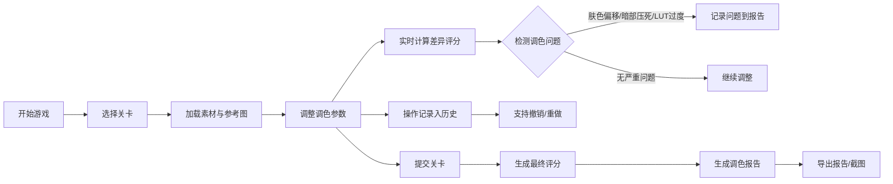

## 1. 产品概述

数字调色挑战是一款面向影视后期从业者和爱好者的调色技能训练游戏。玩家通过调整曝光、色温和LUT参数来匹配参考画面，提升调色技能。

- 核心目的：通过游戏化方式训练影视调色能力，提供即时反馈和完整的学习记录
- 目标用户：影视后期从业者、调色师、影视专业学生、视频制作爱好者
- 产品价值：将专业调色技能转化为可量化的游戏体验，支持技能成长追踪

## 2. 核心功能

### 2.1 用户角色
| 角色 | 注册方式 | 核心权限 |
|------|----------|----------|
| 玩家 | 无需注册，本地存储 | 游玩关卡、查看历史、导出报告 |

### 2.2 功能模块
1. **游戏主界面**：实时调色预览、参数控制面板、差异评分
2. **关卡系统**：多关卡素材、目标参考画面、难度递进
3. **历史记录**：操作回退、修改追踪、时间戳记录
4. **报告系统**：调色分析、问题检测、导出PDF/图片
5. **对比功能**：分屏对比、截图保存、回放记录

### 2.3 页面详情
| 页面名称 | 模块名称 | 功能描述 |
|----------|----------|----------|
| 游戏主界面 | 双画布预览区 | 左侧参考画面、右侧实时调色预览，支持分屏对比 |
| 游戏主界面 | 参数控制面板 | 曝光滑块(-2~+2)、色温滑块(2000K~10000K)、LUT选择器 |
| 游戏主界面 | 评分面板 | 实时差异百分比、相似度评分、问题检测提示 |
| 游戏主界面 | 操作工具栏 | 撤销/重做、重置、截图对比、提交关卡 |
| 历史记录面板 | 时间线列表 | 操作步骤记录、修改时间、操作者标识、参数快照 |
| 报告导出页 | 调色分析报告 | 最终分数、参数详情、问题检测（肤色偏移/暗部压死/LUT过度）、对比截图 |

## 3. 核心流程

## 4. 用户界面设计

### 4.1 设计风格
- **主色调**：深灰色(#0a0a0f)背景，专业影视工作环境
- **强调色**：赛博蓝(#00d4ff)用于评分和操作按钮
- **警示色**：橙红(#ff6b35)用于问题检测提示
- **成功色**：翠绿(#00ff88)用于高相似度提示
- **按钮风格**：扁平直角，轻微发光效果，hover时亮度提升
- **字体**：标题使用Orbitron（科技感），正文使用Roboto Mono（等宽专业感）
- **布局风格**：专业工作站布局，左右分栏，信息密度高但层次清晰
- **视觉效果**：轻微噪点纹理、扫描线效果、发光边框营造专业影视后期氛围

### 4.2 页面设计概述
| 页面名称 | 模块名称 | UI元素 |
|----------|----------|--------|
| 游戏主界面 | 双画布区 | 50%分屏布局、中间可拖动分割线、悬浮网格对齐辅助线 |
| 游戏主界面 | 参数滑块 | 垂直排列滑块、实时数值显示、刻度标记、发光轨道 |
| 游戏主界面 | 评分仪表 | 环形进度条、数字跳动动画、颜色随分数变化 |
| 历史记录 | 时间线 | 左侧时间轴、右侧操作卡片、修改痕迹高亮、悬停显示参数快照 |
| 报告页面 | 分析面板 | 问题检测卡片带图标、参数对比表格、对比截图画廊 |

### 4.3 响应性
- 桌面端优先（1920×1080及以上），针对专业工作站优化
- 支持平板横屏适配，滑块区域可折叠
- 触摸设备优化：增大滑块触控区域

## 5. 游戏机制细节

### 5.1 调色参数
- **曝光**：范围-2.0到+2.0，步长0.01，影响整体亮度
- **色温**：范围2000K（暖）到10000K（冷），步长50K
- **LUT**：预设5款风格LUT（电影感、复古、冷调、暖调、黑白），强度0-100%

### 5.2 评分算法
- 基于像素级RGB差异计算
- 加权计算：亮度40%、色彩40%、细节20%
- 相似度≥90%为S级，≥80%为A级，≥70%为B级，≥60%为C级

### 5.3 问题检测
- **肤色偏移**：检测人脸区域色偏，ΔE > 10触发警告
- **暗部压死**：直方图暗部（0-20）像素占比>30%触发警告
- **LUT过度**：LUT强度>80%且色彩饱和度过高触发警告

### 5.4 历史追踪
- 每条记录包含：时间戳、操作类型、参数前后值、操作者（本地用户名）
- 支持点击任意历史点回退到该状态
- 支持对比两个历史点的参数差异
