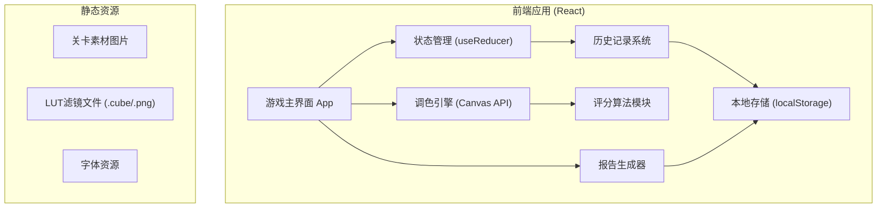

## 1. 架构设计



## 2. 技术描述

- **前端框架**: React@18 + TypeScript + Vite
- **样式方案**: TailwindCSS@3 + CSS Variables
- **调色核心**: HTML5 Canvas 2D API + 像素级处理
- **状态管理**: React useReducer + useContext（轻量方案）
- **图片处理**: 原生Canvas API实现LUT应用、色温/曝光调整
- **报告导出**: html2canvas + jsPDF 生成PDF报告
- **本地存储**: localStorage 存储历史记录和关卡进度
- **初始化工具**: npm create vite@latest

## 3. 目录结构

```
src/
├── components/
│   ├── CanvasPreview.tsx      # 双画布预览组件
│   ├── ParameterSlider.tsx    # 参数滑块组件
│   ├── ScorePanel.tsx         # 评分面板
│   ├── HistoryTimeline.tsx    # 历史时间线
│   ├── LUTSelector.tsx        # LUT选择器
│   ├── ReportModal.tsx        # 报告弹窗
│   └── LevelSelect.tsx        # 关卡选择
├── hooks/
│   ├── useColorGrading.ts     # 调色核心逻辑
│   ├── useHistory.ts          # 历史记录管理
│   └── useScoring.ts          # 评分算法
├── utils/
│   ├── colorMath.ts           # 色彩计算工具
│   ├── lutProcessor.ts        # LUT处理
│   ├── reportGenerator.ts     # 报告生成
│   └── imageUtils.ts          # 图片处理工具
├── types/
│   └── index.ts               # TypeScript类型定义
├── data/
│   ├── levels.ts              # 关卡数据
│   └── luts.ts                # LUT预设数据
├── App.tsx
└── main.tsx
```

## 4. 路由定义

| 路由 | 页面组件 | 用途 |
|------|----------|------|
| / | GameApp | 游戏主界面（包含所有功能模块） |

## 5. 数据模型

### 5.1 类型定义

```typescript
// 调色参数
interface ColorParams {
  exposure: number;      // -2.0 ~ +2.0
  temperature: number;   // 2000 ~ 10000 (K)
  lutId: string | null;
  lutIntensity: number;  // 0 ~ 100
}

// 历史记录项
interface HistoryEntry {
  id: string;
  timestamp: number;
  actionType: 'exposure' | 'temperature' | 'lut' | 'reset' | 'revert';
  params: ColorParams;
  previousParams?: ColorParams;
  operator: string;
  note?: string;
}

// 问题检测
interface IssueDetected {
  type: 'skin_shift' | 'shadows_clipped' | 'lut_overdose';
  severity: 'warning' | 'error';
  message: string;
  value: number;
}

// 评分结果
interface ScoreResult {
  overall: number;       // 0 ~ 100
  brightness: number;
  color: number;
  detail: number;
  grade: 'S' | 'A' | 'B' | 'C' | 'D';
  issues: IssueDetected[];
}

// 关卡数据
interface Level {
  id: string;
  name: string;
  difficulty: 1 | 2 | 3;
  sourceImage: string;
  targetImage: string;
  targetParams: ColorParams;
  description: string;
}

// 调色报告
interface GradingReport {
  id: string;
  levelId: string;
  timestamp: number;
  finalParams: ColorParams;
  score: ScoreResult;
  history: HistoryEntry[];
  comparisonScreenshot: string;
  notes: string;
}
```

### 5.2 本地存储结构

```
localStorage:
  - color_challenge_history: HistoryEntry[]    # 当前关卡操作历史
  - color_challenge_reports: GradingReport[]   # 已生成的报告列表
  - color_challenge_progress: {                # 关卡进度
      [levelId]: {
        bestScore: number,
        completed: boolean,
        attempts: number
      }
    }
```

## 6. 核心算法

### 6.1 曝光调整算法
```
每个像素RGB值乘以 2^exposure 值
然后钳制在 [0, 255] 范围内
```

### 6.2 色温调整算法
```
基于色温转RGB矩阵：
1. 将色温转换为XYZ色彩空间
2. 转换为RGB调整系数
3. 对每个像素应用R/G/B通道增益
```

### 6.3 差异评分算法
```
1. 计算两张图所有像素的RGB差异
2. 转换为Lab色彩空间计算ΔE
3. 加权平均：亮度40% + 色彩40% + 细节20%
4. 映射到0-100分制
```

### 6.4 LUT应用算法
```
使用3D LUT tetrahedral interpolation:
1. 根据像素RGB值定位LUT中的立方体位置
2. 计算在立方体中的相对位置
3. 使用四面体插值计算最终颜色值
4. 按强度与原图混合
```
