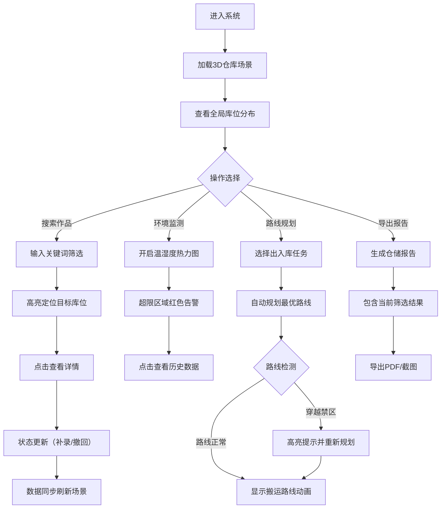

## 1. 产品概述

艺术仓库库位孪生系统 - 基于Web3D的智能仓储可视化管理平台，通过三维数字化方式呈现艺术品仓储环境，实现库位导航、环境监测、路线规划的一体化管理，大幅提升艺术品出入库效率，减少人工翻箱查找成本。

- 核心价值：将实体仓库1:1数字化孪生，实现可视化管理与智能决策
- 目标用户：美术馆典藏人员、艺术品仓储管理员、物流调度人员
- 解决痛点：传统仓库管理依赖人工记忆与纸质记录，查找效率低，温湿度监控不直观，搬运路线缺乏科学规划

## 2. 核心功能

### 2.1 用户角色

| 角色 | 注册方式 | 核心权限 |
|------|----------|----------|
| 仓储管理员 | 系统分配 | 完整权限：库位管理、温湿度监控、路线规划、报告导出 |
| 典藏人员 | 系统分配 | 查询权限：作品搜索、状态查看、路线预览 |
| 搬运人员 | 系统分配 | 执行权限：路线导航、状态更新、任务确认 |

### 2.2 功能模块

1. **3D仓库孪生场景**：货架、库位、作品箱三维可视化展示，自由漫游查看
2. **环境监测系统**：温湿度实时热力图，超限区域高亮预警
3. **智能路线规划**：出入库路线自动规划，禁区穿越检测与告警
4. **作品管理系统**：作品信息查询、库位搜索、状态筛选
5. **仓储报告中心**：异常统计、操作日志、截图导出、PDF报告生成

### 2.3 页面详情

| 页面名称 | 模块名称 | 功能描述 |
|----------|----------|----------|
| 主界面 | 3D场景区 | 全视角3D仓库展示，支持缩放、旋转、平移，点击交互 |
| 主界面 | 左侧控制面板 | 筛选条件面板：按区域、状态、温湿度范围、作品类型筛选 |
| 主界面 | 右侧信息面板 | 悬浮详情：库位/作品箱详细信息，温湿度历史曲线 |
| 主界面 | 顶部工具栏 | 搜索框、视角切换、热力图开关、路线模式、导出按钮 |
| 主界面 | 底部状态栏 | 当前筛选结果统计、异常告警列表、实时时间 |
| 报告弹窗 | 仓储报告 | 异常统计图表、操作日志、截图预览、PDF导出 |

## 3. 核心流程

## 4. 用户界面设计

### 4.1 设计风格

- **主色调**：深蓝灰色系 (#0F172A, #1E293B) 营造专业仓储管理氛围
- **强调色**：科技蓝 (#3B82F6) 用于交互元素，警戒红 (#EF4444) 用于异常告警，安全绿 (#10B981) 用于正常状态
- **辅助色**：琥珀黄 (#F59E0B) 用于温湿度热力过渡
- **按钮风格**：极简直角按钮，悬停时细微发光效果
- **字体**：标题使用 Space Grotesk，正文使用 JetBrains Mono，营造科技感与数据感
- **布局风格**：沉浸式3D场景为主体，半透明控制面板悬浮四周
- **图标风格**：线性图标 lucide-react，统一2px线宽

### 4.2 页面设计概述

| 页面名称 | 模块名称 | UI 元素 |
|----------|----------|---------|
| 主界面 | 3D场景区 | 暗色背景、聚光灯光效、金属质感货架、玻璃透明作品箱、发光路线、雾化景深效果 |
| 主界面 | 左侧面板 | 半透明毛玻璃效果、圆角8px、滚动条自定义、折叠动画 |
| 主界面 | 右侧面板 | 渐变边框、详情卡片、数据图表、实时数据跳动动画 |
| 主界面 | 顶部工具栏 | 搜索框自动补全、下拉筛选菜单、开关按钮、图标工具栏 |
| 主界面 | 底部状态栏 | 横向滚动告警条、计数徽章、状态指示灯 |

### 4.3 响应式

- 桌面端优先设计（1920x1080及以上）
- 平板适配：面板自适应宽度，触控优化
- 触控操作：双指缩放、单指旋转、长按选中
- 性能降级：低配设备自动降低3D渲染质量

### 4.4 3D场景指导

- **环境氛围**：工业风仓库，顶灯阵列照明，地面反光材质
- **光照设置**：主方向光 + 区域光（模拟顶灯）+ 环境光，阴影开启
- **相机设置**：轨道控制器，默认45度俯视角，阻尼平滑效果
- **构图焦点**：仓库中心区域，可快速切换到任意货架
- **交互动画**：选中库位时轻微上浮发光，鼠标悬停显示外框，路线动画匀速移动
- **后处理效果**：Bloom发光、轻微色差、景深（聚焦选中物体）
- **性能预算**：三角面数控制在5万以内，Draw Call < 100
