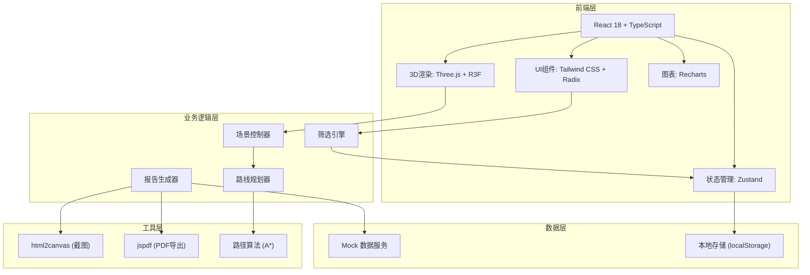
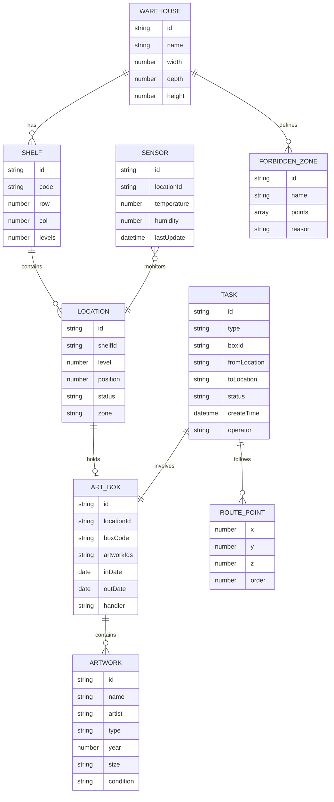

## 1. 架构设计



## 2. 技术说明

- **前端框架**: React@18 + TypeScript + Vite
- **3D引擎**: three@0.160, @react-three/fiber@8, @react-three/drei@9, @react-three/postprocessing@2
- **样式方案**: tailwindcss@3, @radix-ui/react-*
- **状态管理**: zustand@4
- **图表库**: recharts@2
- **工具库**: html2canvas, jspdf, lodash-es
- **后端**: 无后端，纯前端Mock数据驱动
- **数据存储**: localStorage 持久化操作记录

## 3. 路由定义

| 路由 | 用途 |
|------|------|
| / | 主界面 - 3D仓库孪生场景 |

## 4. 数据模型

### 4.1 数据模型定义



### 4.2 Mock 数据结构

**仓库配置**
```typescript
interface Warehouse {
  id: string;
  name: string;
  dimensions: { width: number; depth: number; height: number };
  shelves: Shelf[];
  forbiddenZones: ForbiddenZone[];
}
```

**库位与作品箱**
```typescript
interface Shelf {
  id: string;
  code: string; // 如 A-01, B-03
  position: { x: number; z: number };
  levels: number;
  positionsPerLevel: number;
}

interface Location {
  id: string;
  shelfId: string;
  level: number;
  position: number;
  code: string; // 如 A-01-L2-P03
  status: 'empty' | 'occupied' | 'reserved' | 'maintenance';
  zone: 'normal' | 'constant_temp' | 'valuables';
  box?: ArtBox;
  sensor?: SensorData;
}

interface ArtBox {
  id: string;
  code: string; // 箱号：BX-2024-00156
  artworks: Artwork[];
  inDate: string;
  expectedOutDate?: string;
  actualOutDate?: string;
  handler: string;
  notes?: string;
  status: 'in_stock' | 'outbound' | 'pending' | 'returned';
}
```

**环境监测**
```typescript
interface SensorData {
  locationId: string;
  temperature: number; // 摄氏度
  humidity: number; // 百分比
  lastUpdate: string;
  history: { time: string; temp: number; humidity: number }[];
  alerts: { type: 'temp_high' | 'temp_low' | 'humid_high' | 'humid_low'; level: 'warning' | 'critical' }[];
}
```

**任务与路线**
```typescript
interface Task {
  id: string;
  type: 'inbound' | 'outbound' | 'transfer';
  boxId: string;
  fromLocation: string;
  toLocation: string;
  status: 'pending' | 'in_progress' | 'completed' | 'cancelled';
  route: RoutePoint[];
  hasForbiddenCrossing: boolean;
  createTime: string;
  operator: string;
  operationLog: { action: string; time: string; operator: string; remark?: string }[];
}

interface RoutePoint {
  x: number;
  y: number;
  z: number;
}
```

## 5. 核心算法

### 5.1 温湿度热力图计算
- 根据传感器数据插值计算整个空间的温度分布
- 使用颜色映射：蓝(冷)→绿(正常)→黄(警告)→红(超限)

### 5.2 路径规划算法
- A* 寻路算法，考虑禁区规避
- 曼哈顿距离作为启发函数
- 多层货架间路径需包含电梯/楼梯节点

### 5.3 异常检测逻辑
- 箱位重复检测：同一库位分配多个箱子时触发
- 温湿度超限：温度 > 25℃ 或 < 18℃，湿度 > 60% 或 < 40%
- 路线穿越禁区：规划路径与禁区多边形相交时告警
