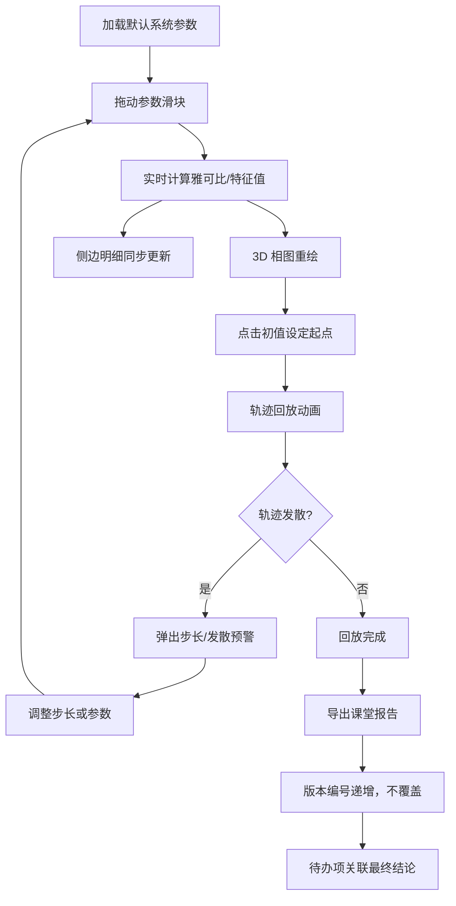

## 1. 产品概述

**微分方程相图岛** — 面向数学可视化课堂的交互式二维动力系统相图探索平台。学生通过拖动参数滑块实时观察相轨线、平衡点和稳定区域的变化，3D 相图视图与侧边明细面板同步联动。
- 解决传统课堂中参数-相图关系难以直观感受的教学痛点
- 目标用户：高校数学/力学教师与学生，支持课堂演示与自主探索

## 2. 核心功能

### 2.1 用户角色
| 角色 | 使用方式 | 核心权限 |
|------|----------|----------|
| 教师 | 直接访问 | 调参、标注、轨迹回放、导出报告、管理待办 |
| 学生 | 直接访问 | 调参、观察、轨迹回放、导出个人报告 |

### 2.2 功能模块
1. **主画布页**：3D 相图视图、参数滑块面板、平衡点标注、稳定区域着色、轨迹回放控件
2. **侧边明细面板**：当前系统方程、雅可比矩阵、特征值、平衡点分类、待办事项提示

### 2.3 页面详情
| 页面名称 | 模块名称 | 功能描述 |
|----------|----------|----------|
| 主画布页 | 3D 相图视图 | Three.js 渲染相平面，叠加相轨线、向量场、平衡点标记、稳定区域着色；支持旋转/缩放 |
| 主画布页 | 参数滑块面板 | a/b/c/d 四参数实时调节，步长选择（Euler/RK4），时间范围设置，初值拖拽设定 |
| 主画布页 | 轨迹回放控件 | 播放/暂停/步进/重置，速度调节，当前步数与时间显示，发散预警提示 |
| 主画布页 | 稳定性标注 | 自动计算雅可比矩阵与特征值，标注平衡点类型（稳定结/不稳定结/鞍点/焦点/中心），颜色编码稳定区域 |
| 侧边明细面板 | 系统信息卡 | 显示方程组、雅可比矩阵、特征值/特征向量、det/tr 判据、平衡点列表 |
| 侧边明细面板 | 待办与版本管理 | 缺失资料记录（编号待补），晚到材料不覆盖已有版本，待办→结论联动 |
| 报告导出弹窗 | 课堂报告生成 | 导出当前参数快照、相图截图、平衡点分析、轨迹数据为 JSON/PNG，版本号自动递增 |

## 3. 核心流程

用户打开页面后，默认加载一组二维线性系统参数。拖动滑块改变参数，3D 相图实时重绘；侧边面板同步更新方程、特征值和平衡点分类。用户可点击"轨迹回放"按钮观看从选定初值出发的轨线动画。发现步长过大或轨迹发散时，系统弹出预警。课堂结束时，用户导出报告，系统自动管理版本编号，确保重复编号或晚到材料不覆盖前版。

## 4. 用户界面设计

### 4.1 设计风格
- **主色调**：深海蓝 (#0A1628) + 珊瑚橙 (#FF6B4A) 作为强调色
- **辅助色**：青碧 (#00D4AA) 用于稳定区域，琥珀 (#FFB84D) 用于预警
- **按钮风格**：圆角胶囊形，微光泽质感，hover 时发光边框
- **字体**：标题用 JetBrains Mono（等宽科学感），正文用 Noto Sans SC
- **布局**：左侧大画布 + 右侧可折叠明细面板，桌面优先
- **图标**：Lucide 图标库
- **动效**：参数变化时相轨线平滑过渡，平衡点出现/消失带缩放动画

### 4.2 页面设计概览
| 页面名称 | 模块名称 | UI 元素 |
|----------|----------|----------|
| 主画布页 | 3D 相图视图 | 深色背景网格平面，渐变色轨线，发光平衡点标记，半透明稳定区域着色，可旋转/缩放 |
| 主画布页 | 参数滑块面板 | 4 列水平滑块组（a/b/c/d），步长下拉，初值输入框，参数预设按钮 |
| 主画布页 | 轨迹回放控件 | 底部播放条：播放/暂停/步进按钮，进度条，速度旋钮，时间/步数显示 |
| 侧边明细面板 | 系统信息卡 | 暗色卡片，等宽字体显示矩阵/特征值，彩色标签标注平衡点类型 |
| 侧边明细面板 | 待办与版本管理 | 列表项带状态标记（待补/已补/晚到），版本号标签，待办→结论链接 |
| 报告导出弹窗 | 课堂报告生成 | 模态弹窗，参数摘要表，预览缩略图，格式选择，导出按钮 |

### 4.3 响应式策略
- 桌面优先设计，最小宽度 1024px
- 侧边面板可折叠/展开
- 移动端暂不作为主要目标

### 4.4 3D 场景指引
- **环境**：深空背景，微弱星空粒子，营造"岛屿"氛围
- **光照**：柔和环境光 + 定向光，平衡点处点光源
- **相机**：45° 俯视透视相机，可鼠标旋转/缩放，默认看向原点
- **构图**：相平面网格为主舞台，轨线环绕如岛屿海岸线，平衡点如灯塔
- **交互**：鼠标悬停平衡点显示详情，拖拽初值点改变起点
- **后处理**：泛光效果（Bloom）用于轨线和平衡点发光，增加视觉冲击力
- **性能**：轨线点数控制在 2000 以内，稳定区域用简化几何体