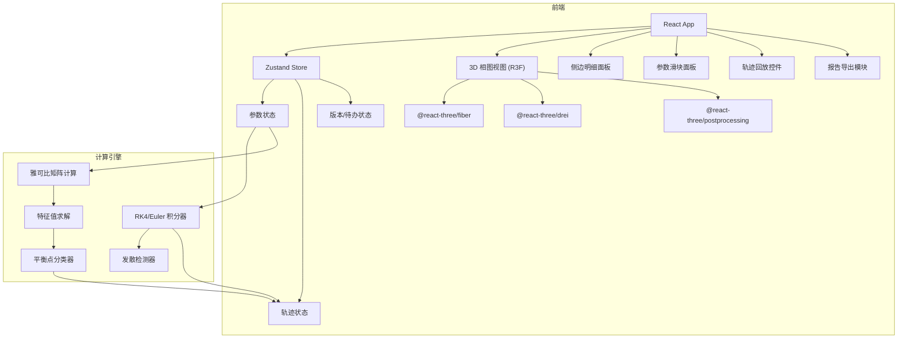

## 1. 架构设计



## 2. 技术说明
- **前端**：React@18 + TypeScript + Tailwind CSS@3 + Vite
- **初始化工具**：vite-init (react-ts 模板)
- **3D 渲染**：three + @react-three/fiber + @react-three/drei + @react-three/postprocessing
- **状态管理**：Zustand
- **数学计算**：纯前端实现（无需后端），RK4/Euler 积分、特征值计算均在浏览器端完成
- **后端**：无（纯前端项目）

## 3. 路由定义
| 路由 | 用途 |
|------|------|
| / | 主画布页，包含 3D 相图、参数面板、侧边明细、回放控件 |

## 4. 数据模型（前端 Zustand Store）

### 4.1 核心状态定义

```typescript
interface SystemParams {
  a: number;
  b: number;
  c: number;
  d: number;
}

interface EquilibriumPoint {
  id: string;
  x: number;
  y: number;
  type: 'stable_node' | 'unstable_node' | 'saddle' | 'stable_spiral' | 'unstable_spiral' | 'center';
  eigenvalues: [number, number];
  eigenvectors: [[number, number], [number, number]];
}

interface TrajectoryPoint {
  t: number;
  x: number;
  y: number;
}

interface InitialCondition {
  x0: number;
  y0: number;
}

interface SimulationConfig {
  method: 'euler' | 'rk4';
  dt: number;
  tMax: number;
}

interface PendingItem {
  id: string;
  label: string;
  status: 'missing' | 'supplemented' | 'late';
  version: number;
  description: string;
  linkedConclusionId: string | null;
}

interface ReportVersion {
  version: number;
  timestamp: number;
  params: SystemParams;
  equilibria: EquilibriumPoint[];
  trajectorySnapshot: TrajectoryPoint[];
  pendingItems: PendingItem[];
}

interface AppStore {
  params: SystemParams;
  initialCondition: InitialCondition;
  simConfig: SimulationConfig;
  trajectories: TrajectoryPoint[];
  equilibria: EquilibriumPoint[];
  playbackState: 'idle' | 'playing' | 'paused';
  playbackStep: number;
  playbackSpeed: number;
  divergenceWarning: boolean;
  pendingItems: PendingItem[];
  reportVersions: ReportVersion[];
  sidePanelOpen: boolean;
}
```

### 4.2 版本管理规则
- 报告导出时自动递增版本号，不覆盖已有版本
- 待办项编号与报告版本关联，晚到材料追加为新版本条目
- 重复编号检测：若发现已有同编号记录，自动附加后缀（如 `R3-v2`）而非覆盖

### 4.3 待办与结论联动
- 样例数据中包含一条"需补资料"记录（status: 'missing'），其 `linkedConclusionId` 初始为 null
- 用户补充资料后，状态变为 'supplemented'，`linkedConclusionId` 指向最终结论记录
- 晚到材料（status: 'late'）追加为新条目，保留原始记录不变

## 5. 计算引擎设计

### 5.1 积分方法
- **Euler 法**：`x_{n+1} = x_n + dt * f(x_n, y_n)`
- **RK4 法**：经典四阶 Runge-Kutta，更高精度

### 5.2 平衡点分类
- 对于系统 `dx/dt = ax + by, dy/dt = cx + dy`：
  - 唯一平衡点在原点 (0, 0)
  - 雅可比矩阵 J = [[a, b], [c, d]]
  - 特征值 λ = (tr ± sqrt(tr² - 4det)) / 2
  - 分类判据：det(J) > 0, tr(J) < 0 → 稳定结/焦点；det(J) < 0 → 鞍点；det(J) = 0 → 退化；tr = 0, det > 0 → 中心

### 5.3 发散检测
- 当 |x| 或 |y| 超过阈值（如 100）时标记发散
- 步长过大时弹出预警提示

## 6. 关键技术决策
- 3D 渲染使用 @react-three/fiber 而非原生 Three.js，便于 React 组件化管理
- 轨线用 `Line` 组件绘制，平衡点用 `Sphere` + `Billboard` 标签
- 稳定区域用半透明 `Plane` 几何体着色
- 后处理使用 `Bloom` 效果增强轨线与平衡点视觉表现
- 所有数学计算纯前端实现，无需服务端