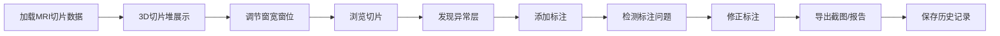

# MRI 3D 工作台 产品需求文档

## 1. 产品概述

医学物理课MRI切片3D可视化工作台，帮助学生理解核磁共振成像原理，通过交互式3D切片堆学习窗宽窗位调节、异常标注等操作，掌握医学影像分析技能。

- 核心价值：
- 将静态MRI切片转化为可交互的3D教学工具
- 支持多人协作材料管理，模拟真实临床工作流
- 强调错误可追溯，培养问题定位与修正能力

## 2. 产品目标：
- 医学物理专业学生
- 医学影像教学场景

## 2. 核心功能

### 2.1 用户角色

| 角色 | 注册方式 | 核心权限 |
|------|----------|---------|
| 学生用户 | 无需注册，本地使用 | 3D浏览、窗宽调节、标注、导出 |

### 2.2 功能模块

1. **3D切片堆工作台
2. **窗宽窗位控制台
3. **层级标注系统
4. **历史记录与协作面板
5. **截图导出工具

### 2.3 页面详情

| 页面名称 | 模块名称 | 功能描述 |
|-----------|----------|------------|
| 主工作台 | 3D切片堆 | 可旋转3D视图、切片筛选、层厚调节 |
| 主工作台 | 窗宽窗位控制 | 实时调节、预设窗位、直方图显示 |
| 主工作台 | 标注面板 | 异常层标注、标注点漂移检测、标注修正 |
| 主工作台 | 协作面板 | 历史记录、病例备注、课堂材料管理 |
| 主工作台 | 导出工具 | 截图导出、标注导出、历史导出 |

## 3. 核心流程

## 4. 用户界面设计

### 4.1 设计风格
- **主色调：深蓝科技感，医疗专业感
- **配色**：深蓝 (#0f172a 深灰背景，配青色 (#06b6d4 高亮
- **按钮风格**：圆角矩形，轻微悬浮效果
- **字体**：JetBrains Mono 等宽字体 + Space Grotesk 显示字体
- **布局风格**：三栏布局，左侧控制面板，中央3D视图，右侧协作面板
- **图标**：lucide-react 线性图标

### 4.2 页面设计概览

| 页面名称 | 模块名称 | UI元素 |
|---------|---------|--------|
| 主工作台 | 3D视图区 | 深色背景、3D切片堆叠、旋转交互、悬停高亮 |
| 主工作台 | 控制面板 | 滑块控件、参数显示、实时反馈 |
| 主工作台 | 协作面板 | 时间线、备注卡片、错误标记 |

### 4.3 响应式
- 桌面端优先，支持平板适配
- 触控设备支持手势旋转

### 4.4 3D场景指引
- **环境**：深色医疗场景，模拟医院控制室氛围
- **光照**：柔和环境光 + 方向光突出切片边缘
- **相机**：透视相机，支持轨道控制
- **交互**：鼠标拖拽旋转，滚轮缩放，中键平移
- **后处理**：Bloom效果突出标注点
- **资产**：程序生成MRI模拟数据，真实感材质
