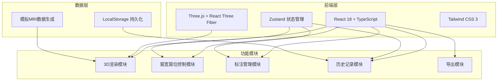
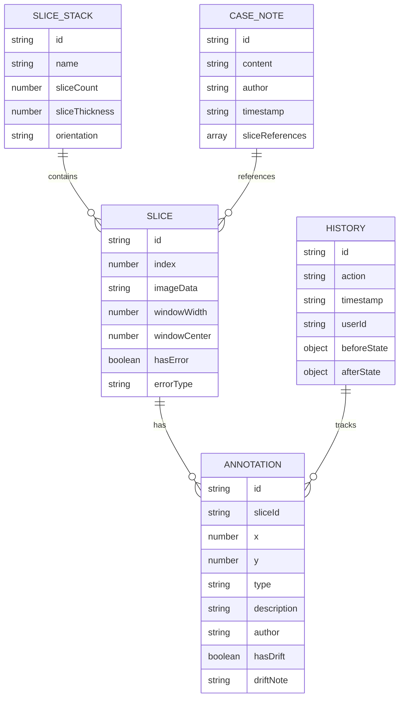

# MRI 3D 工作台 技术架构文档

## 1. 架构设计



## 2. 技术选型

- **前端框架**：React@18 + TypeScript
- **构建工具**：Vite
- **3D渲染**：three, @react-three/fiber, @react-three/drei, @react-three/postprocessing
- **状态管理**：zustand
- **样式方案**：tailwindcss@3
- **图标库**：lucide-react
- **后端**：无（纯前端应用，数据本地存储）
- **数据存储**：LocalStorage + IndexedDB（可选）

## 3. 路由定义

| 路由 | 用途 |
|------|------|
| / | 主工作台页面 |

## 4. 数据模型

### 4.1 数据模型定义



### 4.2 TypeScript 类型定义

```typescript
// MRI 切片
interface Slice {
  id: string;
  index: number;
  imageData: string;
  windowWidth: number;
  windowCenter: number;
  hasError: boolean;
  errorType?: 'sequence_error' | 'window_lost' | 'drift_detected';
  errorNote?: string;
}

// 标注点
interface Annotation {
  id: string;
  sliceId: string;
  x: number;
  y: number;
  type: 'lesion' | 'artifact' | 'note';
  description: string;
  author: string;
  timestamp: string;
  hasDrift: boolean;
  originalPosition?: { x: number; y: number };
}

// 病例备注
interface CaseNote {
  id: string;
  content: string;
  author: string;
  timestamp: string;
  sliceReferences: string[];
}

// 历史记录
interface HistoryRecord {
  id: string;
  action: 'window_adjust' | 'annotation_add' | 'annotation_edit' | 'slice_reorder' | 'note_add';
  timestamp: string;
  author: string;
  beforeState: any;
  afterState: any;
}

// 应用状态
interface AppState {
  slices: Slice[];
  annotations: Annotation[];
  caseNotes: CaseNote[];
  history: HistoryRecord[];
  currentWindowWidth: number;
  currentWindowCenter: number;
  selectedSlice: string | null;
  selectedAnnotation: string | null;
}
```

## 5. 项目结构

```
src/
├── components/
│   ├── viewer/
│   │   ├── SliceStack3D.tsx      # 3D切片堆渲染
│   │   ├── SlicePlane.tsx        # 单个切片平面
│   │   └── SceneSetup.tsx        # 3D场景配置
│   ├── controls/
│   │   ├── WindowControl.tsx     # 窗宽窗位控制
│   │   ├── SliceFilter.tsx       # 切片筛选
│   │   └── ThicknessControl.tsx  # 层厚控制
│   ├── annotation/
│   │   ├── AnnotationPanel.tsx   # 标注面板
│   │   ├── AnnotationMarker.tsx  # 标注标记
│   │   └── DriftDetector.tsx     # 漂移检测
│   ├── collaboration/
│   │   ├── HistoryPanel.tsx      # 历史记录
│   │   ├── CaseNotes.tsx         # 病例备注
│   │   └── ErrorTimeline.tsx     # 错误时间线
│   └── export/
│       ├── ScreenshotExporter.tsx # 截图导出
│       └── ReportExporter.tsx    # 报告导出
├── hooks/
│   ├── useWindowLevel.ts         # 窗宽窗位hook
│   ├── useAnnotation.ts          # 标注管理hook
│   └── useHistory.ts             # 历史记录hook
├── store/
│   └── useAppStore.ts            # Zustand状态管理
├── utils/
│   ├── mriGenerator.ts           # MRI模拟数据生成
│   ├── windowLevel.ts            # 窗宽窗位算法
│   └── exportUtils.ts            # 导出工具
├── types/
│   └── index.ts                  # 类型定义
├── pages/
│   └── Workbench.tsx             # 主工作台页面
└── App.tsx
```
