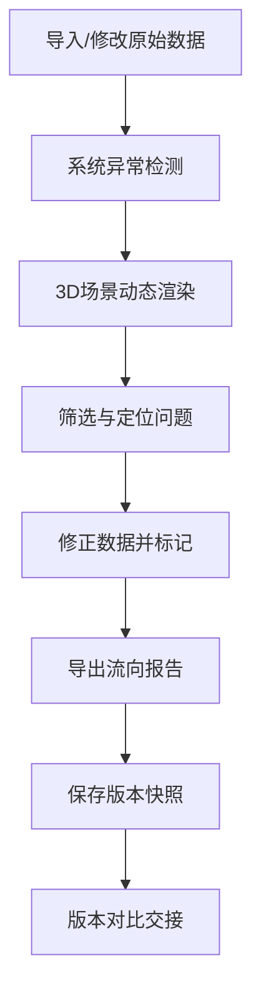

## 1. 产品概述
园区低碳办碳交易流向3D可视化工作台，用于企业碳配额、交易流水和履约缺口的动态展示与分析。解决静态报表无法直观呈现碳流动态关系的问题，支持月底/课前数据整理与交接。

## 2. 核心 Features

### 2.1 User Roles
| 角色 | 使用场景 | 核心权限 |
|------|----------|----------|
| 低碳办管理员 | 月底数据整理、履约核查 | 完整操作权限、数据编辑、报告导出 |
| 企业对接人 | 查看本企业碳数据 | 只读权限、筛选本企业数据 |
| 新接手人员 | 交接工作、理解历史数据 | 版本对比、问题追溯 |

### 2.2 Feature Module
1. **3D流向工作台**: 可旋转3D场景、企业节点、配额交易流线、履约缺口高亮
2. **时间切片控制**: 按履约期/月份切换数据视图，动画播放时间轴
3. **筛选联动面板**: 企业筛选、履约期筛选、数据类型筛选，与3D视角联动
4. **问题定位系统**: 配额重复扣、履约期错位、流线遮挡的自动检测与标记
5. **企业明细面板**: 点击企业节点显示详细配额、交易、缺口数据
6. **报告导出系统**: 生成流向报告，支持PDF/Excel导出
7. **版本对比功能**: 原始数据修改前后的结果差异可视化对比

### 2.3 Page Details
| 页面名称 | 模块名称 | Feature description |
|-----------|-------------|---------------------|
| 3D工作台主页面 | 3D场景画布 | Three.js 3D渲染，OrbitControls旋转缩放，流线动画，节点交互 |
| 3D工作台主页面 | 顶部控制栏 | 时间轴播放器、履约期切换、视图预设、导出按钮 |
| 3D工作台主页面 | 左侧筛选面板 | 企业多选、数据类型筛选、缺口阈值设置、问题高亮开关 |
| 3D工作台主页面 | 右侧明细面板 | 企业基本信息、配额明细、交易流水、履约缺口、问题说明 |
| 3D工作台主页面 | 底部状态栏 | 当前统计数据、时间节点、问题数量提示 |
| 版本对比模态框 | 差异对比视图 | 双栏3D场景对比、数据差异高亮、变更记录列表 |

## 3. Core Process

### 3.1 月底整理流程
用户导入或修改原始数据 → 系统自动检测异常问题 → 3D场景动态渲染 → 用户筛选定位问题 → 修正数据（标记解释）→ 导出流向报告 → 保存版本

### 3.2 交接流程
新用户打开工作台 → 选择历史版本 → 查看数据说明和问题标记 → 对比不同版本差异 → 理解业务逻辑 → 接手工作

## 4. User Interface Design

### 4.1 Design Style
- **主色调**: 深邃科技蓝 (#0A1628) 作为背景，配合荧光绿 (#00FF9D) 表示正常配额，警示橙 (#FF8A00) 表示预警，危险红 (#FF3B3B) 表示缺口
- **辅助色**: 流光紫 (#9D4EDD) 用于交易流线，冰蓝 (#00D4FF) 用于选中高亮
- **按钮风格**: 极简圆角矩形，悬停时有光效，激活状态有呼吸灯动画
- **字体**: 标题使用 Orbitron 科技感字体，正文使用 Inter 清晰易读
- **布局风格**: 深色沉浸式布局，面板半透明玻璃拟态，3D场景占70%空间，控制面板悬浮四周
- **图标风格**: 线性简约图标，配合发光效果

### 4.2 Page Design Overview
| 页面名称 | 模块名称 | UI Elements |
|-----------|-------------|-------------|
| 3D工作台主页面 | 3D场景画布 | 深空背景、星云粒子效果、企业节点球体、发光流线动画、缺口脉冲标记 |
| 3D工作台主页面 | 顶部控制栏 | 半透明玻璃面板、时间轴滑块、播放/暂停按钮、履约期下拉菜单、视图预设、导出下拉 |
| 3D工作台主页面 | 左侧筛选面板 | 可折叠抽屉、企业搜索框、复选框列表、滑块控件、开关按钮 |
| 3D工作台主页面 | 右侧明细面板 | 可折叠抽屉、企业名称卡片、数据表格、进度条、问题标记标签、修正按钮 |
| 3D工作台主页面 | 底部状态栏 | 数据统计胶囊、时间节点显示、问题数量徽章 |
| 版本对比模态框 | 差异对比视图 | 左右分栏3D场景、差异连接线、数据变更表格、版本选择器 |

### 4.3 Responsiveness
- 桌面端优先设计（1920×1080及以上）
- 平板端自适应：面板改为可全屏切换
- 移动端：简化为数据列表模式，3D场景降级为2D拓扑图

### 4.4 3D Scene Guidance
- **环境**: 深空渐变背景 + 随机星点粒子，营造"河图"神秘感
- **光照**: 环境光 + 半球光提供基础照明，每个企业节点有自发光，流线使用发光材质
- **相机**: PerspectiveCamera，初始视角为45°俯视角，OrbitControls支持阻尼旋转
- **构图**: 企业节点按行业集群分布在环形区域，中心为园区低碳办节点，流线呈放射状流动
- **交互**: 悬停节点显示信息标签，点击选中并高亮，双击聚焦视角，流线点击高亮对应交易
- **动画**: 流线粒子流动动画、缺口节点脉冲动画、时间切换时的场景过渡动画、节点选中的弹跳动画
- **后处理**: Bloom泛光效果（增强发光质感）、FXAA抗锯齿、轻微色差增加科技感
- **性能**: 企业节点使用InstancedMesh，流线使用TubeGeometry + 动态UV，限制最大节点数50个

## 5. 数据需求

### 5.1 模拟数据实体
- **企业**: id, name, industry, quota, used, position (3D坐标)
- **配额分配**: id, enterpriseId, period, amount, date
- **交易流水**: id, fromId, toId, amount, price, date, period
- **履约期**: id, name, startDate, endDate, status
- **履约缺口**: id, enterpriseId, period, required, actual, gap, issues
- **问题记录**: id, type (重复扣/错位/遮挡), description, severity, status, fixNote
- **版本快照**: id, timestamp, dataHash, description, diffFromPrev
