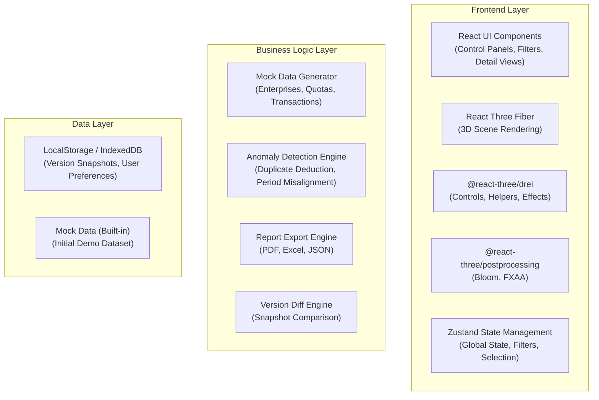
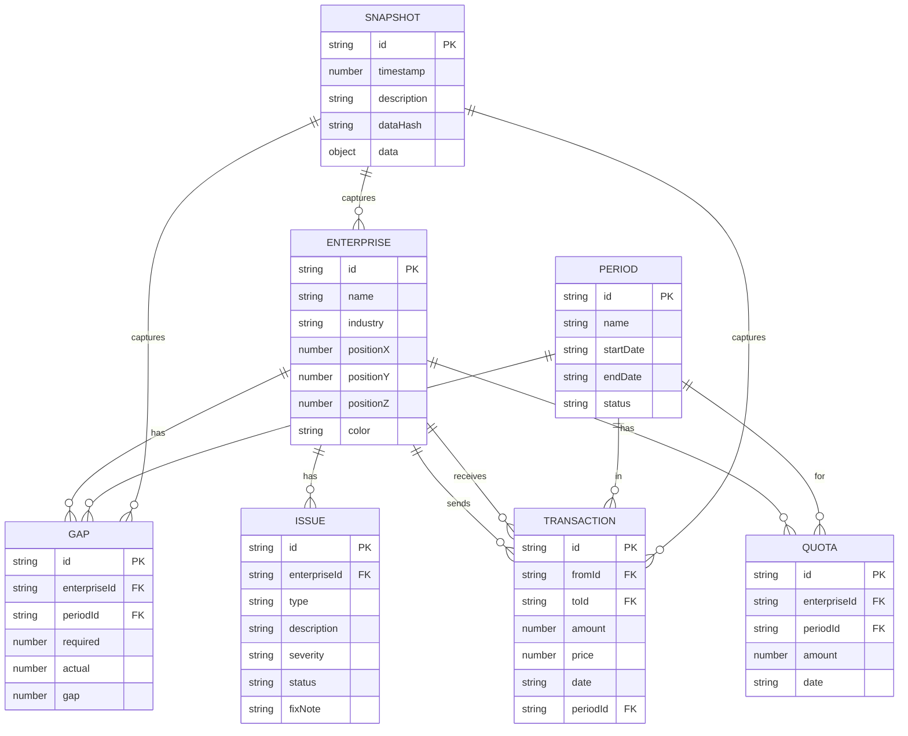

## 1. Architecture Design



## 2. Technology Description

- **Frontend Framework**: React@18 + TypeScript
- **Build Tool**: Vite@5
- **Styling**: TailwindCSS@3 + CSS Variables
- **3D Engine**: three@0.160, @react-three/fiber@8, @react-three/drei@9, @react-three/postprocessing@2
- **State Management**: Zustand@4
- **UI Components**: HeadlessUI + Radix UI Primitives
- **Icons**: Lucide React
- **Animation**: Framer Motion + Three.js Animations
- **Export Libraries**: jspdf, xlsx, html2canvas
- **Data Storage**: LocalStorage for snapshots, IndexedDB for large data

## 3. Route Definitions

| Route | Purpose |
|-------|---------|
| / | Main 3D Workbench (Single Page Application) |

## 4. Data Model

### 4.1 Data Model Definition



### 4.2 Core Types

```typescript
interface Enterprise {
  id: string;
  name: string;
  industry: string;
  position: [number, number, number];
  color: string;
  totalQuota: number;
  usedQuota: number;
}

interface Transaction {
  id: string;
  fromId: string;
  toId: string;
  amount: number;
  price: number;
  date: string;
  periodId: string;
}

interface Gap {
  id: string;
  enterpriseId: string;
  periodId: string;
  required: number;
  actual: number;
  gap: number;
}

interface Issue {
  id: string;
  type: 'duplicate_deduction' | 'period_misalignment' | 'flow_occlusion';
  description: string;
  severity: 'low' | 'medium' | 'high';
  status: 'open' | 'explained' | 'fixed';
  fixNote?: string;
  enterpriseId?: string;
  transactionId?: string;
}

interface Period {
  id: string;
  name: string;
  startDate: string;
  endDate: string;
  status: 'upcoming' | 'active' | 'completed';
}

interface Snapshot {
  id: string;
  timestamp: number;
  description: string;
  data: {
    enterprises: Enterprise[];
    transactions: Transaction[];
    gaps: Gap[];
    issues: Issue[];
  };
  diffFromPrev?: DiffResult;
}

interface FilterState {
  selectedEnterprises: string[];
  selectedPeriod: string | null;
  showOnlyWithGap: boolean;
  gapThreshold: number;
  showIssues: boolean;
  showFlows: boolean;
  timePosition: number;
  isPlaying: boolean;
}

interface SelectionState {
  selectedEnterprise: string | null;
  selectedTransaction: string | null;
  highlightedTransactions: string[];
}
```

## 5. Project Structure

```
src/
├── components/
│   ├── ui/                      # Reusable UI components
│   │   ├── GlassPanel.tsx
│   │   ├── Button.tsx
│   │   ├── Slider.tsx
│   │   ├── Switch.tsx
│   │   ├── Badge.tsx
│   │   └── Table.tsx
│   ├── three/                   # 3D components
│   │   ├── Scene.tsx
│   │   ├── EnterpriseNode.tsx
│   │   ├── FlowLine.tsx
│   │   ├── Particles.tsx
│   │   ├── Starfield.tsx
│   │   └── Effects.tsx
│   ├── panels/                  # Control panels
│   │   ├── TopBar.tsx
│   │   ├── FilterPanel.tsx
│   │   ├── DetailPanel.tsx
│   │   ├── StatusBar.tsx
│   │   └── VersionCompareModal.tsx
│   └── export/                  # Export components
│       ├── ReportGenerator.tsx
│       └── ExportMenu.tsx
├── store/                       # State management
│   ├── useDataStore.ts
│   ├── useFilterStore.ts
│   └── useSelectionStore.ts
├── data/                        # Data and mock generators
│   ├── mockData.ts
│   ├── dataGenerator.ts
│   └── initialData.ts
├── utils/                       # Utility functions
│   ├── anomalyDetection.ts
│   ├── versionDiff.ts
│   ├── exportUtils.ts
│   └── threeUtils.ts
├── types/                       # TypeScript type definitions
│   └── index.ts
├── hooks/                       # Custom hooks
│   ├── useAnimationFrame.ts
│   ├── useHover.ts
│   └── useSnapshot.ts
├── styles/                      # Global styles
│   ├── globals.css
│   └── theme.css
├── App.tsx
├── main.tsx
└── vite-env.d.ts
```

## 6. Core Implementation Notes

### 6.1 3D Performance Optimization
- Use `InstancedMesh` for enterprise nodes to reduce draw calls
- Implement `TubeGeometry` with dynamic UV offset for flow animations
- Use `Points` with shader material for particle effects
- Implement frustum culling for off-screen elements
- Limit maximum visible flow lines based on performance settings

### 6.2 Anomaly Detection Logic
- **Duplicate Deduction**: Check for multiple quota deductions with same transaction ID or same date/amount pair
- **Period Misalignment**: Flag transactions with dates outside the selected period's date range
- **Flow Occlusion**: Detect when multiple flow lines overlap and provide interactive selection

### 6.3 State Sync Between 3D and UI
- Zustand store as single source of truth
- 3D scene subscribes to filter/selection changes
- UI panels reflect 3D interactions via store updates
- All state changes are serializable for version snapshots

### 6.4 Export System
- **PDF**: jsPDF + html2canvas for report generation with embedded charts
- **Excel**: SheetJS (xlsx) for data export with multiple sheets
- **JSON**: Full state snapshot export/import
- **Screenshot**: html2canvas for 3D scene + UI capture

### 6.5 Version Comparison
- Deep diff algorithm to detect changes between snapshots
- Visual highlighting in both 3D scene and data tables
- Side-by-side 3D view with synchronized camera controls
- Change summary with categorized modifications
