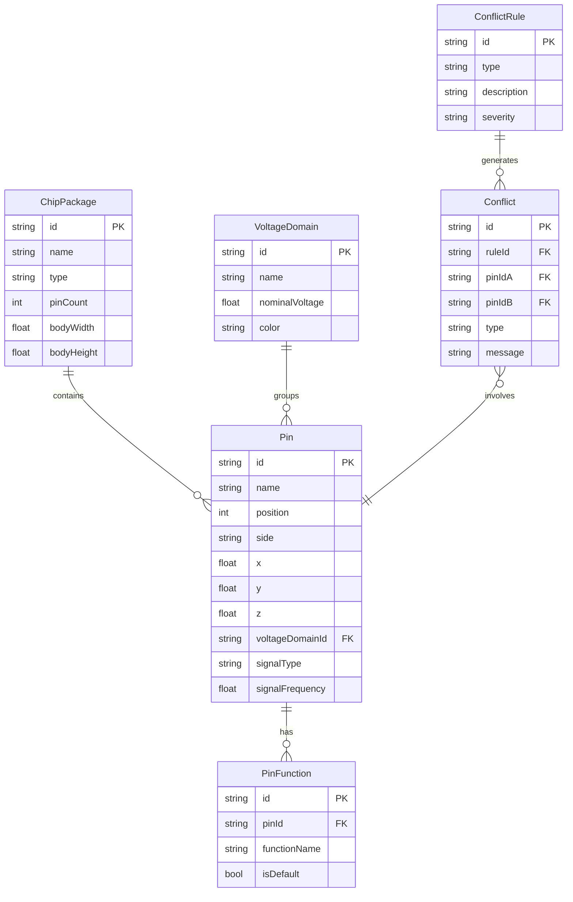

## 1. 架构设计

```mermaid
graph TB
    subgraph "前端层"
        "React App" --> "3D Scene (R3F)"
        "React App" --> "UI Panels"
        "3D Scene (R3F)" --> "ChipPackage 组件"
        "3D Scene (R3F)" --> "PinTower 组件"
        "3D Scene (R3F)" --> "PostProcessing"
        "UI Panels" --> "VoltageDomainPanel"
        "UI Panels" --> "ConflictPanel"
        "UI Panels" --> "DetailPanel"
        "UI Panels" --> "ExportToolbar"
    end
    subgraph "状态层 (Zustand)"
        "useChipStore" --> "封装/引脚数据"
        "useFilterStore" --> "电压域筛选"
        "useConflictStore" --> "冲突检测结果"
        "useSelectionStore" --> "选中/聚焦状态"
    end
    subgraph "引擎层"
        "ConflictEngine" --> "电压域混接检测"
        "ConflictEngine" --> "引脚复用冲突检测"
        "ConflictEngine" --> "标签遮挡检测"
        "ReportExporter" --> "JSON 报告生成"
    end
    subgraph "数据层 (Mock)"
        "chipData.ts" --> "封装数据"
        "pinData.ts" --> "引脚数据"
        "voltageDomainData.ts" --> "电压域数据"
        "conflictRules.ts" --> "冲突规则"
    end
```

## 2. 技术说明

- **前端**：React@18 + TypeScript + Tailwind CSS@3 + Vite
- **3D 渲染**：three + @react-three/fiber + @react-three/drei + @react-three/postprocessing
- **状态管理**：Zustand
- **初始化工具**：vite-init (react-ts 模板)
- **后端**：无（纯前端，数据使用 Mock）
- **图标**：lucide-react

## 3. 路由定义

| 路由 | 用途 |
|------|------|
| / | 评审工作台主页面，包含 3D 场景与所有交互面板 |

## 4. API 定义

无后端 API，所有数据通过前端 Mock 数据提供。

## 5. 数据模型

### 5.1 数据模型定义



### 5.2 核心类型定义

```typescript
interface ChipPackage {
  id: string;
  name: string;
  type: "BGA" | "QFP" | "QFN" | "SOP";
  pinCount: number;
  bodyWidth: number;
  bodyHeight: number;
}

interface Pin {
  id: string;
  name: string;
  position: number;
  side: "top" | "bottom" | "left" | "right";
  x: number;
  y: number;
  z: number;
  voltageDomainId: string;
  signalType: "power" | "ground" | "signal" | "clock" | "reset";
  signalFrequency: number;
  functions: PinFunction[];
}

interface VoltageDomain {
  id: string;
  name: string;
  nominalVoltage: number;
  color: string;
}

interface PinFunction {
  id: string;
  pinId: string;
  functionName: string;
  isDefault: boolean;
}

interface Conflict {
  id: string;
  type: "voltage_mixed" | "pin_mux" | "label_occlusion";
  pinIds: string[];
  message: string;
  severity: "error" | "warning";
}

interface ReviewReport {
  batchId: string;
  timestamp: string;
  chipName: string;
  conflicts: Conflict[];
  voltageDomainSummary: Record<string, number>;
  pinSignalMap: Record<string, string>;
}
```

## 6. 冲突检测规则

| 规则类型 | 检测逻辑 | 严重度 |
|----------|----------|--------|
| 电压域混接 | 相邻引脚属于不同电压域，且电压差 > 阈值 | error |
| 引脚复用冲突 | 同一引脚有多个非默认功能且无明确选择 | warning |
| 标签遮挡 | 相邻引脚标签在 3D 空间中重叠 | warning |

## 7. 报告导出格式

文件名规则：`review_report_{chipName}_{batchId}_{yyyyMMdd_HHmmss}.json`

导出内容：
- 批次信息（batchId、时间戳、芯片名称）
- 冲突清单（类型、涉及引脚、消息、严重度）
- 电压域分布（域名 → 引脚数量）
- 引脚信号映射（引脚名 → 信号类型）
