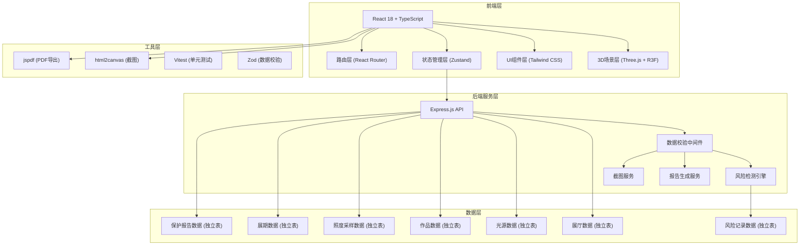
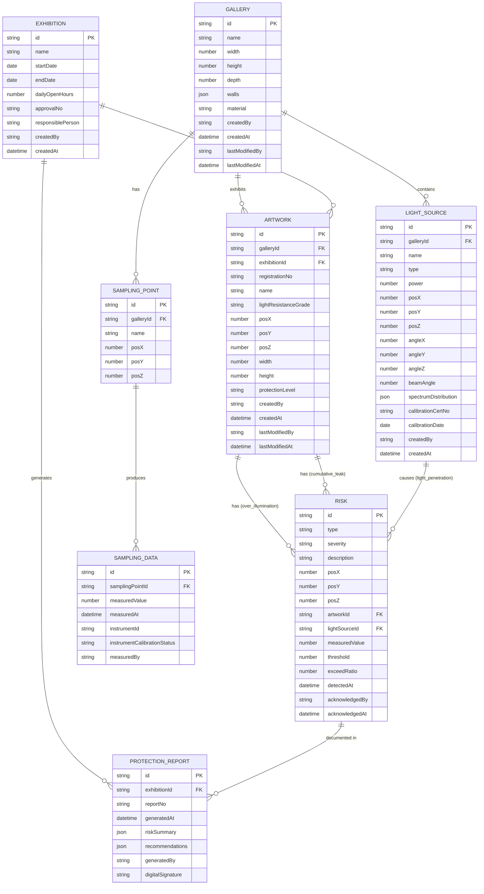

## 1. 架构设计



## 2. 技术描述

- **前端**: React@18 + TypeScript@5 + Vite@5 + tailwindcss@3 + zustand@4
- **3D引擎**: three@0.160 + @react-three/fiber@8 + @react-three/drei@9 + @react-three/postprocessing@2
- **后端**: Express@4 + TypeScript@5
- **数据持久化**: lowdb@7（轻量级JSON文件数据库，便于部署和审计）
- **数据校验**: zod@3（前后端共用校验规则）
- **导出功能**: html2canvas@1（截图） + jspdf@2（PDF导出）
- **测试框架**: Vitest@1 + @testing-library/react@14
- **图标**: lucide-react@0.294

### 核心技术选型理由

1. **@react-three/fiber**: React声明式Three.js封装，便于组件化3D场景，与React生态无缝集成
2. **lowdb**: 轻量级JSON文件存储，六类数据可分别保存为独立JSON文件，满足"不要混成一坨"的审计要求
3. **Zod**: 前后端共用类型定义和校验规则，确保数据一致性
4. **Zustand**: 轻量级状态管理，支持时间旅行和状态持久化，便于调试

## 3. 模块划分与目录结构

```
src/
├── components/           # 通用UI组件
│   ├── layout/          # 布局组件
│   ├── ui/              # 基础UI组件（Button, Card, Tabs等）
│   └── three/           # 3D场景子组件
├── pages/               # 页面组件
│   ├── Workbench.tsx    # 主工作台
│   ├── DataManager.tsx  # 数据管理页
│   └── ReportPreview.tsx # 报告预览页
├── store/               # Zustand状态管理
│   ├── galleryStore.ts  # 展厅数据store
│   ├── lightSourceStore.ts # 光源数据store
│   ├── artworkStore.ts  # 作品数据store
│   ├── samplingStore.ts # 照度采样store
│   ├── exhibitionStore.ts # 展期数据store
│   ├── reportStore.ts   # 保护报告store
│   ├── riskStore.ts     # 风险检测store
│   └── uiStore.ts       # UI状态store
├── hooks/               # 自定义Hooks
│   ├── useLightCalculation.ts # 光照计算
│   ├── useRiskDetection.ts    # 风险检测
│   ├── useExposureCalculation.ts # 曝光计算
│   └── useRayTracing.ts       # 光线追踪
├── utils/               # 工具函数
│   ├── validation.ts    # Zod校验规则
│   ├── exporters/       # 导出工具
│   └── math/            # 数学计算工具
├── types/               # TypeScript类型定义
│   └── index.ts         # 所有数据模型定义
├── three/               # 3D相关配置
│   ├── materials/       # 自定义材质
│   └── shaders/         # 自定义Shader
└── mock/                # Mock数据
    └── demoData.ts      # 演示用数据
```

```
api/                    # 后端Express服务
├── routes/
│   ├── gallery.ts      # 展厅数据接口
│   ├── lightSource.ts  # 光源数据接口
│   ├── artwork.ts      # 作品数据接口
│   ├── sampling.ts     # 照度采样接口
│   ├── exhibition.ts   # 展期数据接口
│   ├── report.ts       # 保护报告接口
│   └── risk.ts         # 风险检测接口
├── middleware/
│   ├── validation.ts   # 数据校验中间件
│   └── audit.ts        # 审计日志中间件
├── services/
│   ├── riskEngine.ts   # 风险检测引擎
│   ├── reportGenerator.ts # 报告生成服务
│   └── dataService.ts  # 数据CRUD服务
└── db/                 # lowdb数据库文件
    ├── gallery.json
    ├── lightSources.json
    ├── artworks.json
    ├── samplings.json
    ├── exhibitions.json
    ├── reports.json
    └── risks.json
```

## 4. 路由定义

| 路由 | 页面 | 权限 | 说明 |
|-------|------|------|------|
| / | 主工作台 | 文保专员/策展人 | 3D场景、明细面板、风险标注、工具栏 |
| /data | 数据管理 | 文保专员/系统管理员 | 六类数据源的独立管理界面 |
| /data/gallery | 展厅数据管理 | 文保专员 | 展厅CRUD |
| /data/light-sources | 光源数据管理 | 文保专员 | 光源CRUD |
| /data/artworks | 作品数据管理 | 文保专员 | 作品CRUD |
| /data/sampling | 照度采样管理 | 文保专员 | 采样数据CRUD |
| /data/exhibition | 展期数据管理 | 文保专员 | 展期CRUD |
| /report | 报告预览 | 文保专员/策展人 | 报告预览和导出 |

## 5. API 定义

### 5.1 统一响应格式

```typescript
interface ApiResponse<T> {
  success: boolean;
  data?: T;
  error?: {
    code: string;
    message: string;
    details?: Record<string, string>;
  };
  timestamp: string;
  requestId: string;
}
```

### 5.2 数据操作接口（六类数据源通用模式）

| 方法 | 路径 | 说明 |
|------|------|------|
| GET | /api/:dataType | 获取列表（支持分页、筛选） |
| GET | /api/:dataType/:id | 获取单条详情 |
| POST | /api/:dataType | 新增（带幂等键防止重复提交） |
| PUT | /api/:dataType/:id | 更新 |
| DELETE | /api/:dataType/:id | 删除（软删除，保留审计记录） |

### 5.3 核心业务接口

| 方法 | 路径 | 说明 |
|------|------|------|
| POST | /api/risk/detect | 执行风险检测，返回三类风险列表 |
| POST | /api/risk/acknowledge | 确认风险，记录处理人 |
| POST | /api/exposure/calculate | 计算指定作品的累计曝光量 |
| POST | /api/relayout/preview | 预览换位方案，返回新位置的光照数据 |
| POST | /api/relayout/apply | 确认换位方案，更新作品位置 |
| POST | /api/report/generate | 生成保护报告 |
| GET | /api/report/:id/pdf | 下载PDF报告 |
| POST | /api/screenshot | 保存截图，关联数据快照 |

### 5.4 重要请求/响应Schema

```typescript
// 风险检测请求
interface RiskDetectionRequest {
  galleryId: string;
  exhibitionId: string;
  includeRayTracing?: boolean; // 是否执行光源穿墙检测
}

// 风险检测响应
interface RiskDetectionResponse {
  summary: {
    totalRisks: number;
    overIllumination: number;
    cumulativeLeak: number;
    lightPenetration: number;
  };
  risks: Risk[];
  timestamp: string;
  calculationTimeMs: number;
}

// 风险数据结构
interface Risk {
  id: string;
  type: 'over_illumination' | 'cumulative_leak' | 'light_penetration';
  severity: 'low' | 'medium' | 'high' | 'critical';
  description: string;
  location: { x: number; y: number; z: number };
  artworkId?: string;
  lightSourceId?: string;
  measuredValue: number;
  threshold: number;
  exceedRatio: number;
  evidence: {
    screenshotRef?: string;
    samplingDataRef?: string;
    notes?: string;
  };
  detectedAt: string;
  acknowledgedBy?: string;
  acknowledgedAt?: string;
}

// 换位预览请求
interface RelayoutPreviewRequest {
  artworkId: string;
  newPosition: { x: number; y: number; z: number };
  galleryId: string;
}

// 换位预览响应
interface RelayoutPreviewResponse {
  originalPosition: { x: number; y: number; z: number };
  newPosition: { x: number; y: number; z: number };
  originalIllumination: number;
  newIllumination: number;
  originalRiskLevel: RiskLevel;
  newRiskLevel: RiskLevel;
  improvement: number; // 改善百分比
  recommendation: string;
}
```

## 6. 数据模型

### 6.1 ER图



### 6.2 数据隔离设计

六类数据使用独立的存储文件和API端点，确保审计时可单独追溯：

| 数据类型 | 存储文件 | API端点 | 审计字段 |
|-----------|----------|---------|----------|
| 展厅 | gallery.json | /api/gallery | createdBy, createdAt, lastModifiedBy, lastModifiedAt |
| 光源 | lightSources.json | /api/light-sources | createdBy, createdAt, calibrationCertNo, calibrationDate |
| 作品 | artworks.json | /api/artworks | createdBy, createdAt, lastModifiedBy, lastModifiedAt, registrationNo |
| 照度采样 | samplings.json | /api/sampling | measuredBy, measuredAt, instrumentId, instrumentCalibrationStatus |
| 展期 | exhibitions.json | /api/exhibition | createdBy, createdAt, approvalNo, responsiblePerson |
| 保护报告 | reports.json | /api/report | generatedBy, generatedAt, reportNo, digitalSignature |
| 风险记录 | risks.json | /api/risk | detectedAt, acknowledgedBy, acknowledgedAt |

## 7. 核心算法设计

### 7.1 光照强度计算（反向距离平方定律）

```typescript
function calculateIllumination(
  lightSource: LightSource,
  point: Point3D,
  walls: Wall[]
): number {
  // 1. 检查光线是否被墙体阻挡
  const isBlocked = checkRayIntersection(
    lightSource.position,
    point,
    walls
  );

  if (isBlocked) return 0;

  // 2. 计算距离
  const distance = calculateDistance(lightSource.position, point);

  // 3. 计算入射角余弦
  const incidentAngle = calculateIncidentAngle(
    lightSource.direction,
    lightSource.position,
    point
  );

  // 4. 应用光束衰减
  const beamAttenuation = calculateBeamAttenuation(
    lightSource.beamAngle,
    incidentAngle
  );

  // 5. 反向距离平方定律
  const baseIntensity = lightSource.intensity / (distance * distance);

  return baseIntensity * Math.cos(incidentAngle) * beamAttenuation;
}
```

### 7.2 累计曝光计算

```typescript
function calculateCumulativeExposure(
  artwork: Artwork,
  exhibition: Exhibition,
  averageIllumination: number,
  existingSamplingData?: SamplingData[]
): {
  totalExposure: number;
  calculatedExposure: number;
  actualExposure: number;
  leakageDays: number[];
} {
  // 1. 计算理论总曝光时长
  const totalDays = calculateExhibitionDays(exhibition);
  const totalHours = totalDays * exhibition.dailyOpenHours;

  // 2. 计算理论总曝光量 (lux * hours)
  const calculatedExposure = averageIllumination * totalHours;

  // 3. 根据采样数据计算实际曝光量
  let actualExposure = 0;
  const leakageDays: number[] = [];

  if (existingSamplingData && existingSamplingData.length > 0) {
    actualExposure = integrateSamplingData(existingSamplingData, exhibition);

    // 4. 检测漏算日期
    const expectedDays = generateExpectedSamplingDays(exhibition);
    const actualDays = extractSamplingDays(existingSamplingData);
    leakageDays = difference(expectedDays, actualDays);
  } else {
    actualExposure = calculatedExposure; // 无采样数据时使用理论值
  }

  return {
    totalExposure: Math.max(calculatedExposure, actualExposure),
    calculatedExposure,
    actualExposure,
    leakageDays
  };
}
```

### 7.3 耐光等级阈值（ISO 15426标准）

```typescript
const LIGHT_RESISTANCE_THRESHOLDS: Record<string, {
  maxAnnualExposure: number; // lux * hours / year
  maxInstantIllumination: number; // lux
  colorTemperatureLimit: number; // K
}> = {
  'ISO 15426 Grade 1': { // 最敏感
    maxAnnualExposure: 50000,
    maxInstantIllumination: 50,
    colorTemperatureLimit: 3000
  },
  'ISO 15426 Grade 2': {
    maxAnnualExposure: 200000,
    maxInstantIllumination: 200,
    colorTemperatureLimit: 4000
  },
  'ISO 15426 Grade 3': {
    maxAnnualExposure: 500000,
    maxInstantIllumination: 500,
    colorTemperatureLimit: 6500
  },
  'ISO 15426 Grade 4': { // 最不敏感
    maxAnnualExposure: 1000000,
    maxInstantIllumination: 1000,
    colorTemperatureLimit: 6500
  }
};
```

## 8. 测试设计

### 8.1 测试分类

| 测试类型 | 覆盖场景 | 工具 |
|-----------|----------|------|
| 单元测试 | 光照计算、曝光计算、风险检测算法 | Vitest |
| 组件测试 | 3D场景组件、表单组件、风险标注组件 | Vitest + Testing Library |
| 集成测试 | API接口、数据校验、状态流转 | Vitest + Supertest |
| E2E测试 | 核心工作流程 | Playwright（可选） |

### 8.2 重点测试场景

1. **重复提交测试**：
   - 同一数据重复POST（带相同幂等键）应返回409 Conflict
   - 重复提交应返回已存在的记录ID，不创建新记录

2. **缺字段测试**：
   - 缺少必填字段应返回400 Bad Request
   - 错误响应应明确指出缺失的字段名和要求
   - 字段类型错误应被正确识别

3. **状态不允许测试**：
   - 已确认的风险不允许重复确认
   - 已结束的展期不允许修改
   - 已生成的报告不允许删除
   - 作品在展期中不允许删除
