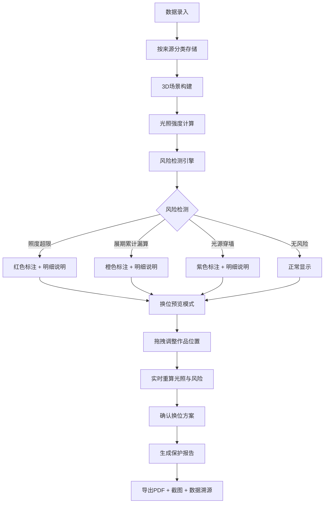

## 1. 产品概述

美术馆光照保护场是为文保团队打造的3D可视化决策系统，解决展厅作品光照风险评估与位置优化问题。通过实时3D光照场模拟、累计曝光计算、风险智能检测，帮助文保人员快速识别照度超限、展期累计漏算、光源穿墙等风险，辅助决策作品换位方案。

- 核心价值：将复杂的光照数据转化为直观的3D空间关系，实现"所见即所得"的风险可视化与决策辅助
- 目标用户：文保团队、美术馆策展人、文物保护专家
- 核心场景：展览前光照评估、展期风险监控、作品换位方案验证、保护报告生成

## 2. 核心功能

### 2.1 用户角色

| 角色 | 核心权限 |
|------|----------|
| 文保专员 | 数据录入、风险检测、换位预览、报告导出 |
| 策展人 | 方案审核、数据查看、报告审阅 |
| 系统管理员 | 数据源配置、权限管理 |

### 2.2 功能模块

1. **3D光照场可视化**：展厅3D场景、光照强度热力图、光源射线追踪、作品耐光等级标识
2. **累计曝光计算**：展期时间轴、照度积分计算、累计曝光量展示
3. **换位预览**：拖拽调整作品位置、实时光照重计算、方案对比
4. **风险检测与标注**：照度超限预警、展期累计漏算检测、光源穿墙检测
5. **报告导出**：风险报告生成、截图嵌入、数据溯源、PDF导出
6. **数据管理**：多数据源独立管理（展厅、光源、作品、照度采样、展期、保护报告）

### 2.3 页面详情

| 页面名称 | 模块名称 | 功能描述 |
|-----------|-------------|---------------------|
| 主工作台 | 3D场景视窗 | 可旋转缩放的3D展厅，显示光照热力图、光源、作品位置和耐光等级 |
| 主工作台 | 明细面板 | 分Tab展示各数据源详情，支持与3D场景双向联动 |
| 主工作台 | 风险标注栏 | 实时显示三类风险（照度超限、展期累计漏算、光源穿墙），点击定位到3D场景 |
| 主工作台 | 操作工具栏 | 换位模式切换、截图、报告导出、视图重置 |
| 数据管理页 | 数据源列表 | 独立管理展厅、光源、作品、照度采样、展期、保护报告六类数据 |
| 数据管理页 | 数据录入表单 | 支持批量导入和单条录入，字段校验 |
| 报告预览页 | 报告模板 | 包含风险统计、空间关系图、数据溯源、保护建议 |

## 3. 核心流程

### 3.1 主工作流程

### 3.2 双向联动流程

用户在3D场景点击作品 → 明细面板自动切换到该作品详情 → 显示光照数据、累计曝光、风险记录

用户在明细面板选择数据项 → 3D场景自动定位并高亮对应元素 → 调整视角至最佳观察位置

## 4. 用户界面设计

### 4.1 设计风格

- **主色调**：深空灰 (#121418) 作为基底，配合文保金 (#C9A962) 作为主题色，风险红 (#E5484D)、预警橙 (#F2994A)、穿墙紫 (#9B51E0) 作为风险标识色
- **字体**：展示字体使用 "Noto Serif SC"（文保专业感），正文字体使用 "JetBrains Mono"（数据可读性）
- **按钮风格**：微立体圆角按钮，悬停时有轻微上浮和发光效果
- **布局风格**：三栏式专业工作台布局，左侧数据来源树、中间3D场景、右侧明细面板，底部风险状态栏
- **图标风格**：线性轮廓图标，统一2px描边，配合状态色填充

### 4.2 页面设计概述

| 页面名称 | 模块名称 | UI Elements |
|-----------|-------------|-------------|
| 主工作台 | 3D场景视窗 | 深色背景，光照热力图半透明叠加，作品按耐光等级用不同颜色边框，点击选中时金色高亮脉冲动画，相机平滑过渡动画 |
| 主工作台 | 明细面板 | 卡片式布局，每个数据源一个Tab，数据表格斑马纹，关键字段加粗高亮，风险项红底白字 |
| 主工作台 | 风险标注栏 | 横向滚动的风险卡片，每张卡片含风险类型图标、位置描述、数值对比、跳转按钮 |
| 数据管理页 | 数据录入表单 | 左侧字段列表带必填标记，右侧输入区域，实时校验提示，提交前完整性检查 |
| 报告预览页 | 报告模板 | 仿正式文档排版，页眉带报告编号，每页有水印，风险图嵌入对应位置 |

### 4.3 响应性

- 桌面端（>=1440px）：三栏完整布局，3D场景占60%宽度
- 平板端（1024px-1440px）：两栏布局，明细面板改为底部抽屉
- 移动端（<1024px）：单栏布局，3D场景全屏，通过浮动按钮切换面板

### 4.4 3D场景指导

- **环境设置**：纯深色背景（#0a0b0d），HDR环境光使用中性冷色调，突出光照热力图的色彩层次
- **光照系统**：
  - 环境光：低强度半球光，确保场景可见但不影响热力图显示
  - 光源对象：用发光几何体表示实际光源，强度与实际功率成正比
  - 光照热力图：在展厅地面和墙面生成半透明热力平面，颜色从深蓝（低照度）到亮黄（高照度）渐变
  - 光源射线：用半透明线条表示光线传播路径，穿墙时线条变为紫色闪烁
- **相机设置**：
  - 初始视角：45度俯视，可看清整个展厅布局
  - 控制模式：OrbitControls，支持缩放、旋转、平移
  - 定位动画：选中作品时，相机平滑飞行到最佳观察位置（距离目标3米，高度1.5米）
- **交互设计**：
  - 悬停：显示作品名称和当前照度值的浮动标签
  - 点击：选中作品，金色边框高亮，明细面板联动
  - 拖拽（换位模式）：沿地面平面移动作品，实时显示新位置的照度值
- **后处理效果**：
  - Bloom效果：光源和高风险区域有轻微泛光
  - 轮廓效果：选中对象显示金色轮廓线
  - 色调映射：ACES电影级色调映射，确保色彩准确
- **性能预算**：3D场景三角形数控制在5万以内，帧率稳定在60fps

## 5. 数据溯源与审计

### 5.1 数据来源分离

六类数据独立存储、独立管理、独立审计，确保追责时可追溯：

| 数据类型 | 关键字段 | 审计要求 |
|-----------|----------|----------|
| 展厅 | 编号、名称、尺寸、墙体位置、材质 | 记录创建人、创建时间、最后修改人 |
| 光源 | 编号、位置、类型、功率、照射角度、光谱分布 | 记录校准证书编号、校准日期 |
| 作品 | 编号、名称、耐光等级（ISO 15426标准）、当前位置 | 记录文物登记号、保护等级 |
| 照度采样 | 采样点编号、位置、测量值、测量时间、测量仪器 | 记录仪器校准状态、测量人员 |
| 展期 | 展览名称、开始时间、结束时间、每日开放时长 | 记录审批文号、责任人 |
| 保护报告 | 报告编号、生成时间、风险统计、处理建议 | 数字签名、不可篡改 |

### 5.2 三类重点风险单独记录

每类风险单独成表，包含完整上下文：

1. **照度超限**：作品编号、位置、实测照度、限值、超限比例、持续时间、现场照片
2. **展期累计漏算**：作品编号、漏算时段、理论曝光量、实际曝光量、漏算原因
3. **光源穿墙**：光源编号、穿墙位置、墙体厚度、穿透后照度、整改建议
