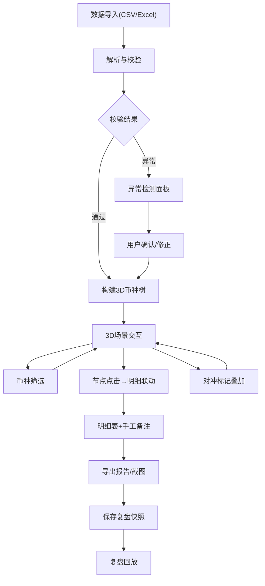

## 1. 产品概述

跨国公司外汇敞口3D币种树 — 面向集团财务总部，将各子公司币种敞口以3D树图呈现，直观展示自然对冲效果，同时提供明细交互、异常检测和复盘能力。

- 解决问题：多子公司、多币种敞口难以一目了然，自然对冲效果无法可视化，手工备注易丢失，币种折算/套保重复/合并遗漏等风险难以发现
- 目标用户：集团财务总部资金管理团队、CFO、风控部门

## 2. 核心功能

### 2.1 用户角色

| 角色 | 注册方式 | 核心权限 |
|------|----------|----------|
| 财务分析师 | 管理员分配 | 导入数据、查看3D树、筛选币种、标记对冲、导出报告 |
| 财务总监(CFO) | 管理员分配 | 查看3D树、审核异常、导出报告、复盘 |
| 风控专员 | 管理员分配 | 查看异常报告、标记风险、复盘 |

### 2.2 功能模块

1. **敞口总览页**：3D币种树场景、币种筛选器、敞口汇总卡片、自然对冲效果指标
2. **明细与异常页**：3D树联动明细表、异常检测结果（折算错/套保重复/合并遗漏）、手工备注保留区
3. **复盘与导出页**：历史快照列表、复盘回放、报告导出、截图导出

### 2.3 页面详情

| 页面名称 | 模块名称 | 功能描述 |
|----------|----------|----------|
| 敞口总览页 | 3D币种树场景 | Three.js渲染3D树图，子公司为分支，币种为叶子，叶面积=敞口金额，颜色=多空方向，点击节点联动明细 |
| 敞口总览页 | 币种筛选器 | 按币种/子公司/多空方向筛选，实时更新3D树和汇总 |
| 敞口总览页 | 敞口汇总卡片 | 净敞口、多空比例、对冲覆盖率、自然对冲节省金额 |
| 敞口总览页 | 对冲标记层 | 在3D树上叠加套保合约标记，区分已套保/未套保敞口 |
| 明细与异常页 | 联动明细表 | 点击3D节点后展示该节点明细（子公司+币种+应收应付+套保），保留原始口径和手工备注 |
| 明细与异常页 | 异常检测面板 | 列出币种折算错、套保重复、子公司合并遗漏，每条异常可展开解释 |
| 明细与异常页 | 手工备注编辑 | 对任意行添加/编辑备注，备注不随数据重算丢失 |
| 复盘与导出页 | 历史快照列表 | 每次导入生成快照，列出时间、导入人、数据摘要 |
| 复盘与导出页 | 复盘回放 | 加载历史快照，还原3D树+明细+异常，无需重新导入 |
| 复盘与导出页 | 报告导出 | 导出PDF/Excel，含3D树截图、敞口汇总、异常清单、备注 |
| 复盘与导出页 | 截图导出 | 一键截取3D场景高清图，含时间戳和数据水印 |

## 3. 核心流程

**主流程**：用户导入数据 → 系统解析并校验 → 3D树自动构建 → 用户筛选/点击 → 明细联动 → 标记对冲 → 检查异常 → 导出报告/截图 → 保存复盘快照

## 4. 用户界面设计

### 4.1 设计风格

- **主色调**：深海蓝 (#0A1628) 为底色，青绿色 (#00E5A0) 表示多头敞口，珊瑚红 (#FF6B6B) 表示空头敞口，金色 (#FFD700) 表示套保标记
- **次色调**：深灰 (#1A2332) 面板背景，浅灰 (#8899AA) 辅助文字
- **按钮风格**：圆角胶囊按钮，hover时微发光，primary用青绿渐变
- **字体**：数字用 JetBrains Mono，标题用 DM Sans，正文用 Noto Sans SC
- **布局风格**：左侧3D场景占60%，右侧面板占40%，顶部工具栏
- **图标**：使用 lucide-react 线性图标

### 4.2 页面设计概览

| 页面名称 | 模块名称 | UI元素 |
|----------|----------|--------|
| 敞口总览页 | 3D币种树场景 | 深色背景、Three.js 3D树图、节点发光、鼠标悬浮高亮、相机轨道控制 |
| 敞口总览页 | 币种筛选器 | 顶部标签栏，多选币种标签，蓝色系active态 |
| 敞口总览页 | 敞口汇总卡片 | 右侧面板顶部4个数据卡片，渐变背景，数字大字 |
| 敞口总览页 | 对冲标记层 | 3D树上金色光环标识已套保节点 |
| 明细与异常页 | 联动明细表 | 右侧可滚动表格，选中行高亮，备注列可编辑 |
| 明细与异常页 | 异常检测面板 | 红色警告卡片列表，可展开详情，含修复建议 |
| 复盘与导出页 | 历史快照列表 | 时间线式列表，缩略图+元数据 |
| 复盘与导出页 | 复盘回放 | 全屏3D场景+浮动面板 |
| 复盘与导出页 | 报告/截图导出 | 底部操作栏，导出按钮组 |

### 4.3 响应式

- Desktop-first设计，1920x1080为最佳分辨率
- 1440px以下时右侧面板可折叠
- 不适配移动端（专业财务工具）

### 4.4 3D场景指导

- **环境/HDRI**：深空环境，微弱星光粒子，营造专业金融氛围
- **灯光**：顶部柔光+侧面青绿点光源+底部珊瑚红补光，形成多空双色氛围
- **相机**：透视相机，FOV 50°，初始距离12，可轨道旋转缩放
- **构图**：树根居中，分支向四周扩展，叶节点在末端
- **交互**：鼠标悬浮节点发光放大，点击触发联动，右键拖拽旋转，滚轮缩放
- **后期处理**：Bloom辉光效果，使节点边缘柔和发光
- **性能预算**：节点数<200时保持60fps，使用InstancedMesh优化

## 5. 数据导入与保留

### 5.1 支持的数据源

| 数据类型 | 必填字段 | 可选字段 | 备注 |
|----------|----------|----------|------|
| 子公司 | 公司编码、公司名称、所属区域 | 合并层级、功能货币 | - |
| 币种 | 币种代码、币种名称 | - | ISO 4217 |
| 应收应付 | 子公司编码、币种、金额、方向(收/付)、到期日 | 合同编号、手工备注 | 原始口径必保留 |
| 套保合约 | 合约编号、子公司编码、币种、名义金额、方向、到期日 | 套保工具类型、对手方 | - |
| 汇率 | 币种对、即期汇率、远期汇率 | 汇率日期 | - |
| 敞口报告 | 子公司编码、币种、净敞口、报告日期 | 手工备注 | 原始口径必保留 |

### 5.2 数据保留原则

- 所有导入数据保留原始字段值，不自动清洗或覆盖
- 手工备注字段独立存储，与计算字段分离
- 异常标记为附加标注，不修改原始数据
- 快照保存完整数据集+所有标注+3D相机状态
