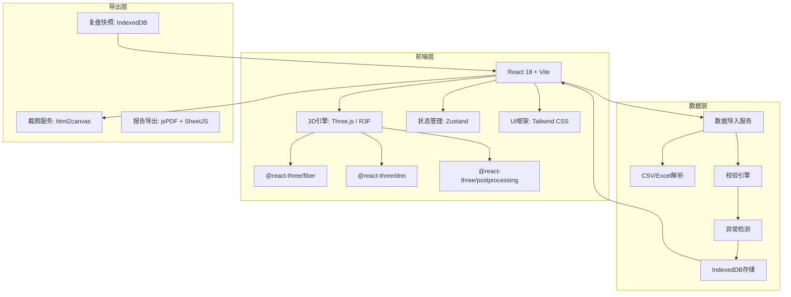
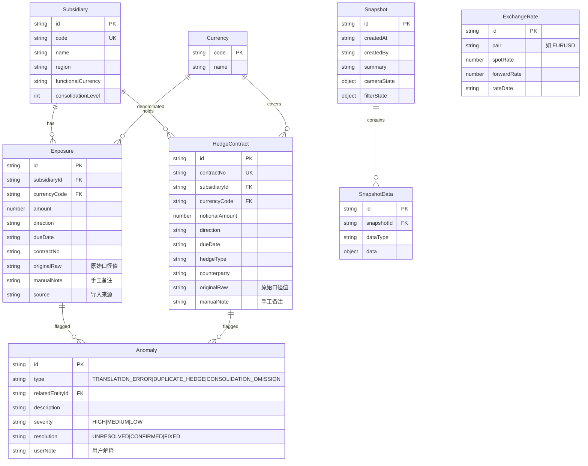

## 1. 架构设计



## 2. 技术说明

- **前端**：React@18 + Tailwind CSS@3 + Vite
- **初始化工具**：vite-init
- **后端**：无（纯前端，数据存浏览器IndexedDB）
- **数据库**：IndexedDB（via idb库），用于持久化导入数据、快照、备注
- **3D引擎**：three + @react-three/fiber + @react-three/drei + @react-three/postprocessing
- **导出**：html2canvas（截图）+ jsPDF（PDF报告）+ xlsx（Excel导出）
- **数据解析**：papaparse（CSV）+ xlsx（Excel读取）

## 3. 路由定义

| 路由 | 用途 |
|------|------|
| `/` | 敞口总览页：3D币种树+筛选+汇总+对冲标记 |
| `/detail` | 明细与异常页：联动明细表+异常检测+备注编辑 |
| `/review` | 复盘与导出页：历史快照+复盘回放+报告/截图导出 |

## 4. 数据模型

### 4.1 数据模型定义



### 4.2 索引设计

- `Exposure`: 索引 `[subsidiaryId, currencyCode, direction]`
- `HedgeContract`: 索引 `[subsidiaryId, currencyCode]`，唯一索引 `contractNo`
- `Anomaly`: 索引 `[type, severity, resolution]`
- `Snapshot`: 索引 `createdAt` (降序)

## 5. 核心算法

### 5.1 3D树布局算法

采用径向树布局（Radial Tree Layout）：
- 根节点：集团总部，位于3D空间中心
- 一级分支：子公司，从中心向外辐射，角度均匀分布
- 二级分支：币种，从子公司节点向外延伸
- 叶节点面积：与敞口绝对值成正比
- 叶节点颜色：多头=青绿(#00E5A0)，空头=珊瑚红(#FF6B6B)
- 已套保节点：叠加金色光环

### 5.2 异常检测规则

| 异常类型 | 检测逻辑 |
|----------|----------|
| 币种折算错 | 应收应付金额×汇率≠净敞口报告值，偏差>5% |
| 套保重复 | 同一合约编号出现多次，或同子公司同币种同到期日多名义金额 |
| 子公司合并遗漏 | 敞口报告中缺少已导入子公司的数据 |

### 5.3 自然对冲计算

```
净敞口 = Σ多头敞口 - Σ空头敞口 (按币种)
自然对冲比例 = 1 - |净敞口| / 总敞口
对冲覆盖率 = 已套保敞口 / 总敞口
自然对冲节省 = |净敞口| × 汇率波动假设
```

## 6. 目录结构

```
src/
├── components/
│   ├── tree3d/           # 3D树相关组件
│   │   ├── TreeScene.tsx      # 3D场景容器
│   │   ├── TreeNode.tsx       # 单个树节点
│   │   ├── TreeEdge.tsx       # 节点连线
│   │   ├── HedgeMarker.tsx    # 套保标记
│   │   └── SceneEffects.tsx   # 后期处理效果
│   ├── panels/           # 右侧面板
│   │   ├── SummaryCards.tsx   # 敞口汇总卡片
│   │   ├── CurrencyFilter.tsx # 币种筛选器
│   │   ├── DetailTable.tsx    # 明细表
│   │   └── AnomalyPanel.tsx   # 异常面板
│   ├── import/           # 数据导入
│   │   ├── ImportDialog.tsx   # 导入对话框
│   │   └── DataValidator.tsx  # 校验结果展示
│   ├── review/           # 复盘
│   │   ├── SnapshotList.tsx   # 快照列表
│   │   └── ExportBar.tsx      # 导出工具栏
│   └── layout/
│       └── AppLayout.tsx      # 全局布局
├── hooks/
│   ├── useTreeData.ts         # 3D树数据计算
│   ├── useAnomalyDetection.ts # 异常检测
│   ├── useSnapshots.ts        # 快照管理
│   └── useExport.ts           # 导出逻辑
├── pages/
│   ├── OverviewPage.tsx       # 敞口总览页
│   ├── DetailPage.tsx         # 明细与异常页
│   └── ReviewPage.tsx         # 复盘与导出页
├── store/
│   ├── exposureStore.ts       # 敞口数据store
│   ├── treeStore.ts           # 3D树交互store
│   └── snapshotStore.ts       # 快照store
├── utils/
│   ├── db.ts                  # IndexedDB操作
│   ├── parser.ts              # CSV/Excel解析
│   ├── anomalyEngine.ts       # 异常检测引擎
│   ├── hedgingCalc.ts         # 对冲计算
│   └── exportUtils.ts         # 导出工具
├── App.tsx
└── main.tsx
```
