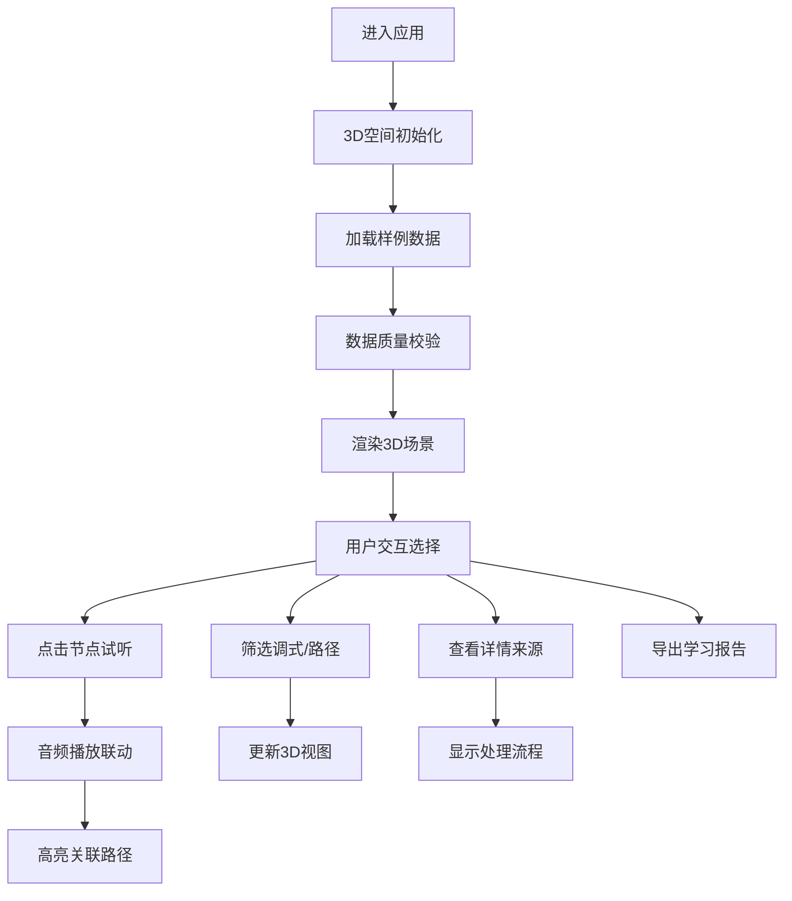

## 1. 产品概述

音乐理论3D和声空间可视化教学工具，将抽象的调式、和弦功能和转调路径转化为可交互的3D空间，学生通过点击试听示例来理解音乐理论概念。重点解决等音混淆、转调路径断裂、音频错配等教学痛点。

## 2. 核心功能

### 2.1 用户角色

| 角色 | 登录方式 | 核心权限 |
|------|----------|----------|
| 学生/教师 | 无需登录，直接使用 | 3D空间浏览、和弦试听、标签筛选、报告导出 |

### 2.2 功能模块

1. **3D和声空间主界面**：调式节点展示、和弦功能分布、转调路径连线、相机控制
2. **详情面板**：元素详情、音频试听、来源追溯、数据质量标记
3. **筛选控制面板**：调式筛选、功能标签筛选、数据质量筛选、转调路径类型筛选
4. **图例说明**：颜色编码说明、位置编码说明、数据质量图例
5. **报告导出**：学习报告生成、数据质量报告、PDF/JSON导出

### 2.3 页面详情

| 页面名称 | 模块名称 | 功能描述 |
|----------|----------|----------|
| 主界面 | 3D场景渲染 | Three.js渲染的3D和声空间，调式为球体节点，转调路径为发光连线 |
| 主界面 | 相机控制 | 轨道控制器、缩放、旋转、平移、自动旋转开关 |
| 主界面 | 交互点击 | 点击调式节点显示详情，悬停高亮关联转调路径 |
| 详情面板 | 元素详情 | 显示调式/和弦信息、功能标签、音频示例播放器 |
| 详情面板 | 来源追溯 | 显示该材料的原始来源、处理阶段、质量验证结果 |
| 筛选面板 | 标签筛选 | 按调式类型、功能标签、数据质量等级筛选可见元素 |
| 筛选面板 | 路径筛选 | 按转调类型、路径完整性筛选可见连线 |
| 图例面板 | 颜色编码 | 不同颜色对应不同调式类型、功能标签、数据质量等级 |
| 图例面板 | 位置编码 | XYZ轴分别对应五度圈、功能层级、调式亮度 |
| 导出面板 | 报告生成 | 生成学习进度报告、数据质量分析报告 |
| 导出面板 | 格式选择 | 支持PDF文档导出、JSON数据导出 |

## 3. 核心流程

学生进入应用后，首先看到完整的3D和声空间概览。可以通过筛选器聚焦特定类型的调式或转调路径，点击调式节点查看详细信息并试听音频示例，系统会显示数据处理顺序和质量验证结果。完成学习后可导出包含学习轨迹的课堂报告。

## 4. 用户界面设计

### 4.1 设计风格

**设计方向**：深邃科技感 - 深色背景配合霓虹发光效果，营造专业音乐理论学习氛围

- **主色调**：深邃藏蓝 `#0a1628` 作为背景
- **强调色**：
  - 大调：金色 `#ffd700`（明亮温暖）
  - 小调：深紫 `#9b59b6`（幽暗神秘）
  - 转调路径：青色 `#00d4ff`（流动感）
- **数据质量色**：
  - 正常数据：绿色 `#2ecc71`
  - 临界数据：橙色 `#f39c12`
  - 错误数据：红色 `#e74c3c`
- **按钮风格**：半透明玻璃质感，圆角8px，悬停发光效果
- **字体**：显示字体使用 Orbitron（科技感），正文字体使用 JetBrains Mono（清晰易读）
- **布局**：左侧控制面板，中间3D场景，右侧详情面板，底部图例栏

### 4.2 页面设计概述

| 页面名称 | 模块名称 | UI元素 |
|----------|----------|--------|
| 主界面 | 3D场景 | 深色星空背景、发光球体节点、脉冲光效路径、雾效深度感 |
| 主界面 | 控制面板 | 半透明侧边栏、折叠式筛选组、滑动条控件、切换开关 |
| 主界面 | 详情面板 | 玻璃卡片、音频波形可视化、时间线处理流程、来源标签 |
| 主界面 | 图例栏 | 颜色方块图例、图标说明、悬停提示 |
| 导出模态框 | 报告预览 | 报告缩略图、格式选择按钮、下载进度条 |

### 4.3 响应性

- 桌面端优先设计（1280px+）
- 平板端：左右面板改为可滑动抽屉
- 移动端：简化3D视图，列表式展示核心内容
- 触摸设备优化：增大点击热区，支持手势旋转缩放

### 4.4 3D场景设计

- **环境**：深空背景，微弱星点粒子效果，指数雾效营造深度
- **光照**：主方向光 + 环境光 + 节点自发光，避免过暗区域
- **相机**：PerspectiveCamera，初始距离适中，轨道控制器限制近远距离
- **构图**：五度圈沿X轴分布，功能层级沿Y轴，调式亮度沿Z轴
- **交互**：点击缩放动画，悬停发光脉冲，路径选中高亮流动效果
- **后处理**：Bloom泛光效果，轻微色差，增强科技感
- **性能**：实例化渲染重复元素，LOD层级，保持60fps
