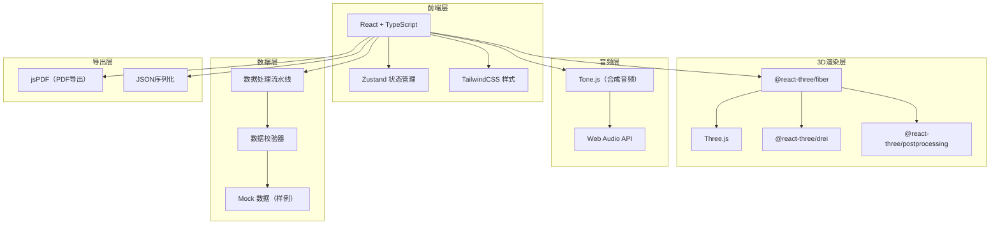

## 1. 架构设计



## 2. 技术描述

- **前端框架**：React@18 + TypeScript + Vite
- **状态管理**：Zustand（轻量级，适合3D场景状态同步）
- **样式方案**：TailwindCSS@3（快速UI构建）
- **3D渲染**：Three.js + @react-three/fiber + @react-three/drei + @react-three/postprocessing
- **音频处理**：Tone.js + Web Audio API（生成和弦示例音频）
- **报告导出**：jsPDF（PDF）+ 原生JSON导出
- **数据**：内置Mock样例数据，包含正常/临界/错误三种质量等级
- **初始化工具**：vite-init react-ts 模板

## 3. 路由定义

| 路由 | 用途 |
|------|------|
| / | 主界面 - 3D和声空间可视化 |

## 4. 数据模型

### 4.1 数据模型定义

```mermaid
erDiagram
    MODE ||--o{ CHORD : contains
    MODE ||--o{ MODULATION_PATH : from
    MODE ||--o{ MODULATION_PATH : to
    CHORD ||--o{ AUDIO_SAMPLE : has
    MODE ||--o{ AUDIO_SAMPLE : has
    DATA_SOURCE ||--o{ MODE : provides
    DATA_SOURCE ||--o{ CHORD : provides
    DATA_SOURCE ||--o{ MODULATION_PATH : provides
    
    MODE {
        string id
        string name
        string type "major/minor"
        number fifthsPosition "五度圈位置"
        number brightness "调式亮度Z轴"
        string quality "normal/borderline/error"
        string sourceId
        object validationResult
    }
    
    CHORD {
        string id
        string name
        string function "tonic/subdominant/dominant"
        number functionLevel "功能层级Y轴"
        string modeId
        string quality
        string sourceId
    }
    
    MODULATION_PATH {
        string id
        string fromModeId
        string toModeId
        string type "direct/pivot/sequential"
        boolean isBroken "路径是否断裂"
        string quality
        string sourceId
    }
    
    AUDIO_SAMPLE {
        string id
        string targetId "mode or chord"
        string targetType
        string audioUrl
        boolean isMismatched "音频是否错配"
        string quality
        string sourceId
    }
    
    DATA_SOURCE {
        string id
        string name
        string type "textbook/score/recording"
        string processingStage "raw/validated/cleaned"
        number processingOrder
        string url
    }
```

### 4.2 TypeScript 类型定义

```typescript
// 数据质量枚举
type DataQuality = 'normal' | 'borderline' | 'error';

// 调式类型
type ModeType = 'major' | 'minor' | 'dorian' | 'phrygian' | 'lydian' | 'mixolydian' | 'aeolian' | 'locrian';

// 和弦功能
type ChordFunction = 'tonic' | 'supertonic' | 'mediant' | 'subdominant' | 'dominant' | 'submediant' | 'leading';

// 转调类型
type ModulationType = 'direct' | 'pivot' | 'sequential' | 'enharmonic';

// 数据源
interface DataSource {
  id: string;
  name: string;
  type: 'textbook' | 'score' | 'recording' | 'analysis';
  processingStage: 'raw' | 'validated' | 'cleaned' | 'final';
  processingOrder: number;
  url?: string;
  notes?: string;
}

// 验证结果
interface ValidationResult {
  isValid: boolean;
  checks: {
    enharmonicConfusion: boolean;
    audioMismatch: boolean;
    brokenPath: boolean;
    invalidInterval: boolean;
  };
  warnings: string[];
  errors: string[];
}

// 调式
interface Mode {
  id: string;
  name: string;
  type: ModeType;
  rootNote: string;
  fifthsPosition: number; // X轴: 五度圈位置
  functionLevel: number; // Y轴: 功能层级
  brightness: number; // Z轴: 调式亮度
  color: string;
  quality: DataQuality;
  sourceId: string;
  audioSampleId?: string;
  validation: ValidationResult;
  position: { x: number; y: number; z: number };
}

// 和弦
interface Chord {
  id: string;
  name: string;
  symbol: string;
  function: ChordFunction;
  modeId: string;
  quality: DataQuality;
  sourceId: string;
  audioSampleId?: string;
  position: { x: number; y: number; z: number };
}

// 转调路径
interface ModulationPath {
  id: string;
  fromModeId: string;
  toModeId: string;
  type: ModulationType;
  isBroken: boolean;
  pivotChords?: string[];
  quality: DataQuality;
  sourceId: string;
}

// 音频示例
interface AudioSample {
  id: string;
  targetId: string;
  targetType: 'mode' | 'chord' | 'progression';
  notes: string[]; // 构成音
  isMismatched: boolean;
  quality: DataQuality;
  sourceId: string;
}

// 筛选状态
interface FilterState {
  modeTypes: ModeType[];
  chordFunctions: ChordFunction[];
  modulationTypes: ModulationType[];
  dataQualities: DataQuality[];
  showBrokenPaths: boolean;
  showMismatchedAudio: boolean;
}

// 应用状态
interface AppState {
  modes: Mode[];
  chords: Chord[];
  modulationPaths: ModulationPath[];
  audioSamples: AudioSample[];
  dataSources: DataSource[];
  selectedModeId: string | null;
  selectedChordId: string | null;
  highlightedPathId: string | null;
  filters: FilterState;
  isPlaying: boolean;
  currentAudioId: string | null;
}
```

## 5. 核心组件结构

```
src/
├── components/
│   ├── Scene3D/
│   │   ├── index.tsx          # 3D场景主组件
│   │   ├── ModeNode.tsx       # 调式节点（球体）
│   │   ├── ChordNode.tsx      # 和弦节点
│   │   ├── ModulationLine.tsx # 转调路径线
│   │   ├── AxesHelper.tsx     # 坐标轴辅助
│   │   └── StarsBackground.tsx# 星空背景
│   ├── ControlPanel/
│   │   ├── index.tsx          # 控制面板主组件
│   │   ├── ModeFilters.tsx    # 调式筛选
│   │   ├── PathFilters.tsx    # 路径筛选
│   │   ├── QualityFilters.tsx # 数据质量筛选
│   │   └── CameraControls.tsx # 相机控制
│   ├── DetailPanel/
│   │   ├── index.tsx          # 详情面板主组件
│   │   ├── ModeDetail.tsx     # 调式详情
│   │   ├── ChordDetail.tsx    # 和弦详情
│   │   ├── AudioPlayer.tsx    # 音频播放器
│   │   ├── SourceTimeline.tsx # 来源时间线
│   │   └── ValidationBadge.tsx# 验证状态徽章
│   ├── LegendBar/
│   │   ├── index.tsx          # 图例栏
│   │   ├── ColorLegend.tsx    # 颜色图例
│   │   └── PositionLegend.tsx # 位置图例
│   └── ExportModal/
│       ├── index.tsx          # 导出模态框
│       ├── ReportPreview.tsx  # 报告预览
│       └── ExportButtons.tsx  # 导出按钮
├── store/
│   └── useAppStore.ts         # Zustand 状态管理
├── data/
│   ├── mockData.ts            # 样例数据
│   └── dataValidator.ts       # 数据校验器
├── hooks/
│   ├── useAudio.ts            # 音频播放Hook
│   └── use3DInteraction.ts    # 3D交互Hook
├── utils/
│   ├── musicTheory.ts         # 音乐理论工具函数
│   ├── colorUtils.ts          # 颜色工具
│   └── exportUtils.ts         # 导出工具
├── types/
│   └── index.ts               # 类型定义
├── App.tsx
└── main.tsx
```
