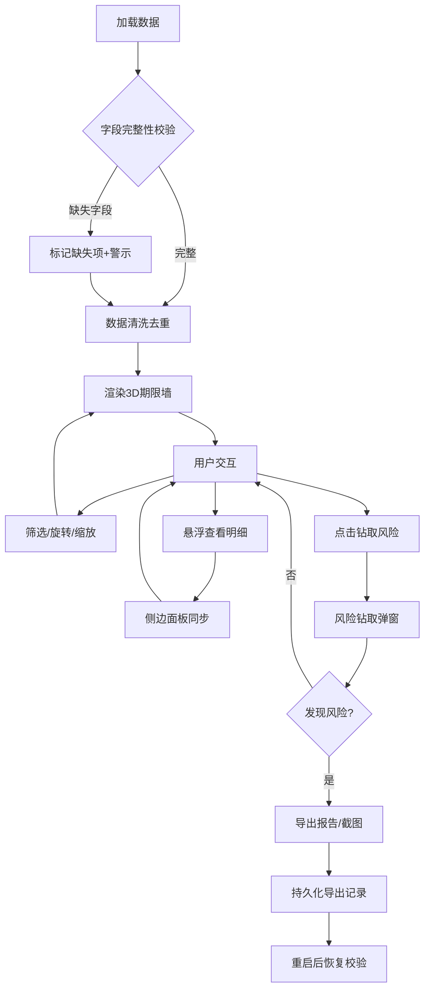

## 1. 产品概述

期货持仓期限墙——面向期货公司风控团队的三维可视化工具，将客户持仓按品种、合约月份和多空方向在三维空间中堆叠成"期限墙"，快速识别集中到期风险、跨月移仓缺口与保证金重复占用。

- 核心价值：将散落在多张表格中的持仓数据投射到可旋转、可切片、可钻取的3D空间，风控人员一眼定位"哪个客户、哪个品种、哪个月集中到期"
- 目标用户：期货公司风控经理、结算专员、客户经理

## 2. 核心功能

### 2.1 用户角色

| 角色 | 进入方式 | 核心权限 |
|------|----------|----------|
| 风控经理 | 内部账号登录 | 全量数据查看、风险钻取、报告导出 |
| 结算专员 | 内部账号登录 | 持仓查看、月份切片、导出 |
| 客户经理 | 内部账号登录 | 仅看本客户组数据、筛选、导出 |

### 2.2 功能模块

1. **期限墙主页面**：3D期限墙、相机控制、图例、筛选面板、侧边数据面板、风险钻取弹窗、导出按钮
2. **月份切片视图**：点击某月份平面展示该月横截面详情

### 2.3 页面详情

| 页面名称 | 模块名称 | 功能描述 |
|----------|----------|----------|
| 期限墙主页面 | 3D期限墙 | X轴品种、Y轴合约月份、Z轴客户堆叠；方块高度=保证金、颜色=多空方向；悬浮显示明细；点击方块触发风险钻取 |
| 期限墙主页面 | 相机控制 | 轨道旋转、缩放、平移；预设视角按钮（正面/侧面/俯视）；重置视角 |
| 期限墙主页面 | 图例 | 多/空颜色说明、保证金高度映射、缺失字段标记说明 |
| 期限墙主页面 | 筛选面板 | 按品种、月份范围、多空方向、客户筛选；支持多选；筛选后3D墙与侧边面板同步更新 |
| 期限墙主页面 | 侧边数据面板 | 当前选中/悬浮方块的持仓明细；品种汇总统计；到期日倒计时；缺失字段警示 |
| 期限墙主页面 | 风险钻取弹窗 | 点击方块弹出：该客户该品种该月全部持仓明细；集中度指标（占该品种总保证金%）；跨月移仓预警；保证金重复检测 |
| 期限墙主页面 | 报告导出 | 导出CSV/截图PNG；导出内容与当前筛选/视图一致；导出带水印时间戳 |
| 月份切片视图 | 月份横截面 | 选中某月后展示该月所有品种×客户的2D热力图；多空对冲情况一目了然 |

## 3. 核心流程

用户打开应用 → 导入持仓数据（或加载历史数据）→ 系统校验字段完整性并标记缺失项 → 渲染3D期限墙 → 用户通过筛选缩小范围 → 旋转/缩放查看空间分布 → 点击方块钻取风险明细 → 侧边面板同步展示 → 发现集中到期风险 → 导出报告或截图

## 4. 用户界面设计

### 4.1 设计风格

- **主色调**：深蓝黑底色(#0a0e1a)，代表金融专业与夜间交易场景
- **辅助色**：多头暖橙(#ff6b35)、空头冷青(#00d4aa)，形成鲜明多空对比
- **警示色**：缺失字段用琥珀黄(#fbbf24)边框，风险集中用红(#ef4444)高亮
- **字体**：标题用 JetBrains Mono（等宽金融数据感），正文用 DM Sans
- **布局**：3D画布占据主区域，左侧筛选面板可折叠，右侧数据面板可收起，底部图例条
- **风格**：工业数据仪表盘风——暗色、网格线、精确数据标注

### 4.2 页面设计概述

| 页面名称 | 模块名称 | UI元素 |
|----------|----------|--------|
| 期限墙主页面 | 3D期限墙 | 深色背景+网格地面、方块带圆角边缘、多空颜色渐变、悬浮发光效果、入场动画 |
| 期限墙主页面 | 筛选面板 | 左侧抽屉式面板、品种多选标签、月份范围滑块、方向切换按钮、客户搜索框 |
| 期限墙主页面 | 侧边数据面板 | 右侧固定面板、选中项明细卡片、汇总统计条形图、缺失字段警示横幅 |
| 期限墙主页面 | 图例 | 底部半透明条、颜色方块+文字说明、高度刻度尺 |
| 期限墙主页面 | 风险钻取弹窗 | 居中模态、表格明细+指标卡片+移仓预警标签 |
| 期限墙主页面 | 相机控制 | 右下角浮动按钮组（正面/侧面/俯视/重置） |
| 期限墙主页面 | 导出按钮 | 顶部工具栏右侧、下拉菜单选择格式 |
| 月份切片视图 | 月份横截面 | 2D热力图矩阵、行=品种、列=客户、色深=保证金量、多空分区 |

### 4.3 响应式设计

- 桌面优先（1920×1080基准）
- 3D画布自适应容器尺寸
- 侧边面板在窄屏下自动收起为抽屉
- 筛选面板在小屏下浮层展示

### 4.4 3D场景指引

- **环境**：暗色空间，微弱环境光，营造数据空间感
- **灯光**：方向光从左上方投射，柔和环境光填充，悬浮方块时追加点光源高亮
- **相机**：透视相机，默认45°俯角，距离自动适配数据范围
- **构图**：方块按品种分组，组间留间隔，月份轴从前到后排列
- **交互**：鼠标悬浮方块发光+tooltip，点击弹窗，滚轮缩放，拖拽旋转
- **后处理**：轻微bloom效果增加科技感，方块边缘线框
- **性能**：InstancedMesh渲染大量方块，LOD控制

## 5. 数据完整性规则

| 字段 | 缺失处理 | 标记方式 |
|------|----------|----------|
| 客户ID | 标记为缺失，不合并 | 方块边框琥珀黄+图标 |
| 品种代码 | 标记为缺失，不假设 | 归入"未知品种"组+警示 |
| 合约月份 | 标记为缺失，不假设 | 方块置于"未标注月份"层+警示 |
| 多空方向 | 标记为缺失，不默认 | 方块灰色+警示 |
| 保证金 | 缺失则高度为0+警示 | 方块虚线边框+最小高度占位 |
| 风险报告 | 缺失不影响展示 | 侧边面板标注"无风险报告" |

## 6. 风险校验规则

| 校验项 | 规则 | 触发条件 |
|--------|------|----------|
| 跨月移仓漏算 | 同客户同品种相邻月份多头空头数量差异超阈值 | 相邻月份净持仓变化>30% |
| 客户合并错 | 同客户ID多行数据去重后再合并 | 姓名相同但ID不同不合并 |
| 保证金重复 | 同客户同品种同月份同方向只计一次 | 保证金金额完全一致视为重复 |

## 7. 持久化与恢复

- 每次数据导入、筛选操作、导出操作均写入本地存储（localStorage + IndexedDB）
- 导出记录包含：时间戳、筛选条件快照、数据哈希、导出文件名
- 重启后自动加载历史数据，比对数据哈希验证一致性
- 侧边面板显示"上次处理"时间戳，可追溯
