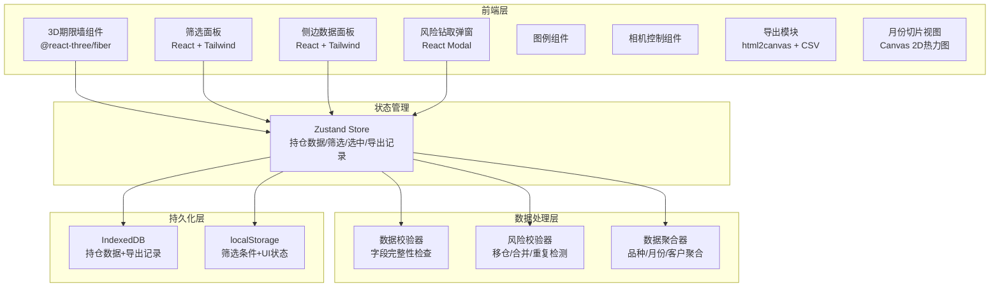
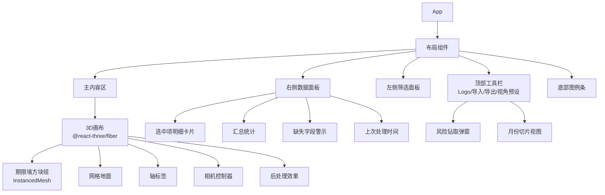
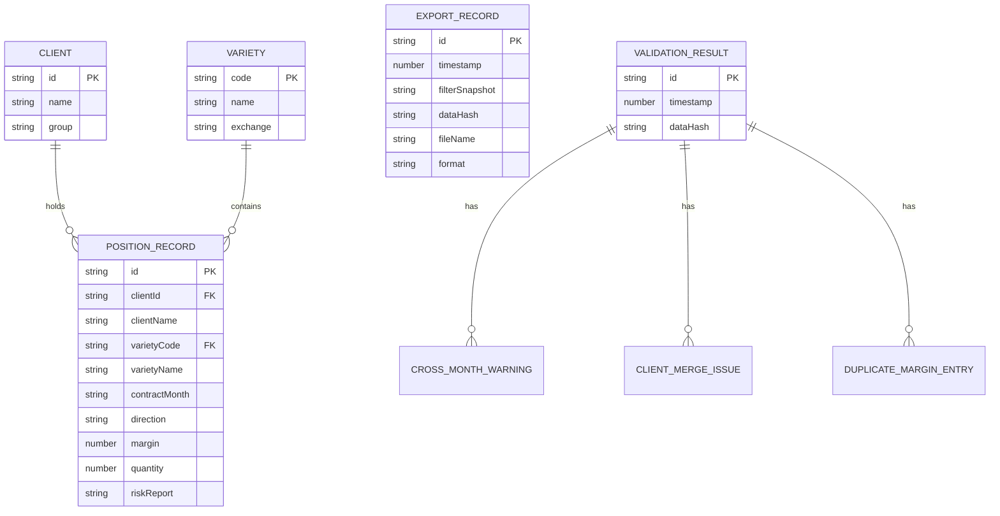

## 1. 架构设计



## 2. 技术说明

- **前端**：React@18 + TypeScript + Tailwind CSS@3 + Vite
- **3D渲染**：three.js + @react-three/fiber + @react-three/drei + @react-three/postprocessing
- **初始化工具**：vite-init (react-ts 模板)
- **后端**：无（纯前端，数据通过文件导入或Mock）
- **数据库**：IndexedDB（浏览器本地持久化）+ localStorage（UI状态）
- **状态管理**：Zustand
- **导出**：html2canvas（截图PNG）+ 自定义CSV生成
- **图表**：自定义Canvas 2D渲染月份切片热力图

## 3. 路由定义

| 路由 | 用途 |
|------|------|
| / | 期限墙主页面（3D墙+筛选+侧边面板+图例+导出） |
| /slice/:month | 月份切片视图（指定月份的2D横截面热力图） |

## 4. API定义

本项目为纯前端应用，无后端API。数据通过以下方式获取：

- **Mock数据**：内置模拟持仓数据集，首次加载时自动填充
- **文件导入**：用户可上传CSV/JSON文件导入持仓数据

### 4.1 数据结构定义

```typescript
interface PositionRecord {
  id: string
  clientId: string
  clientName: string | null
  varietyCode: string
  varietyName: string | null
  contractMonth: string | null
  direction: "long" | "short" | null
  margin: number | null
  quantity: number | null
  riskReport: string | null
  fieldFlags: FieldFlags
}

interface FieldFlags {
  clientIdMissing: boolean
  varietyCodeMissing: boolean
  contractMonthMissing: boolean
  directionMissing: boolean
  marginMissing: boolean
  riskReportMissing: boolean
}

interface ValidationResult {
  crossMonthRollWarnings: CrossMonthWarning[]
  clientMergeIssues: ClientMergeIssue[]
  duplicateMarginEntries: DuplicateMarginEntry[]
}

interface CrossMonthWarning {
  clientId: string
  varietyCode: string
  fromMonth: string
  toMonth: string
  netChangePercent: number
}

interface ClientMergeIssue {
  clientName: string
  distinctIds: string[]
}

interface DuplicateMarginEntry {
  clientId: string
  varietyCode: string
  contractMonth: string
  direction: string
  duplicateCount: number
  marginAmount: number
}

interface ExportRecord {
  id: string
  timestamp: number
  filterSnapshot: FilterState
  dataHash: string
  fileName: string
  format: "csv" | "png"
}
```

## 5. 核心组件架构



## 6. 数据模型

### 6.1 数据模型定义



### 6.2 IndexedDB 存储结构

- **stores**: position_records, clients, varieties, export_records, validation_results
- **索引**: position_records按clientId+varietyCode+contractMonth组合索引，export_records按timestamp索引
- **初始数据**: 内置Mock数据集含8个品种、12个月份、20个客户、约200条持仓记录

## 7. 校验与一致性机制

### 7.1 数据校验流程

1. 导入/加载数据 → 逐条检查字段完整性 → 生成FieldFlags
2. 去重检测 → 同客户同品种同月份同方向保证金完全一致则标记重复
3. 客户合并 → 仅按clientId合并，不同ID即使同名也不合并
4. 跨月移仓检测 → 同客户同品种相邻月份净持仓变化>30%标记预警

### 7.2 组件间交叉校验

| 校验对 | 规则 |
|--------|------|
| 3D墙 ↔ 侧边面板 | 选中方块数据与侧边面板明细一致 |
| 3D墙 ↔ 月份切片 | 切片视图总数=该月3D方块保证金之和 |
| 筛选 ↔ 3D墙 | 筛选后方块数量与筛选结果计数一致 |
| 导出 ↔ 当前视图 | 导出数据与当前筛选/视图展示数据一致 |
| 历史恢复 ↔ 数据哈希 | 重启后数据哈希与上次导出时一致则无篡改 |

## 8. 持久化策略

- 数据导入时生成SHA-256哈希存入IndexedDB
- 每次导出记录筛选条件快照+数据哈希
- 重启时：加载IndexedDB数据 → 比对哈希 → 一致则恢复，不一致则提示数据变更
- UI状态（筛选条件、面板开关、相机位置）存localStorage
