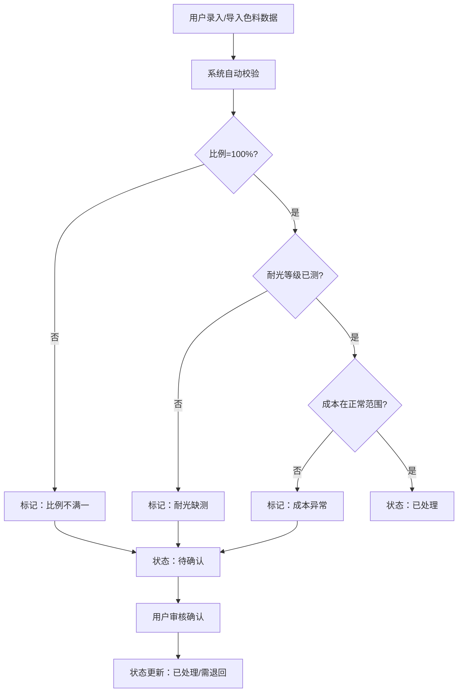
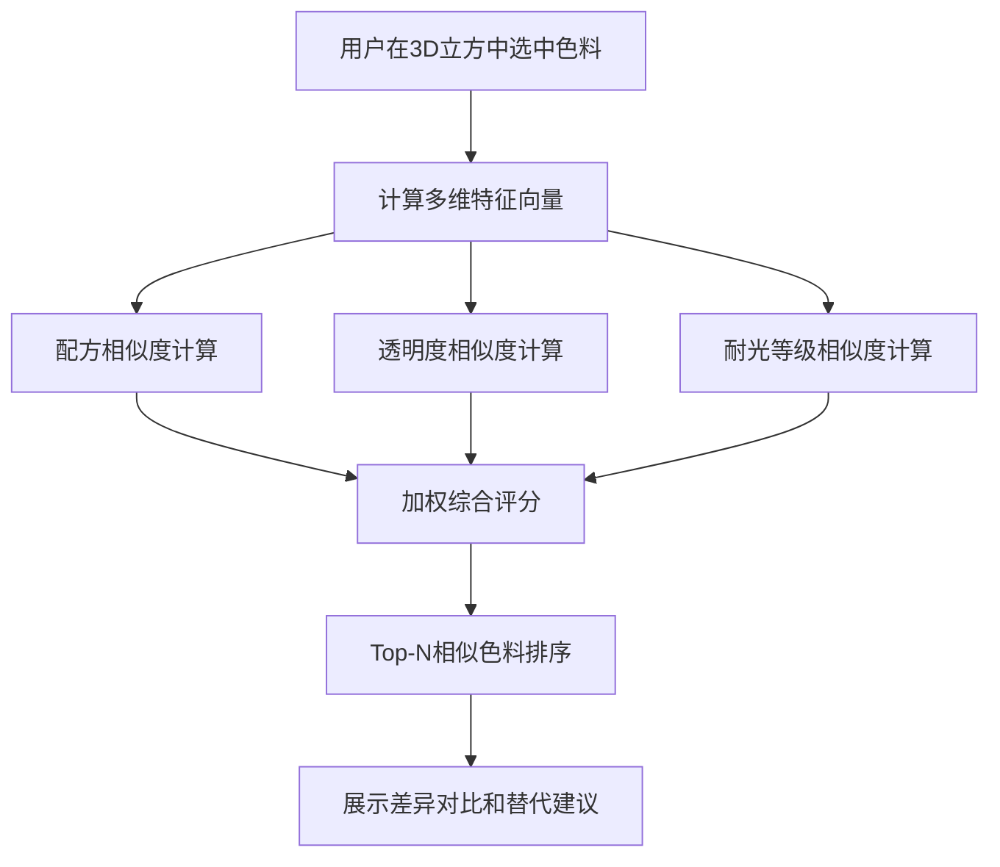

# 画材色料配方立方 - 产品需求文档

## 1. 产品概述

画材色料配方立方是一个3D可视化工具，帮助画材研发人员将颜料配方、透明度和耐光等级映射到三维空间中，直观地查找可替代色料。系统自动检测数据异常（比例不满一、耐光缺测、成本异常）并标记待确认，确保数据质量。

- 核心用户：画材研发团队、配方工程师、质量控制人员
- 核心价值：通过3D空间可视化直观理解色料属性关系，加速配方迭代，确保数据完整性

## 2. 核心功能

### 2.1 用户角色

| 角色 | 登录方式 | 核心权限 |
|------|----------|----------|
| 研发人员 | 本地访问 | 色料管理、3D浏览、相似检索、方案保存、报告导出 |
| 审核人员 | 本地访问 | 异常确认、数据审核、报告生成 |

### 2.2 功能模块

1. **3D配方立方主界面**：色料点云展示、三维轴映射、空间导航
2. **色料数据管理**：配方录入、批量导入、增量更新、异常标记
3. **相似色料检索**：基于配方/透明度/耐光的多维相似度计算
4. **等级筛选系统**：按耐光等级、透明度、成本范围筛选
5. **方案保存管理**：配方方案收藏、对比、版本管理
6. **报告导出模块**：状态分类报告（已处理/待确认/需退回）、Excel导出

### 2.3 页面详情

| 页面名称 | 模块名称 | 功能描述 |
|----------|----------|----------|
| 主工作台 | 3D立方视图 | 可旋转缩放的3D点云，XYZ轴分别映射配方/透明度/耐光等级 |
| 主工作台 | 侧边控制面板 | 筛选条件、异常列表、选中色料详情 |
| 主工作台 | 相似检索面板 | 选中色料后显示Top-N相似色料及差异对比 |
| 数据管理页 | 色料列表 | 表格展示所有色料，支持批量操作和状态筛选 |
| 数据管理页 | 录入表单 | 单条色料录入，实时表单校验和异常提示 |
| 方案管理页 | 方案列表 | 已保存的配方方案，支持对比查看和导出 |
| 报告中心 | 报告生成 | 按状态分类统计，导出Excel格式报告 |

## 3. 核心流程

### 3.1 色料录入与校验流程

### 3.2 相似色料检索流程

## 4. 用户界面设计

### 4.1 设计风格

- **主色调**：深海蓝 (#1e3a5f) - 专业、科技感
- **辅助色**：琥珀橙 (#f59e0b) - 异常标记、交互强调
- **成功色**：翠绿 (#10b981) - 已处理状态
- **警告色**：琥珀橙 (#f59e0b) - 待确认状态
- **危险色**：玫红 (#ef4444) - 需退回状态
- **中性色**：石板灰系列 - 背景、文字
- **按钮风格**：圆角8px，微悬浮效果，微妙阴影
- **字体**：标题用 Noto Sans SC 粗体，正文用 Inter 常规
- **布局风格**：左侧面板 + 中央3D视图 + 右侧详情面板的三栏布局
- **图标风格**：线性图标，2px描边，与Lucide风格一致

### 4.2 页面设计概览

| 页面名称 | 模块名称 | UI元素 |
|----------|----------|---------|
| 主工作台 | 3D立方视图 | 半透明立方体线框、彩色点云（按状态着色）、坐标轴标签、悬浮提示 |
| 主工作台 | 左侧筛选面板 | 折叠式筛选组、范围滑块、多选标签、异常快捷过滤 |
| 主工作台 | 右侧详情面板 | 选中色料卡片、配方进度条、属性雷达图、相似色料列表 |
| 数据管理页 | 色料表格 | 状态徽章、异常列高亮、行悬浮操作、批量选择 |
| 报告中心 | 状态统计 | 环形图统计、分类卡片、时间筛选、导出按钮 |

### 4.3 响应式设计

- **桌面端（>1200px）**：三栏完整布局，3D视图最大化
- **平板端（768-1200px）**：左右面板可折叠，中央3D视图自适应
- **移动端（<768px）**：单栏垂直布局，优先展示3D视图，功能面板底部抽屉式

### 4.4 3D场景设计

- **环境**：深色渐变背景，轻微网格地板，营造实验室氛围
- **光照**：三光源设置（主光+补光+轮廓光），确保点云清晰可见
- **相机**：轨道控制器，默认45度俯视角，支持缩放和平移
- **动画**：选中点放大动画、新数据飞入效果、平滑转场
- **交互**：点击选中、悬浮显示信息、滚轮缩放、拖拽旋转
- **后处理**：轻微Bloom效果让选中点发光，FXAA抗锯齿
- **性能**：使用InstancedMesh渲染大量点云，目标帧率60fps

## 5. 数据校验规则

| 异常类型 | 判定条件 | 处理方式 |
|----------|----------|----------|
| 比例不满一 | 配方各成分比例之和 ≠ 100%（±1%容差） | 标记待确认，显示差额数值 |
| 耐光缺测 | 耐光等级为null/空/未测 | 标记待确认，提示补测 |
| 成本异常 | 成本偏离同类色料均值±30% | 标记待确认，显示偏离百分比 |
| 数据缺失 | 必填字段为空 | 标记需退回，高亮缺失字段 |
| 重复录入 | 色料名称/编号重复 | 提示合并或更新 |
