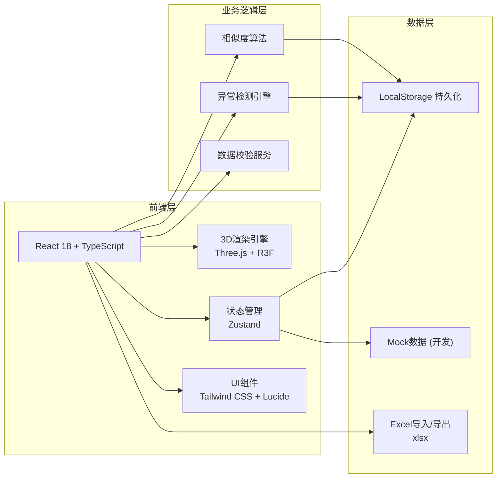
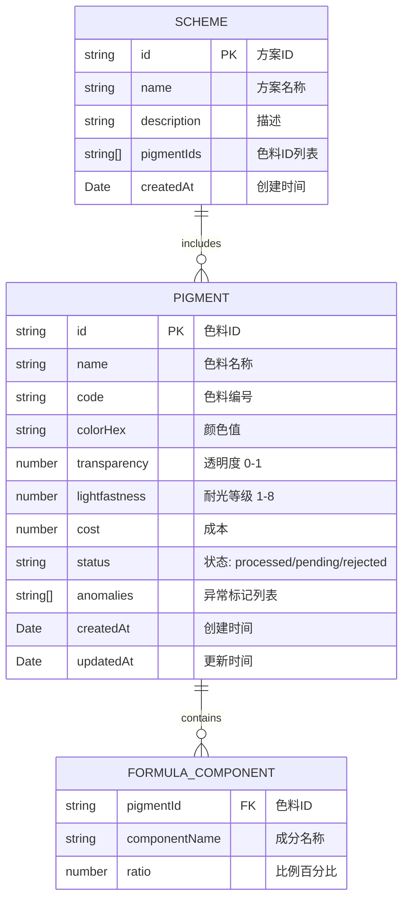

# 画材色料配方立方 - 技术架构文档

## 1. 架构设计



## 2. 技术栈说明

### 2.1 核心技术
- **前端框架**：React 18 + TypeScript
- **构建工具**：Vite 5
- **样式方案**：Tailwind CSS 3
- **状态管理**：Zustand
- **图标库**：Lucide React

### 2.2 3D可视化
- **3D引擎**：Three.js
- **React绑定**：@react-three/fiber
- **辅助组件**：@react-three/drei
- **后处理**：@react-three/postprocessing

### 2.3 工具库
- **Excel处理**：xlsx
- **唯一ID**：uuid
- **图表**：recharts

### 2.4 项目初始化模板
- **模板选择**：react-ts（纯前端）
- **包管理器**：npm

## 3. 路由定义

| 路由路径 | 页面组件 | 功能说明 |
|----------|----------|----------|
| `/` | Workbench | 主工作台 - 3D立方视图 |
| `/data` | DataManagement | 数据管理 - 色料列表和录入 |
| `/schemes` | SchemeManager | 方案管理 - 已保存配方方案 |
| `/reports` | ReportCenter | 报告中心 - 报告生成和导出 |

## 4. 数据模型

### 4.1 数据模型定义



### 4.2 TypeScript 类型定义

```typescript
// 色料状态类型
type PigmentStatus = 'processed' | 'pending' | 'rejected';

// 异常类型
type AnomalyType = 'ratio_incomplete' | 'lightfastness_missing' | 'cost_abnormal' | 'data_missing';

// 配方成分
interface FormulaComponent {
  componentName: string;
  ratio: number;
}

// 色料数据
interface Pigment {
  id: string;
  name: string;
  code: string;
  colorHex: string;
  transparency: number; // 0-1
  lightfastness: number | null; // 1-8, null表示未测
  cost: number;
  formula: FormulaComponent[];
  status: PigmentStatus;
  anomalies: AnomalyType[];
  createdAt: string;
  updatedAt: string;
  notes?: string;
}

// 筛选条件
interface FilterCriteria {
  transparencyRange: [number, number];
  lightfastnessRange: [number, number];
  costRange: [number, number];
  status: PigmentStatus[];
  anomalies: AnomalyType[];
  searchText: string;
}

// 配方方案
interface Scheme {
  id: string;
  name: string;
  description: string;
  pigmentIds: string[];
  createdAt: string;
}

// 相似色料结果
interface SimilarPigmentResult {
  pigment: Pigment;
  similarityScore: number;
  differences: {
    formula: number;
    transparency: number;
    lightfastness: number;
  };
}
```

## 5. 目录结构

```
src/
├── components/
│   ├── 3d/
│   │   ├── FormulaCube.tsx        # 3D配方立方主组件
│   │   ├── PigmentPoints.tsx      # 色料点云
│   │   ├── AxesHelper.tsx         # 坐标轴辅助
│   │   └── CubeFrame.tsx          # 立方框架
│   ├── layout/
│   │   ├── Sidebar.tsx            # 左侧筛选面板
│   │   ├── DetailPanel.tsx        # 右侧详情面板
│   │   └── Navbar.tsx             # 顶部导航
│   ├── pigments/
│   │   ├── PigmentCard.tsx        # 色料卡片
│   │   ├── PigmentTable.tsx       # 色料表格
│   │   └── PigmentForm.tsx        # 色料录入表单
│   ├── schemes/
│   │   ├── SchemeCard.tsx         # 方案卡片
│   │   └── SchemeComparison.tsx   # 方案对比
│   ├── reports/
│   │   ├── StatusStats.tsx        # 状态统计
│   │   └── ReportExport.tsx       # 报告导出
│   └── ui/
│       ├── Badge.tsx              # 状态徽章
│       ├── Slider.tsx             # 范围滑块
│       └── Modal.tsx              # 弹窗
├── pages/
│   ├── Workbench.tsx              # 主工作台
│   ├── DataManagement.tsx         # 数据管理
│   ├── SchemeManager.tsx          # 方案管理
│   └── ReportCenter.tsx           # 报告中心
├── store/
│   ├── usePigmentStore.ts         # 色料状态管理
│   ├── useFilterStore.ts          # 筛选状态管理
│   └── useSchemeStore.ts          # 方案状态管理
├── utils/
│   ├── anomalyDetector.ts         # 异常检测引擎
│   ├── similarityCalculator.ts    # 相似度计算
│   ├── excelExporter.ts           # Excel导出
│   └── colorUtils.ts              # 颜色工具
├── data/
│   └── mockPigments.ts            # Mock数据
├── types/
│   └── index.ts                   # 类型定义
├── App.tsx
├── main.tsx
└── index.css
```

## 6. 核心算法

### 6.1 异常检测算法

```typescript
// 比例校验：检查配方比例之和是否为100%（±1%容差）
function checkRatioComplete(formula: FormulaComponent[]): boolean {
  const total = formula.reduce((sum, c) => sum + c.ratio, 0);
  return Math.abs(total - 100) <= 1;
}

// 耐光等级校验：检查是否已测
function checkLightfastness(level: number | null): boolean {
  return level !== null && level >= 1 && level <= 8;
}

// 成本异常检测：基于同类色料的3σ原则
function checkCostAbnormal(cost: number, allCosts: number[]): boolean {
  const mean = allCosts.reduce((a, b) => a + b, 0) / allCosts.length;
  const std = Math.sqrt(allCosts.reduce((sum, c) => sum + Math.pow(c - mean, 2), 0) / allCosts.length);
  return Math.abs(cost - mean) > 2 * std;
}
```

### 6.2 相似度计算算法

```typescript
// 配方相似度（余弦相似度）
function calculateFormulaSimilarity(f1: FormulaComponent[], f2: FormulaComponent[]): number {
  const allComponents = new Set([...f1.map(c => c.componentName), ...f2.map(c => c.componentName)]);
  const v1: number[] = [];
  const v2: number[] = [];
  
  allComponents.forEach(comp => {
    v1.push(f1.find(c => c.componentName === comp)?.ratio || 0);
    v2.push(f2.find(c => c.componentName === comp)?.ratio || 0);
  });
  
  const dotProduct = v1.reduce((sum, val, i) => sum + val * v2[i], 0);
  const norm1 = Math.sqrt(v1.reduce((sum, val) => sum + val * val, 0));
  const norm2 = Math.sqrt(v2.reduce((sum, val) => sum + val * val, 0));
  
  return dotProduct / (norm1 * norm2);
}

// 综合相似度（加权）
function calculateOverallSimilarity(p1: Pigment, p2: Pigment): number {
  const formulaSim = calculateFormulaSimilarity(p1.formula, p2.formula);
  const transparencySim = 1 - Math.abs(p1.transparency - p2.transparency);
  const lightfastnessSim = p1.lightfastness && p2.lightfastness 
    ? 1 - Math.abs(p1.lightfastness - p2.lightfastness) / 7 
    : 0.5;
  
  return formulaSim * 0.5 + transparencySim * 0.3 + lightfastnessSim * 0.2;
}
```

## 7. 状态管理设计

### 7.1 色料Store (Zustand)

```typescript
const usePigmentStore = create((set, get) => ({
  pigments: [],
  selectedPigmentId: null,
  
  // CRUD操作
  addPigment: (pigment) => set(state => ({
    pigments: [...state.pigments, { ...pigment, id: uuid(), createdAt: new Date().toISOString() }]
  })),
  
  updatePigment: (id, updates) => set(state => ({
    pigments: state.pigments.map(p => p.id === id ? { ...p, ...updates, updatedAt: new Date().toISOString() } : p)
  })),
  
  deletePigment: (id) => set(state => ({
    pigments: state.pigments.filter(p => p.id !== id)
  })),
  
  // 选中操作
  selectPigment: (id) => set({ selectedPigmentId: id }),
  
  // 异常检测
  detectAnomalies: (pigment) => {
    const anomalies = [];
    // ... 检测逻辑
    return anomalies;
  },
  
  // 相似检索
  findSimilarPigments: (id, topN = 5) => {
    const target = get().pigments.find(p => p.id === id);
    if (!target) return [];
    
    return get().pigments
      .filter(p => p.id !== id)
      .map(p => ({
        pigment: p,
        score: calculateOverallSimilarity(target, p)
      }))
      .sort((a, b) => b.score - a.score)
      .slice(0, topN);
  }
}));
```
