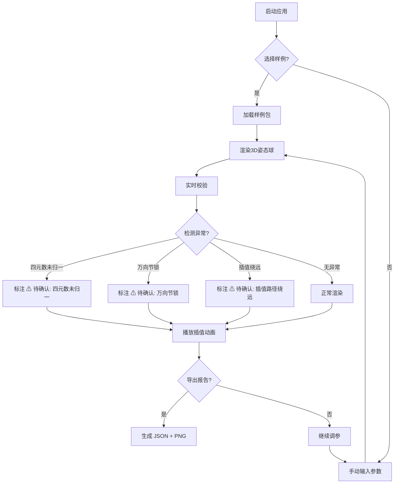

## 1. 产品概述

面向航天课程教学的「卫星姿态四元数球」3D 可视化工具，通过球面映射直观展示四元数与欧拉角的空间关系，让学生观察 SLERP 插值路径和万向节锁奇异点，而非仅靠口头讲解。
- 目标用户：航天工程/飞行器控制课程师生
- 核心价值：让抽象的四元数空间关系变得「看得见、摸得着」，异常状态宁标勿漏

## 2. 核心功能

### 2.1 用户角色
| 角色 | 使用方式 | 核心权限 |
|------|----------|----------|
| 教师 | 直接使用 | 配置样例包、导出课堂报告、修改参数 |
| 学生 | 直接使用 | 浏览3D球面、调参观察、查看奇异点提示 |

### 2.2 功能模块
1. **姿态球主页**: 3D球面可视化、姿态点与路径渲染、奇异点标注、动画播放
2. **参数面板**: 四元数/欧拉角输入、插值步长、目标姿态设置、实时联动
3. **样例包**: 预置课程样例数据，区分原始数据与处理结果
4. **报告导出**: 参数快照 + 可视化截图 + 异常标注导出为 JSON/PNG

### 2.3 页面详情
| 页面名称 | 模块名称 | 功能描述 |
|----------|----------|----------|
| 姿态球主页 | 3D 球面画布 | 渲染单位球面、姿态点、SLERP 插值路径、欧拉角奇异点红色脉冲标注 |
| 姿态球主页 | 动画控制器 | 播放/暂停/步进插值动画，显示当前插值进度和四元数值 |
| 姿态球主页 | 奇异点提示浮层 | 检测到万向节锁/四元数未归一/插值绕远时弹出黄色「⚠ 待确认」标签 |
| 参数面板 | 四元数输入组 | 4 个分量输入框，实时校验归一性，未归一时标黄 |
| 参数面板 | 欧拉角输入组 | 3 个分量 (roll/pitch/yaw)，实时检测万向节锁区域 |
| 参数面板 | 插值配置 | 步长滑块、起始/目标姿态选择、SLERP/LERP 切换 |
| 参数面板 | 姿态模型选择 | 预置卫星模型（简化解算），展示旋转效果 |
| 样例包 | 样例列表 | 展示所有样例，标注「原始信息」与「处理结果」标签 |
| 样例包 | 样例详情 | 展开四元数、欧拉角、插值步长、姿态模型、目标姿态、课堂报告 |
| 报告导出 | 导出面板 | 一键导出当前参数快照 (JSON) + 球面截图 (PNG) |

## 3. 核心流程

**教学演示流程**：教师选择样例 → 加载姿态数据到球面 → 调整目标姿态 → 播放插值动画 → 观察奇异点提示 → 导出课堂报告

**学生探索流程**：学生手动输入四元数/欧拉角 → 实时观察球面变化 → 切换插值方式对比路径 → 查看异常标注理解万向节锁

## 4. 用户界面设计

### 4.1 设计风格
- **主色调**: 深空蓝 (#0a0e27) 背景 + 星云青 (#00e5c7) 强调色 + 警示琥珀 (#fbbf24)
- **辅助色**: 轨道银 (#94a3b8)、脉冲红 (#ef4444) 用于奇异点
- **按钮风格**: 圆角微光边框按钮，hover 时青色光晕
- **字体**: 标题使用 JetBrains Mono（等宽/航天仪表感），正文使用 Noto Sans SC
- **布局**: 左侧3D球面（占 65%），右侧参数面板（占 35%），底部动画控制条
- **图标**: Lucide 图标集

### 4.2 页面设计概览
| 页面名称 | 模块名称 | UI 元素 |
|----------|----------|----------|
| 姿态球主页 | 3D 球面画布 | 深空背景、半透明球面线框、青色姿态点、渐变插值路径线、红色脉冲奇异点标记 |
| 姿态球主页 | 动画控制器 | 底部进度条、播放/暂停/步进按钮、当前四元数值显示 |
| 姿态球主页 | 奇异点提示 | 黄色半透明浮层、⚠ 图标、「待确认」标签、异常原因文字 |
| 参数面板 | 四元数输入 | 4 个数值输入框，归一偏差实时显示，超标时边框变琥珀色 |
| 参数面板 | 欧拉角输入 | 3 个滑块+数值框，万向节锁区域红色背景渐变 |
| 参数面板 | 插值配置 | 步长滑块、起止姿态下拉、SLERP/LERP 切换开关 |
| 样例包 | 样例列表 | 卡片式布局，左上角「原始」/「结果」彩色标签 |
| 报告导出 | 导出面板 | JSON/PNG 格式切换、导出按钮、预览缩略图 |

### 4.3 响应式
- 桌面优先设计（1920×1080 最佳体验）
- 平板适配：参数面板折叠为底部抽屉
- 移动端：仅支持横屏浏览，3D 画布全屏，参数面板为浮动覆盖

### 4.4 3D 场景指导
- **环境**: 深空星域背景，微弱环境光模拟太空
- **光照**: 主方向光从右上前方照射，补光从左下，环境光极低
- **相机**: 透视相机，可旋转/缩放/平移，默认斜 45° 俯视
- **构图**: 单位球面居中，姿态点在球面上，路径线沿球面弧线
- **交互**: OrbitControls 旋转缩放、点击姿态点显示详情、悬停奇异点高亮
- **动画**: 奇异点脉冲呼吸动画、插值路径渐进绘制、姿态点沿路径运动
- **后处理**: 辉光效果（Bloom）增强路径线和奇异点视觉效果
- **性能预算**: 保持 60fps，球面线段数 ≤ 64，粒子数 ≤ 200

## 5. 数据标记规范

样例包中所有数据项必须明确标记来源：
- **[原始信息]**: 直接输入或从外部获取的四元数、欧拉角原始值
- **[处理结果]**: 经过归一化、转换、插值计算后得到的值

标记方式：每个数据项旁显示彩色标签（原始=青色，结果=琥珀色）
