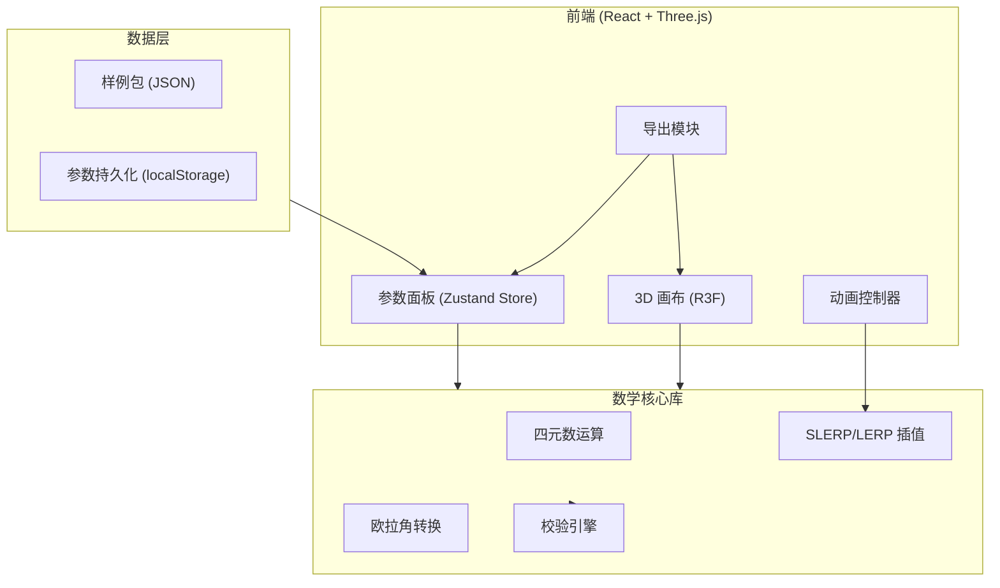

## 1. 架构设计



## 2. 技术说明
- **前端框架**: React 18 + TypeScript + Vite
- **3D 渲染**: three.js + @react-three/fiber + @react-three/drei + @react-three/postprocessing
- **样式**: Tailwind CSS 3
- **状态管理**: Zustand
- **数学库**: 自实现（四元数运算、SLERP 插值、万向节锁检测）
- **数据持久化**: localStorage（参数保存）、JSON 文件下载（报告导出）
- **无后端**: 纯前端应用，所有计算在浏览器端完成

## 3. 路由定义
| 路由 | 用途 |
|------|------|
| / | 主页面：3D 姿态球 + 参数面板 + 样例包 + 导出 |

> 单页应用，所有功能集成在同一页面，通过面板切换显示不同模块

## 4. 核心数据结构

### 4.1 四元数
```typescript
interface Quaternion {
  w: number;
  x: number;
  y: number;
  z: number;
  source: 'raw' | 'computed';
}
```

### 4.2 欧拉角
```typescript
interface EulerAngles {
  roll: number;
  pitch: number;
  yaw: number;
  sequence: 'ZYX' | 'ZYZ' | 'XYZ';
  source: 'raw' | 'computed';
}
```

### 4.3 校验结果
```typescript
interface ValidationResult {
  type: 'unnormalized' | 'gimbal_lock' | 'long_path';
  severity: 'warning' | 'error';
  message: string;
  pendingConfirmation: boolean;
}
```

### 4.4 插值配置
```typescript
interface InterpolationConfig {
  method: 'slerp' | 'lerp';
  steps: number;
  from: Quaternion;
  to: Quaternion;
}
```

### 4.5 样例包
```typescript
interface SamplePack {
  id: string;
  name: string;
  description: string;
  quaternion: Quaternion;
  eulerAngles: EulerAngles;
  interpolationSteps: number;
  attitudeModel: string;
  targetAttitude: Quaternion;
  report: string;
  items: SampleItem[];
}

interface SampleItem {
  key: string;
  label: string;
  value: unknown;
  tag: 'raw' | 'computed';
}
```

### 4.6 应用状态 (Zustand Store)
```typescript
interface AppState {
  currentQuaternion: Quaternion;
  targetQuaternion: Quaternion;
  eulerAngles: EulerAngles;
  interpolationConfig: InterpolationConfig;
  validationResults: ValidationResult[];
  animationProgress: number;
  isPlaying: boolean;
  selectedSampleId: string | null;
  singularityPoints: EulerAngles[];
  setQuaternion: (q: Quaternion) => void;
  setTargetQuaternion: (q: Quaternion) => void;
  setEulerAngles: (e: EulerAngles) => void;
  setInterpolationConfig: (c: InterpolationConfig) => void;
  setAnimationProgress: (p: number) => void;
  togglePlayback: () => void;
  loadSample: (id: string) => void;
  saveParameters: () => void;
  loadParameters: () => void;
  exportReport: () => void;
}
```

## 5. 核心算法

### 5.1 四元数归一化检测
```
norm = sqrt(w² + x² + y² + z²)
if |norm - 1.0| > ε (ε = 0.001) → 标记「⚠ 待确认: 四元数未归一」
```

### 5.2 万向节锁检测
```
当旋转顺序为 ZYX 时:
if |pitch - π/2| < δ (δ = 0.1 rad) → 标记「⚠ 待确认: 万向节锁」
```

### 5.3 插值绕远检测
```
θ = arccos(q1 · q2)  // 四元数点积
if θ > π/2 → 标记「⚠ 待确认: 插值路径绕远，建议取反四元数」
```

### 5.4 四元数 → 球面映射
```
// 四元数 (w, x, y, z) 映射到单位球面:
// 忽略 w 分量（旋转角度），将 (x, y, z) 归一化后投影到球面
v = normalize(x, y, z)
sphere_point = v * radius
```

## 6. 文件结构

```
src/
├── components/
│   ├── AttitudeSphere.tsx       # 3D 姿态球主组件
│   ├── SphereMesh.tsx           # 球面线框渲染
│   ├── AttitudePoint.tsx        # 姿态点渲染
│   ├── InterpolationPath.tsx    # 插值路径渲染
│   ├── SingularityMarker.tsx    # 奇异点标注
│   ├── SatelliteModel.tsx       # 卫星姿态模型
│   ├── AnimationController.tsx  # 动画控制条
│   ├── ValidationOverlay.tsx    # 校验提示浮层
│   ├── ParamPanel.tsx           # 参数面板容器
│   ├── QuaternionInput.tsx      # 四元数输入组
│   ├── EulerInput.tsx           # 欧拉角输入组
│   ├── InterpolationConfig.tsx  # 插值配置
│   ├── SamplePanel.tsx          # 样例包面板
│   ├── ExportPanel.tsx          # 导出面板
│   └── DataTag.tsx              # 原始/结果标签
├── hooks/
│   ├── useAnimation.ts          # 动画循环 hook
│   └── useValidation.ts         # 校验 hook
├── utils/
│   ├── quaternion.ts            # 四元数运算库
│   ├── euler.ts                 # 欧拉角转换
│   ├── interpolation.ts         # SLERP/LERP 插值
│   ├── validation.ts            # 校验引擎
│   ├── sphereMapping.ts         # 球面映射
│   ├── samples.ts               # 样例数据
│   ├── persistence.ts           # 参数持久化
│   └── reportExport.ts          # 报告导出
├── store/
│   └── useAppStore.ts           # Zustand 状态管理
├── types/
│   └── index.ts                 # 类型定义
├── App.tsx
└── main.tsx
```
