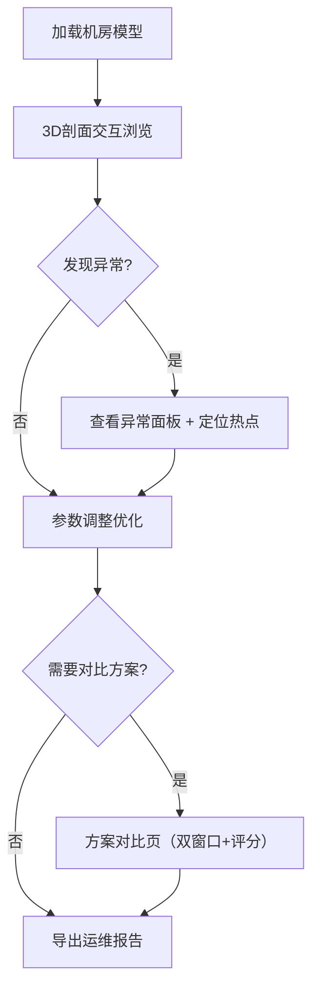

## 1. 产品概述

数据中心风道剖面3D可视化平台——面向机房运维人员，以3D剖面视角呈现冷热通道、机柜功耗、空调风量的空间分布，自动识别局部热点与配置异常，支持方案对比与报告导出，帮助运维团队快速定位问题、记录决策依据。

- 解决传统2D平面图无法直观反映风道三维流向与热点遮挡的问题
- 面向数据中心运维工程师与设施管理人员，降低热点排查时间，提升运维决策可追溯性

## 2. 核心功能

### 2.1 用户角色

| 角色 | 注册方式 | 核心权限 |
|------|----------|----------|
| 运维工程师 | 账号登录 | 查看3D剖面、调整参数、导出报告 |
| 设施管理员 | 账号登录 | 管理机柜/空调配置、审批方案、查看历史版本 |

### 2.2 功能模块

1. **3D剖面主视图**：冷热通道、机柜阵列、空调单元、风道管道的3D渲染，支持旋转/缩放/剖面切割
2. **风向箭头与风量可视化**：3D箭头显示气流方向，箭头粗细/颜色映射风量大小
3. **热点高亮与异常检测**：温度热力图叠加、自动标注热点区域，异常原因解释面板
4. **参数配置面板**：机柜功耗、空调风量、通道布局参数调整与保存
5. **方案对比**：双窗口并排对比不同配置下的风道与热点分布
6. **报告导出**：生成包含3D截图、异常清单、参数快照的运维报告

### 2.3 页面详情

| 页面名称 | 模块名称 | 功能描述 |
|----------|----------|----------|
| 3D剖面主页 | 3D场景渲染 | 渲染机房3D剖面：机柜阵列（冷热通道布局）、空调机组、风道管道，支持OrbitControls交互（旋转/缩放/平移）和剖面切割滑块 |
| 3D剖面主页 | 风向箭头层 | 3D箭头标注气流方向，箭头长度/粗细映射风速，颜色映射温度；点击箭头显示该点风量/温度详情 |
| 3D剖面主页 | 热点高亮层 | 温度热力图叠加在机柜表面，超阈值区域脉冲发光；点击热点弹出异常原因面板（风向反/功耗缺失/遮挡等） |
| 3D剖面主页 | 参数面板（右侧抽屉） | 可调参数：单柜功耗、空调送风量、通道间距、地板开孔率；保存/加载参数集；参数变更实时更新3D场景 |
| 3D剖面主页 | 异常检测面板（底部抽屉） | 异常清单列表：风向反转、功耗缺失、热点遮挡；每条异常可点回3D场景定位，展示解释文案 |
| 方案对比页 | 双窗口对比 | 左右两个3D视图分别加载不同参数集，同步旋转/缩放；底部对比评分栏 |
| 方案对比页 | 评分对比 | 量化评分：冷却效率、热点数量、风量利用率；点击评分可查看计算明细 |
| 报告导出页 | 报告生成 | 自动填充当前参数快照、3D场景截图、异常清单、评分结果；支持导出为PDF |

## 3. 核心流程

用户进入3D剖面主页，加载机房模型后可旋转查看整体布局。通过剖面切割滑块深入观察内部风道走向，风向箭头与热力图直观呈现气流与温度分布。系统自动检测异常（风向反、功耗缺失、热点遮挡），在异常面板列出并支持点击定位。用户通过参数面板调整功耗/风量等参数，实时观察3D场景变化。对比不同方案时切换到方案对比页，双窗口同步查看，评分对比辅助决策。最终导出包含截图、异常说明、参数快照的报告。

## 4. 用户界面设计

### 4.1 设计风格

- **主色调**：深蓝灰（#0f1923）为背景底色，冷通道用冰蓝（#00d4ff），热通道用琥珀橙（#ff6b35），空调用青绿（#00e5a0）
- **按钮风格**：圆角8px，微发光边框，hover时亮度提升+阴影扩散
- **字体**：标题用 JetBrains Mono（工业监控风格），正文用 Noto Sans SC
- **布局风格**：左侧3D主视图占70%宽度，右侧参数面板抽屉，底部异常面板抽屉
- **图标风格**：线性描边图标（lucide-react），与工业监控主题一致

### 4.2 页面设计概览

| 页面名称 | 模块名称 | UI元素 |
|----------|----------|--------|
| 3D剖面主页 | 3D场景 | 深色背景+网格地面，机柜用半透明方块+功耗色阶，空调用带叶片旋转动画的几何体，风道用半透明管道 |
| 3D剖面主页 | 风向箭头 | 3D锥体+圆柱组合箭头，颜色从蓝到红映射温度梯度，箭头粗细映射风速 |
| 3D剖面主页 | 热点高亮 | 机柜表面叠加半透明热力图，超阈值区域脉冲动画（emissive闪烁），热点标注线+悬浮信息卡 |
| 3D剖面主页 | 参数面板 | 右侧滑出抽屉，滑块+数值输入框，保存/加载按钮，参数集下拉选择 |
| 3D剖面主页 | 异常面板 | 底部滑出抽屉，异常列表（图标+文案+严重等级），点击跳转定位按钮 |
| 方案对比页 | 双窗口 | 左右均分两个Canvas，同步控制条，底部评分卡片 |
| 报告导出页 | 报告预览 | A4纸样式预览区，截图缩略图，导出PDF按钮 |

### 4.3 响应式

- 桌面优先设计，3D场景最低宽度1024px
- 平板端参数面板转为浮动弹窗
- 移动端暂不支持（3D交互需精确操作）

### 4.4 3D场景指引

- **环境/HDRI**：暗色工业风格环境光，无户外HDR，室内冷光源氛围
- **光照设置**：主光偏冷白（0.6强度），环境光偏蓝灰（0.3强度），热点区域点光源偏暖橙
- **相机设置**：透视相机，初始视角45度俯瞰，OrbitControls限制极角（不可翻转到底部）
- **构图与焦点**：机柜阵列居中，剖面切割面为视觉焦点，热力图色彩吸引视线
- **交互与动画**：鼠标hover机柜高亮+信息卡，空调叶片持续旋转，热点脉冲闪烁，剖面切割平滑过渡
- **后处理效果**：Bloom（热点发光），AO（机柜间阴影增强纵深）
- **资源与性能**：几何体使用InstancedMesh渲染机柜阵列，热力图用DataTexture，帧率目标≥30fps
