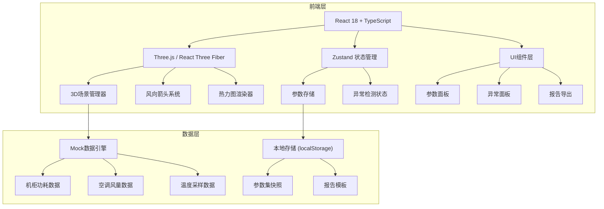
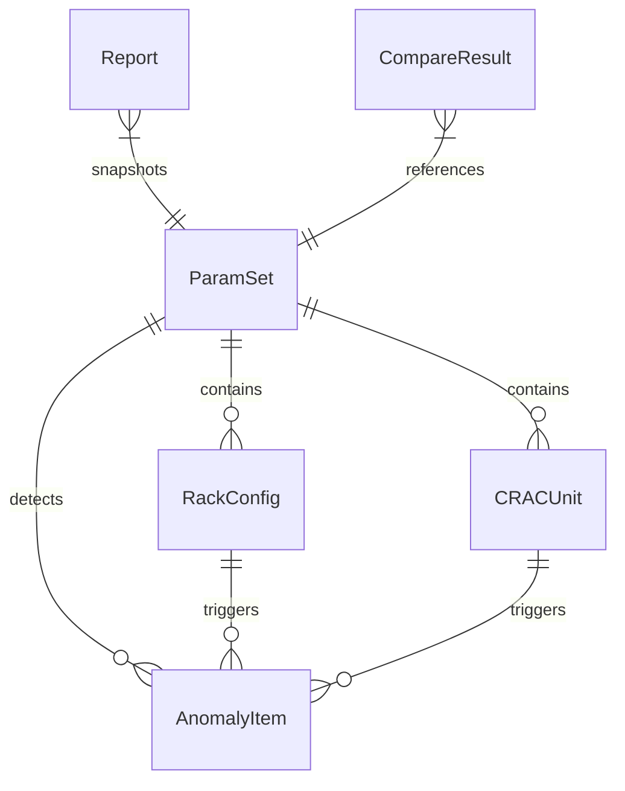

## 1. 架构设计



## 2. 技术说明

- **前端**：React@18 + TypeScript + Tailwind CSS@3 + Vite
- **3D渲染**：three + @react-three/fiber + @react-three/drei + @react-three/postprocessing
- **状态管理**：Zustand（参数集、异常状态、对比方案）
- **初始化工具**：vite-init（react-ts模板）
- **后端**：无（纯前端，数据使用Mock + localStorage持久化）
- **数据库**：无（localStorage存储参数集与报告快照）

## 3. 路由定义

| 路由 | 用途 |
|------|------|
| / | 3D剖面主页：3D场景 + 参数面板 + 异常面板 |
| /compare | 方案对比页：双窗口3D + 评分对比 |
| /report | 报告导出页：报告预览 + PDF导出 |

## 4. API定义

无后端API。所有数据通过Mock引擎生成，参数与报告通过localStorage持久化。

### 4.1 数据类型定义

```typescript
interface RackConfig {
  id: string
  row: number
  col: number
  powerKw: number
  temperature: number
  label: string
}

interface CRACUnit {
  id: string
  position: [number, number, number]
  airflowCfm: number
  direction: [number, number, number]
  temperature: number
  label: string
}

interface AirflowSample {
  position: [number, number, number]
  velocity: number
  direction: [number, number, number]
  temperature: number
}

interface AnomalyItem {
  id: string
  type: 'reversed_airflow' | 'missing_power' | 'hotspot_occluded'
  severity: 'critical' | 'warning' | 'info'
  rackId?: string
  cracId?: string
  position: [number, number, number]
  description: string
  explanation: string
}

interface ParamSet {
  id: string
  name: string
  timestamp: number
  racks: RackConfig[]
  cracUnits: CRACUnit[]
  aisleGap: number
  floorPerforation: number
}

interface CompareScore {
  coolingEfficiency: number
  hotspotCount: number
  airflowUtilization: number
  overallScore: number
  details: string
}
```

## 5. 服务器架构图

无后端服务器。

## 6. 数据模型

### 6.1 数据模型定义



### 6.2 存储结构

- `dc-params/{id}` → ParamSet JSON（localStorage）
- `dc-reports/{id}` → Report JSON（localStorage）
- `dc-current` → 当前活跃参数集ID（localStorage）

### 6.3 Mock数据引擎

内置模拟数据生成器，根据ParamSet计算：
- 机柜表面温度分布（基于功耗 + 距空调距离 + 风向）
- 风场采样点（基于空调风量 + 障碍物遮挡）
- 异常检测（风向反转检测、功耗缺失检测、热点遮挡检测）
