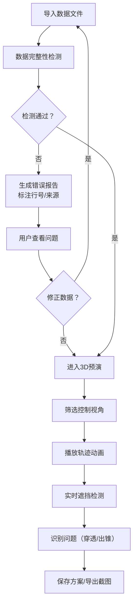

## 1. 产品概述

舞台灯光锥预演Web3D系统，为舞美设计师提供3D可视化预演环境，支持灯位布置、演员走位、灯光锥效果和道具遮挡的综合预览。系统重点在于数据完整性检测与错误识别，能够智能报告数据缺口、灯光穿透、演员出锥、色温错误等问题，而非静默吞掉坏数据。

- **核心价值**：在实际搭建前发现灯光设计问题，减少现场调试时间
- **目标用户**：舞美设计师、灯光师、舞台导演

## 2. 核心功能

### 2.1 用户角色
| 角色 | 注册方式 | 核心权限 |
|------|----------|----------|
| 舞美设计师 | 无需注册，本地使用 | 导入数据、3D预演、错误检测、方案保存、导出截图 |

### 2.2 功能模块
1. **3D舞台主视图**：Three.js 3D场景渲染、灯光锥可视化、演员轨迹、道具模型
2. **数据导入与检测面板**：多格式数据导入、完整性校验、错误报告（含行号定位）
3. **筛选与控制面板**：按灯位/演员/道具类型筛选、视角控制、播放控制
4. **信息悬浮面板**：选中元素详情、灯光参数、演员状态、遮挡检测结果
5. **方案管理面板**：方案保存/加载、版本对比、截图导出

### 2.3 页面详情
| 页面名称 | 模块名称 | 功能描述 |
|---------|---------|----------|
| 3D预演主页面 | 3D场景区 | 渲染舞台、灯光锥、演员、道具，支持旋转/缩放/平移 |
| 3D预演主页面 | 左侧数据面板 | 数据导入、错误检测报告、元素列表筛选 |
| 3D预演主页面 | 右侧信息面板 | 选中元素详情、实时遮挡检测、色温校验结果 |
| 3D预演主页面 | 底部控制栏 | 轨迹播放控制、时间轴、视角预设、截图导出 |
| 方案管理弹窗 | 方案列表 | 保存当前配置、加载历史方案、删除方案 |

## 3. 核心流程

用户导入舞台相关数据文件 → 系统自动检测数据完整性与错误 → 显示检测报告（高亮问题行号） → 用户修正或继续 → 在3D场景中查看灯光锥、演员走位、道具遮挡 → 通过筛选器聚焦特定元素 → 播放动画观察时序配合 → 识别灯光穿透/演员出锥等问题 → 保存方案或导出预演截图

## 4. 用户界面设计

### 4.1 设计风格
- **主色调**：深靛蓝 #1a1a2e 作为背景，营造专业舞台氛围
- **强调色**：琥珀橙 #ff9500 用于高亮警告，青蓝 #00d4ff 用于正常状态，深红 #ff3b30 用于严重错误
- **中性色**：深灰 #2c2c3e、中灰 #4a4a5e、浅灰 #8a8a9e
- **按钮风格**：微立体设计，圆角8px，悬停时有微妙上浮效果
- **字体**：Display - Orbitron（科技感标题），Body - Noto Sans SC（清晰易读）
- **布局风格**：三栏式布局，左侧数据面板，中间3D场景，右侧信息面板
- **图标风格**：线性图标，科技感，统一2px描边

### 4.2 页面设计概述
| 页面名称 | 模块名称 | UI元素 |
|---------|---------|--------|
| 3D预演主页面 | 3D场景区 | 暗色舞台背景、网格地面、半透明灯光锥、彩色轨迹线、实体道具模型、悬浮信息卡片 |
| 3D预演主页面 | 左侧数据面板 | 文件拖放区、错误报告列表（带行号）、可折叠树状筛选器、状态指示灯 |
| 3D预演主页面 | 右侧信息面板 | 选中元素标题、参数表格、遮挡检测结果、色温色卡、问题建议 |
| 3D预演主页面 | 底部控制栏 | 播放/暂停/快进按钮、时间轴滑块、视角预设按钮、截图按钮、保存按钮 |
| 方案管理弹窗 | 方案列表 | 卡片式方案预览、时间戳、操作按钮、导入导出按钮 |

### 4.3 响应式
- Desktop-first 设计，主窗口最小支持 1280x720
- 面板可折叠，小屏幕下可切换显示单个面板
- 触摸操作支持：双指缩放、单指旋转

### 4.4 3D场景指导
- **环境**：深色舞台背景，轻微雾效，网格参考线
- **灯光**：环境光 + 方向光基础照明，用户添加的灯光锥用半透明锥体+体积光效果
- **相机**：PerspectiveCamera，默认45度视角，支持轨道控制
- **构图**：舞台居中，留出空间给控制面板
- **交互**：点击选中元素高亮，悬停显示简要信息，拖拽旋转视角
- **后处理**：轻微Bloom效果增强灯光体积感，FXAA抗锯齿
- **性能**：灯光锥使用InstancedMesh，轨迹线按需加载，保持60fps
