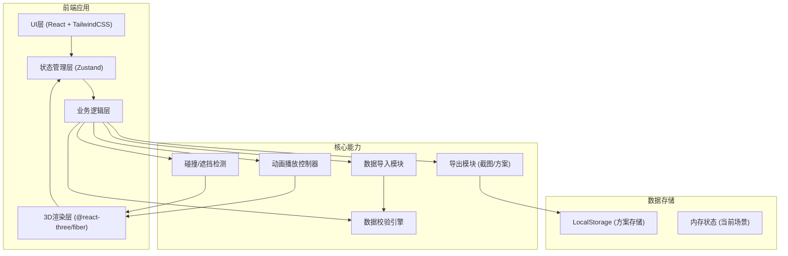
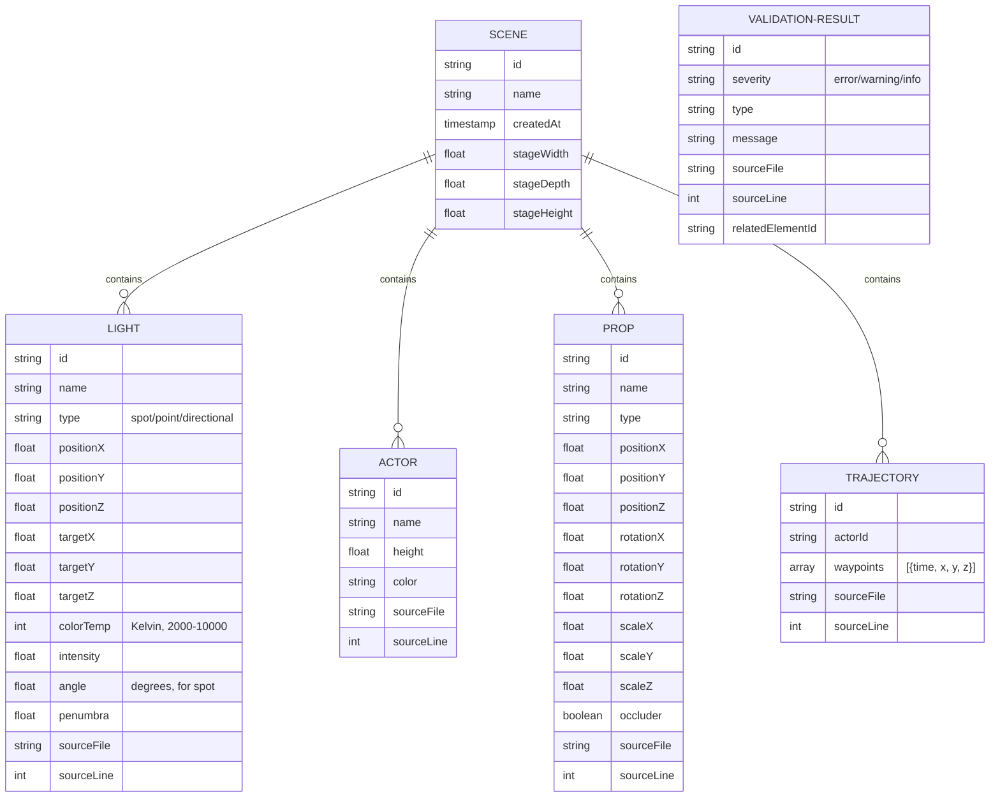

## 1. 架构设计

## 2. 技术描述

- **前端框架**: React@18 + TypeScript
- **构建工具**: Vite@5
- **样式方案**: TailwindCSS@3
- **3D渲染**: 
  - Three.js@0.160
  - @react-three/fiber@8
  - @react-three/drei@9
  - @react-three/postprocessing@2
- **状态管理**: Zustand@4
- **图标**: Lucide React
- **本地存储**: LocalStorage (方案持久化)
- **无后端设计**: 纯前端应用，所有数据处理在客户端完成

## 3. 路由定义

| 路由 | 用途 |
|------|------|
| / | 主应用页面（3D预演+控制面板） |

## 4. 数据模型

### 4.1 数据模型定义

### 4.2 数据校验规则

| 数据类型 | 校验项 | 错误级别 |
|---------|--------|----------|
| 灯光 | position缺失 | error |
| 灯光 | colorTemp < 2000 或 > 10000 | error |
| 灯光 | angle > 180 | warning |
| 演员 | height <= 0 | warning |
| 道具 | scale <= 0 | error |
| 轨迹 | waypoints为空 | error |
| 轨迹 | 时间点重复 | warning |
| 通用 | 缺少name字段 | info |

### 4.3 遮挡检测算法

1. 对每束灯光，创建从光源到目标的光线投射
2. 检测光线与标记为occluder的道具是否相交
3. 若相交，记录"灯光穿透"问题，包含道具ID和交点位置
4. 对演员当前位置，检测是否在任意灯光锥体内
5. 若不在任何锥体内，记录"演员出锥"警告

## 5. 核心模块说明

### 5.1 数据导入模块
- 支持格式: JSON, CSV, 简单的自定义文本格式
- 逐行解析，记录每个数据项的源文件和行号
- 支持拖放文件和文件选择器

### 5.2 数据校验引擎
- 插件化规则系统
- 每个校验规则独立实现，便于扩展
- 校验结果包含：严重级别、消息、源文件、行号、关联元素ID

### 5.3 3D场景层
- 灯光锥使用自定义ShaderMaterial实现半透明体积光效果
- 演员轨迹使用TubeGeometry渲染平滑路径
- 道具使用简化的几何体（Box, Sphere, Cylinder）或基础GLTF模型
- 使用InstancedMesh优化大量灯光的性能

### 5.4 动画控制器
- 基于requestAnimationFrame的时间轴
- 支持播放/暂停/倍速/跳转
- 时间戳与演员位置插值计算
- 实时触发遮挡检测

### 5.5 导出模块
- 截图: 使用renderer.domElement.toDataURL()
- 方案导出: JSON序列化整个场景状态
- 支持导出校验报告为文本
