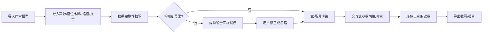

## 1. 产品概述

音乐厅混响声场Web3D可视化工具，为声学顾问提供交互式3D展示平台，用于向甲方直观解释音乐厅座位区的混响特性和声波反射路径。通过三维可视化、数据筛选、参数切换和报告导出形成完整工作闭环。

- **核心价值**：将抽象的声学数据转化为可交互的3D视觉体验，降低专业沟通门槛
- **目标用户**：声学顾问、建筑设计师、甲方项目负责人
- **关键特性**：输入异常检测、多维度声场可视化、交互式参数控制、一键导出汇报材料

## 2. 核心功能

### 2.1 功能模块

1. **数据导入模块**：厅堂模型、声源配置、座位区网格、材料吸声率、反射路径、声场报告
2. **3D场景渲染**：厅堂几何模型、声源标记、座位区热图、反射路径射线
3. **交互控制**：视角控制、参数切换、路径筛选、座位点选
4. **信息展示**：悬浮信息卡、座位读数面板、异常警告提示
5. **导出模块**：场景截图、分析报告

### 2.2 页面详情

| 页面名称 | 模块名称 | 功能描述 |
|-----------|-------------|---------------------|
| 主场景页 | 数据导入区 | 支持拖拽/选择6类输入文件，实时校验数据完整性 |
| 主场景页 | 3D视口 | 渲染厅堂模型、声源、座位区、反射路径，支持轨道控制 |
| 主场景页 | 参数控制面板 | 切换显示参数（混响时间/声压级/清晰度），筛选反射路径阶数 |
| 主场景页 | 座位读数面板 | 显示选中座位的声学参数详情 |
| 主场景页 | 异常检测面板 | 实时显示输入数据中的问题（参数缺失、路径过密、采样错误） |
| 主场景页 | 导出工具栏 | 导出当前场景截图、生成PDF分析报告 |

## 3. 核心流程

### 3.1 标准工作流

### 3.2 演示流程设计

**流程一（顺利流程）**：标准音乐厅模型 → 完整声学数据 → 无异常 → 混响时间可视化 → 筛选1-3阶反射 → 点选VIP座位读数 → 导出汇报截图

**流程二（异常流程）**：模型导入 → 材料吸声率缺失3个面 → 反射路径过密（>5000条）→ 座位区采样点错位 → 系统识别并标记 → 用户确认后部分渲染 → 导出含异常标注的报告

## 4. 用户界面设计

### 4.1 设计风格

- **设计方向**：专业声学工程风格，深色科技感
- **主色调**：深空蓝 (#0A0E1A) 背景，声学蓝 (#1E88E5) 主色，琥珀橙 (#FF9800) 警告色
- **热图色谱**：蓝→青→绿→黄→红，对应声学参数从低到高
- **字体**：Display: Space Grotesk（标题）, Body: JetBrains Mono（数据读数）
- **视觉质感**：磨砂玻璃面板、发光边界线、辉光射线、数据网格化
- **动效**：射线脉冲动画、热图渐变过渡、面板滑入滑出

### 4.2 页面设计概览

| 页面名称 | 模块名称 | UI 元素 |
|-----------|-------------|-------------|
| 主场景页 | 3D视口 | 全屏WebGL画布，轨道控制，网格地板，辉光后处理 |
| 主场景页 | 左侧控制面板 | 折叠式参数面板，滑动开关，滑块控件，下拉筛选 |
| 主场景页 | 右侧信息面板 | 座位读数卡片，异常列表（带警告图标），材质属性表 |
| 主场景页 | 顶部工具栏 | 导入按钮组，视图预设按钮，导出按钮（截图/报告） |
| 主场景页 | 底部状态栏 | 场景统计（面数/射线数/座位数），加载进度条 |

### 4.3 3D场景指导

- **环境光**：冷色HDRI环境光 + 定向主光（模拟舞台灯光方向）
- **模型风格**：厅堂半透明线框 + 实体填充，座位用发光立方体标记
- **射线路径**：渐变发光管，根据反射阶数变色，起点声源处有脉冲动画
- **声场可视化**：座位区用顶点着色实现热图，可选混响时间/声压级/清晰度三种参数映射
- **后处理**：Bloom辉光效果，轻微ACES色调映射，FXAA抗锯齿

### 4.4 异常可视化

- **材料缺失**：对应墙面闪烁红色边框 + 悬浮警告标记
- **路径过密**：射线透明度降低，提示"建议启用路径筛选"
- **采样错误**：错位座位点显示为红色立方体，位置连线显示为虚线
