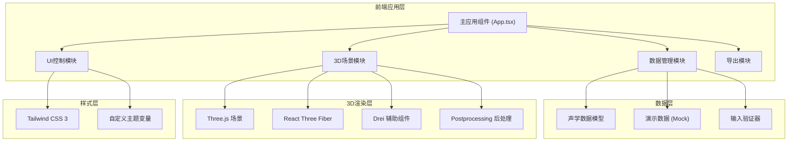
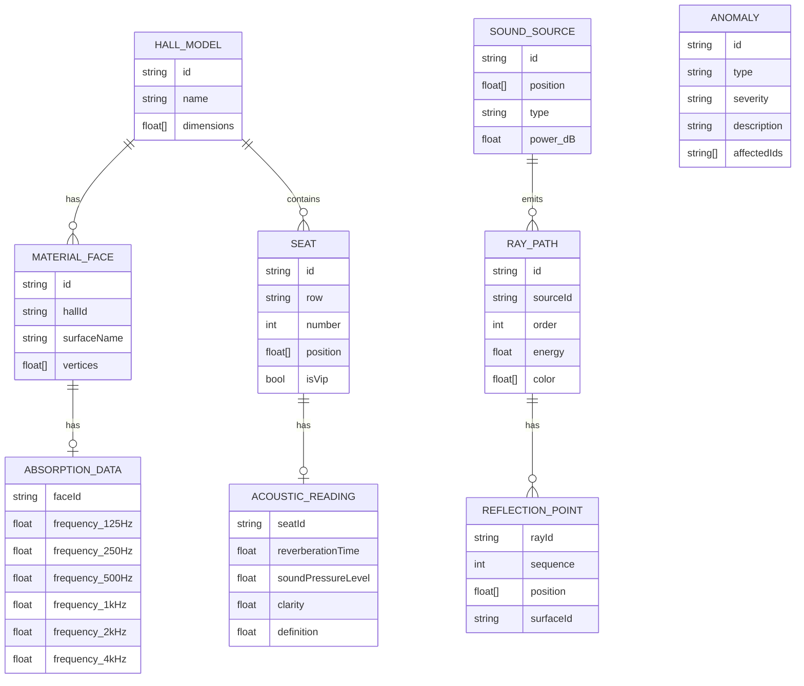

## 1. 架构设计



## 2. 技术选型说明

- **前端框架**: React@18 + TypeScript@5
- **构建工具**: Vite@5
- **3D引擎**: three@0.160, @react-three/fiber@8, @react-three/drei@9, @react-three/postprocessing@2
- **样式方案**: tailwindcss@3 + postcss + autoprefixer
- **UI组件**: 自定义组件（遵循设计系统）
- **数据格式**: JSON (声学数据) + GLB/OBJ (模型，演示用程序化生成)
- **导出功能**: html2canvas (截图), jspdf (报告)

## 3. 目录结构

```
src/
├── components/
│   ├── scene/              # 3D场景组件
│   │   ├── HallModel.tsx   # 厅堂模型
│   │   ├── SoundSource.tsx # 声源
│   │   ├── Seats.tsx       # 座位区
│   │   ├── RayPaths.tsx    # 反射路径
│   │   └── SoundField.tsx  # 声场可视化
│   ├── ui/                 # UI组件
│   │   ├── ControlPanel.tsx
│   │   ├── InfoPanel.tsx
│   │   ├── ImportPanel.tsx
│   │   ├── ExportToolbar.tsx
│   │   └── AnomalyPanel.tsx
│   └── shared/             # 共享组件
├── data/
│   ├── models/             # 数据模型定义
│   │   ├── acoustic.ts     # 声学数据类型
│   │   └── anomalies.ts    # 异常类型
│   ├── validators/         # 输入验证器
│   │   └── inputValidator.ts
│   └── demo/               # 演示数据
│       ├── normalCase.ts   # 正常流程数据
│       └── anomalyCase.ts  # 异常流程数据
├── hooks/                  # 自定义Hooks
│   ├── useAcousticData.ts
│   ├── useRayAnimation.ts
│   └── useSeatPicking.ts
├── utils/                  # 工具函数
│   ├── colorMap.ts         # 热图颜色映射
│   ├── exporter.ts         # 导出工具
│   └── geometryBuilder.ts  # 程序化建模
├── App.tsx
├── main.tsx
└── index.css
```

## 4. 核心数据模型

### 4.1 ER图



### 4.2 异常检测规则

| 异常类型 | 检测条件 | 严重程度 |
|---------|---------|---------|
| 材料参数缺失 | MATERIAL_FACE 存在但无关联 ABSORPTION_DATA | 高 |
| 反射路径过密 | RAY_PATH 总数 > 5000 | 中 |
| 座位采样错误 | SEAT.position 超出 HALL_MODEL.dimensions 边界 | 高 |
| 座位无读数 | SEAT 存在但无关联 ACOUSTIC_READING | 中 |
| 能量衰减异常 | RAY_PATH.energy 随阶数增加而上升 | 高 |

## 5. 核心组件接口

### 5.1 声学数据Hook

```typescript
interface UseAcousticDataReturn {
  data: AcousticDataset | null;
  anomalies: Anomaly[];
  isLoading: boolean;
  loadDataset: (type: 'normal' | 'anomaly' | 'custom', files?: FileList) => Promise<void>;
  updateDisplayParam: (param: DisplayParameter) => void;
  filterRayPaths: (options: RayFilterOptions) => void;
  selectSeat: (seatId: string | null) => void;
}
```

### 5.2 3D场景组件Props

```typescript
interface HallSceneProps {
  dataset: AcousticDataset;
  displayParam: DisplayParameter;
  rayFilter: RayFilterOptions;
  selectedSeatId: string | null;
  anomalies: Anomaly[];
  onSeatSelect: (seatId: string | null) => void;
}
```

## 6. 性能优化策略

1. **射线渲染优化**: 使用 InstancedMesh 批量渲染射线，启用视锥体剔除
2. **座位热图**: 使用顶点着色器实现GPU端颜色计算，避免CPU逐顶点更新
3. **LOD策略**: 厅堂模型根据距离切换线框/实体模式
4. **动画控制**: 射线动画使用 ShaderMaterial 统一时间 uniform
5. **异常标记**: 使用 Sprite 替代 Mesh，减少绘制调用
