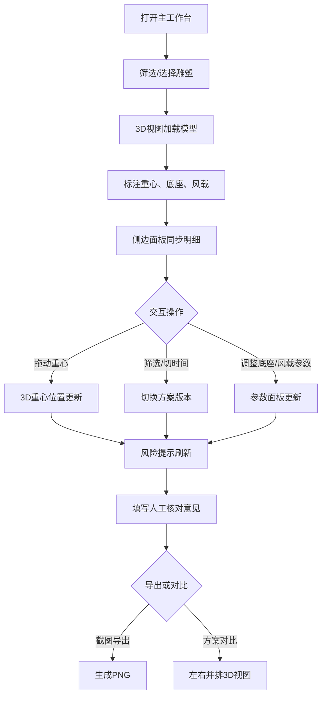

## 1. 产品概述

公共艺术雕塑安装前预审工具，帮助策展团队在安装前直观评估雕塑重心位置、底座支撑面积与风载安全风险，避免重心越界、底座过小、风载方向错误等常见遗漏，减少现场返工。

- 目标用户：策展团队、结构工程师、安装承包商
- 核心价值：将分散的雕塑参数、结构数据和评审报告聚合为可交互3D视图，风险问题用人话标出，降低漏看概率

## 2. 核心功能

### 2.1 用户角色

| 角色 | 使用方式 | 核心权限 |
|------|----------|----------|
| 策展人 | 直接访问 | 浏览、筛选、导出截图、填写核对意见 |
| 结构工程师 | 直接访问 | 调整重心/底座参数、查看风载分析 |
| 安装承包商 | 直接访问 | 查看安装位置、稳定性结论 |

### 2.2 功能模块

1. **主工作台页面**：3D雕塑视图 + 侧边明细面板 + 筛选栏 + 方案对比 + 截图导出

### 2.3 页面详情

| 页面名称 | 模块名称 | 功能描述 |
|----------|----------|----------|
| 主工作台 | 3D雕塑视图 | 加载雕塑模型，标注重心点（可拖动），显示底座轮廓与风载箭头，支撑锥可视化 |
| 主工作台 | 侧边明细面板 | 显示雕塑参数、底座尺寸、重心坐标、风载数据、安装位置、评审报告摘要、人工核对区 |
| 主工作台 | 筛选栏 | 按雕塑名称/安装位置/评审状态筛选，按时间线切换不同方案版本 |
| 主工作台 | 风险提示条 | 重心越界/底座过小/风载方向错的人话警告，始终可见 |
| 主工作台 | 方案对比 | 左右并排两个3D视图对比不同方案 |
| 主工作台 | 截图导出 | 一键导出当前3D视图+参数快照为PNG |

## 3. 核心流程

策展人打开页面 → 筛选或选择雕塑 → 3D视图加载模型并标注重心/底座/风载 → 侧边面板同步显示明细 → 拖动重心点或调整参数 → 3D与面板实时同步更新 → 风险提示自动刷新 → 填写人工核对意见 → 对比方案或导出截图

## 4. 用户界面设计

### 4.1 设计风格

- 主色调：深灰底（#1a1a2e）+ 工程蓝（#0077b6）+ 警告橙（#f77f00）+ 危险红（#d62828）
- 按钮风格：圆角4px，扁平+hover加深，警告按钮带左侧色条
- 字体：标题用 Rajdhani（工程制图感），正文用 Noto Sans SC
- 布局：左侧3D视图占约65%宽度，右侧明细面板35%，顶部筛选栏，底部风险提示条
- 图标：lucide-react 工程风图标

### 4.2 页面设计概览

| 页面名称 | 模块名称 | UI元素 |
|----------|----------|--------|
| 主工作台 | 3D视图区 | Three.js画布，深色背景，网格地面，雕塑模型(灰色半透明)，重心点(红球+拖动手柄)，底座轮廓(蓝色线框)，风载箭头(橙色)，支撑锥(半透明绿色) |
| 主工作台 | 侧边明细面板 | 分组卡片：雕塑参数、底座尺寸、重心坐标、风载数据、安装位置、评审报告、人工核对区（文本框+签名栏） |
| 主工作台 | 筛选栏 | 下拉选择雕塑、位置筛选、评审状态标签、时间线滑块 |
| 主工作台 | 风险提示条 | 固定底部横条，按严重程度分色：危险红/警告橙/注意黄，文字描述人话原因和建议 |
| 主工作台 | 方案对比 | 双3D视图并排，参数差异高亮 |
| 主工作台 | 截图导出 | 右上角相机图标按钮，点击弹出预览+下载 |

### 4.3 响应式

- 桌面优先（1920x1080为主），3D视图最小宽度800px
- 1366px以下侧边面板可折叠为抽屉
- 不支持移动端（工程工具场景）

### 4.4 3D场景指引

- 环境与氛围：深色工程制图风格，网格地面，微弱环境光
- 灯光：方向光模拟日照角度（可调），补充环境光
- 相机：轨道控制器，默认斜45度俯视，可旋转缩放
- 构图焦点：雕塑模型居中，重心点为视觉焦点（红色高亮）
- 交互：拖动重心点、旋转模型、缩放视图
- 后处理：轮廓线（EdgesGeometry）+ 微弱辉光
- 性能预算：单场景<50k三角面，60fps
