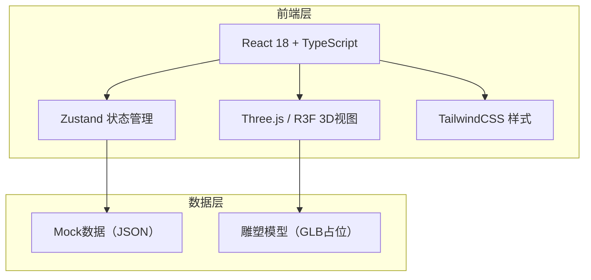
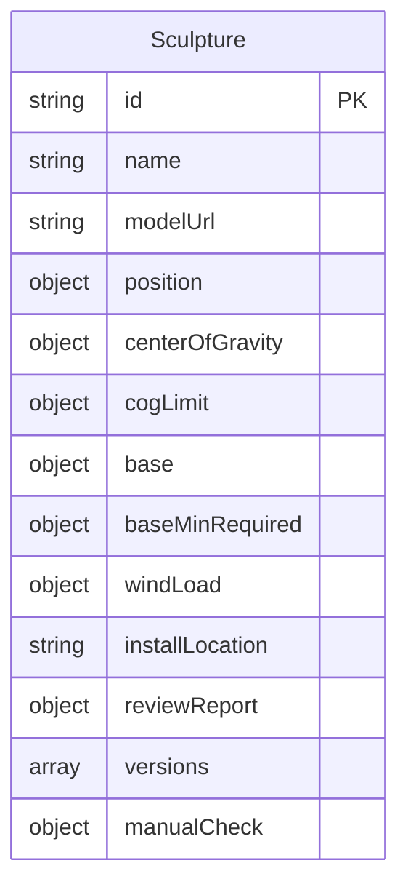
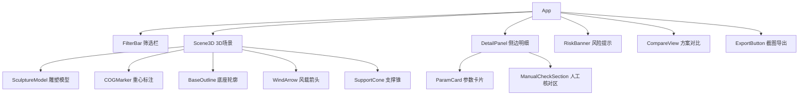

## 1. 架构设计



## 2. 技术说明

- 前端：React@18 + TypeScript + Vite + TailwindCSS@3
- 3D渲染：three + @react-three/fiber + @react-three/drei
- 状态管理：Zustand
- 初始化工具：vite-init (react-ts 模板)
- 后端：无（纯前端，数据用Mock JSON）
- 数据库：无

## 3. 路由定义

| 路由 | 用途 |
|------|------|
| / | 主工作台页面（唯一页面，3D视图+侧边面板+筛选+对比+导出） |

## 4. API定义

无后端API，使用前端Mock数据。

### 数据结构定义

```typescript
interface Sculpture {
  id: string
  name: string
  modelUrl: string
  position: { x: number; y: number; z: number }
  centerOfGravity: { x: number; y: number; z: number }
  cogLimit: { radius: number }
  base: { width: number; depth: number; height: number }
  baseMinRequired: { width: number; depth: number }
  windLoad: { direction: { x: number; z: number }; forceKN: number; designDirection: { x: number; z: number } }
  installLocation: string
  reviewReport: { status: 'pending' | 'approved' | 'rejected'; summary: string; date: string }
  versions: { timestamp: string; label: string; cog: { x: number; y: number; z: number }; baseW: number; baseD: number }[]
  manualCheck: { notes: string; checkedBy: string; checkedAt: string }
}
```

## 5. 服务器架构图

无后端服务。

## 6. 数据模型

### 6.1 数据模型定义



### 6.2 数据定义语言

使用前端TypeScript接口定义 + Mock JSON文件，无需DDL。

## 7. 组件架构


