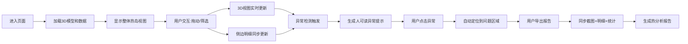

## 1. 产品概述
芯片封装热岛视图是为硬件团队设计的3D交互可视化工具，用于评审芯片封装内的热岛、散热片和风道设计。通过可观察的空间关系展示，帮助团队快速发现温度色阶失真、采样点缺失、风向反了等常见问题。

- 解决硬件评审中3D视图与数据不同步、异常情况易漏看的问题
- 目标用户：硬件工程师、热设计工程师、技术评审人员

## 2. 核心功能

### 2.1 用户角色
| 角色 | 注册方式 | 核心权限 |
|------|----------|----------|
| 硬件工程师 | 无需注册 | 查看3D视图、筛选数据、导出报告 |
| 热设计工程师 | 无需注册 | 调整参数、标记异常、生成分析报告 |

### 2.2 功能模块
1. **3D热岛视图主页面**: 芯片封装3D模型、温度色阶映射、实时交互
2. **侧边明细面板**: 功耗点详情、温度采样数据、风道参数
3. **剖面切换模块**: X/Y/Z轴剖面视图、内部结构透视
4. **异常检测模块**: 温度色阶失真检测、采样点缺失提示、风向校验
5. **报告导出模块**: 数据统计表、截图导出、热分析报告生成

### 2.3 页面详情
| 页面名称 | 模块名称 | 功能描述 |
|-----------|-------------|---------------------|
| 主页面 | 3D视图区域 | 可旋转、缩放、平移的芯片封装3D模型，支持鼠标拖动交互 |
| 主页面 | 温度色阶条 | 颜色与温度映射，点击可调整色阶范围，异常区域高亮 |
| 主页面 | 剖面控制器 | X/Y/Z轴剖面切换滑块，实时显示内部温度分布 |
| 主页面 | 风道可视化 | 动态箭头显示风向和风速，异常方向自动标红 |
| 侧边栏 | 功耗点列表 | 所有功耗点数据，支持筛选和点击定位到3D视图 |
| 侧边栏 | 温度采样点 | 采样点列表，缺失采样点用醒目提示 |
| 侧边栏 | 统计面板 | 最高温、最低温、平均温等关键指标 |
| 侧边栏 | 异常提示区 | 人能读懂的异常描述，可点击定位问题位置 |
| 导出面板 | 报告预览 | 预览导出内容，确保截图和明细一致 |
| 导出面板 | 格式选择 | 支持Excel数据表、PDF报告、PNG截图导出 |

## 3. 核心流程
用户进入页面后，首先看到芯片封装的3D整体视图和侧边明细。可以通过鼠标拖动旋转3D模型，或通过筛选条件聚焦特定区域。当发现异常时，系统自动在侧边栏给出文字提示，点击可自动定位到3D视图中的对应位置。导出报告时，系统会自动同步当前3D视图截图和所有明细数据，确保三者一致。

## 4. 用户界面设计

### 4.1 设计风格
- **主色调**: 深蓝(#1a237e)科技感背景，配合橙红温度渐变
- **辅助色**: 青色(#00bcd4)用于风道箭头，绿色(#4caf50)表示正常，红色(#f44336)表示异常
- **按钮风格**: 圆角矩形，微立体阴影，悬停时有轻微上浮动画
- **字体**: 标题使用 Orbitron 体现科技感，正文使用 Roboto 保证可读性
- **布局风格**: 深色左侧导航 + 主3D视图区 + 右侧明细面板的三栏布局
- **图标风格**: 线性细图标，统一24px尺寸，与文字垂直居中对齐

### 4.2 页面设计概述
| 页面名称 | 模块名称 | UI元素 |
|-----------|-------------|-------------|
| 主页面 | 3D视图区 | 深色背景、雾化效果、聚光灯照明、网格地面、温度颜色映射、剖面半透明效果 |
| 主页面 | 色阶条 | 垂直渐变条、温度刻度、可拖动上下限滑块 |
| 主页面 | 风道箭头 | 动态发光箭头、速度用透明度表示、异常时闪烁红色 |
| 侧边栏 | 异常提示 | 卡片式布局、警告图标、人可读文字、点击高亮效果 |
| 侧边栏 | 数据表格 | 斑马纹、悬停高亮、异常行标红、点击定位动画 |
| 导出面板 | 预览区域 | 报告缩略图、数据一致性校验标记、导出进度条 |

### 4.3 响应性
- 桌面端优先设计，支持1920x1080及以上分辨率
- 3D视图区自适应窗口大小，保持16:9比例
- 侧边栏可折叠，折叠后显示图标模式
- 触控设备支持双指缩放和单指拖动

### 4.4 3D场景指导
- **环境**: 深色科技感空间，轻微雾气营造深度感，HDRI使用工作室环境
- **光照**: 三盏方向灯模拟工作室照明，主光45度角，补光减弱阴影，轮廓灯勾勒模型边缘
- **相机**: 初始视角45度俯角，支持轨道控制，限制最小距离防止穿模
- **构图**: 芯片封装模型居中，散热片和风道作为次要视觉元素
- **交互**: 点击功耗点显示信息弹窗，hover时高亮，剖面切换时有平滑过渡动画
- **后处理**: 泛光效果增强高温区域视觉冲击，轻微抗锯齿
- **性能**: 模型面数控制在10万以内，使用实例化渲染重复元素
