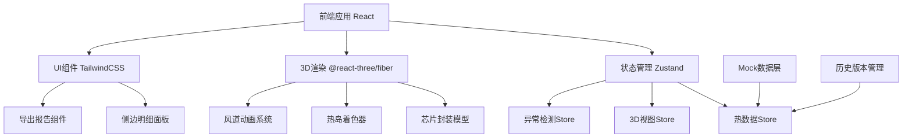
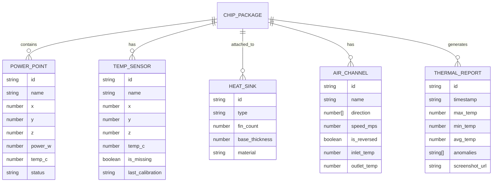

## 1. 架构设计



## 2. 技术描述
- **前端框架**: React@18 + TypeScript
- **构建工具**: Vite@5
- **3D渲染**: three@0.160 + @react-three/fiber@8.15 + @react-three/drei@9.92
- **状态管理**: Zustand@4.4
- **样式方案**: TailwindCSS@3.4
- **图表可视化**: @react-three/postprocessing@2.15
- **数据导出**: xlsx@0.18 + html2canvas@1.4
- **后端**: 无后端，使用Mock数据
- **数据持久化**: localStorage存储历史版本

## 3. 路由定义
| 路由 | 用途 |
|-------|---------|
| / | 主页面 - 3D热岛视图+侧边明细 |

## 4. 数据模型

### 4.1 数据模型定义



### 4.2 核心数据类型定义

```typescript
// 芯片封装
interface ChipPackage {
  id: string;
  name: string;
  dimensions: { width: number; height: number; depth: number };
  powerPoints: PowerPoint[];
  tempSensors: TempSensor[];
  heatSinks: HeatSink[];
  airChannels: AirChannel[];
  versionHistory: VersionEntry[];
}

// 功耗点
interface PowerPoint {
  id: string;
  name: string;
  position: { x: number; y: number; z: number };
  power: number;
  temperature: number;
  status: 'normal' | 'warning' | 'critical';
}

// 温度采样点
interface TempSensor {
  id: string;
  name: string;
  position: { x: number; y: number; z: number };
  temperature: number;
  isMissing: boolean;
  expectedLocation: string;
  lastCalibration: string;
}

// 散热片
interface HeatSink {
  id: string;
  type: string;
  finCount: number;
  baseThickness: number;
  material: string;
  thermalResistance: number;
}

// 风道
interface AirChannel {
  id: string;
  name: string;
  direction: { x: number; y: number; z: number };
  speed: number;
  isReversed: boolean;
  inletTemp: number;
  outletTemp: number;
}

// 异常检测结果
interface Anomaly {
  id: string;
  type: 'color_scale' | 'missing_sensor' | 'wind_reversed';
  severity: 'low' | 'medium' | 'high';
  message: string;
  location?: { x: number; y: number; z: number };
  relatedItemId?: string;
}

// 热分析报告
interface ThermalReport {
  id: string;
  timestamp: string;
  summary: {
    maxTemp: number;
    minTemp: number;
    avgTemp: number;
    hotspotCount: number;
  };
  anomalies: Anomaly[];
  screenshot: string;
  powerPoints: PowerPoint[];
  sensors: TempSensor[];
}

// 版本历史
interface VersionEntry {
  version: string;
  timestamp: string;
  author: string;
  changes: string;
  dataSnapshot: string;
}
```

## 5. 状态管理设计

### 5.1 ThermalStore (热数据状态)
```typescript
interface ThermalState {
  chipPackage: ChipPackage | null;
  selectedItem: string | null;
  filterConditions: {
    tempRange: [number, number];
    powerRange: [number, number];
    showOnlyAnomalies: boolean;
  };
  actions: {
    selectItem: (id: string | null) => void;
    setFilter: (conditions: Partial<ThermalState['filterConditions']>) => void;
    saveVersion: (author: string, changes: string) => void;
    loadVersion: (version: string) => void;
  };
}
```

### 5.2 View3DStore (3D视图状态)
```typescript
interface View3DState {
  cameraPosition: { x: number; y: number; z: number };
  sectionPlane: {
    axis: 'x' | 'y' | 'z' | null;
    position: number;
  };
  colorScale: {
    min: number;
    max: number;
    colors: string[];
  };
  showAirFlow: boolean;
  showSensors: boolean;
  actions: {
    setSectionPlane: (axis: 'x' | 'y' | 'z' | null, position: number) => void;
    setColorScale: (min: number, max: number) => void;
    toggleAirFlow: () => void;
    toggleSensors: () => void;
    focusOnItem: (id: string) => void;
  };
}
```

### 5.3 AnomalyStore (异常检测状态)
```typescript
interface AnomalyState {
  anomalies: Anomaly[];
  isDetecting: boolean;
  actions: {
    runDetection: () => void;
    dismissAnomaly: (id: string) => void;
    locateAnomaly: (id: string) => void;
  };
}
```

## 6. 核心组件结构

```
src/
├── components/
│   ├── view3d/
│   │   ├── Scene3D.tsx          # 3D场景主组件
│   │   ├── ChipPackageMesh.tsx  # 芯片封装模型
│   │   ├── HeatSinkMesh.tsx     # 散热片模型
│   │   ├── AirFlowArrows.tsx    # 风道箭头动画
│   │   ├── TempSensorMarker.tsx # 温度采样点标记
│   │   ├── SectionPlane.tsx     # 剖面切割平面
│   │   └── TemperatureShader.ts # 热岛着色器
│   ├── sidebar/
│   │   ├── SidePanel.tsx        # 侧边栏主组件
│   │   ├── PowerPointsList.tsx  # 功耗点列表
│   │   ├── SensorsList.tsx      # 采样点列表
│   │   ├── StatsPanel.tsx       # 统计面板
│   │   └── AnomaliesPanel.tsx   # 异常提示面板
│   ├── controls/
│   │   ├── ColorScaleBar.tsx    # 温度色阶条
│   │   ├── SectionController.tsx# 剖面控制器
│   │   └── FilterBar.tsx        # 筛选工具栏
│   └── export/
│       ├── ExportPanel.tsx      # 导出面板
│       ├── ReportGenerator.tsx  # 报告生成器
│       └── ExcelExporter.ts     # Excel导出工具
├── store/
│   ├── useThermalStore.ts
│   ├── useView3DStore.ts
│   └── useAnomalyStore.ts
├── data/
│   ├── mockData.ts              # Mock数据
│   └── versionHistory.ts        # 版本历史管理
├── utils/
│   ├── anomalyDetection.ts      # 异常检测算法
│   ├── colorMapping.ts          # 颜色映射工具
│   └── reportTemplate.ts        # 报告模板
└── App.tsx
```

## 7. 异常检测算法

### 7.1 温度色阶失真检测
- 检测逻辑：温度分布与色阶范围不匹配时触发
- 判定条件：(maxTemp - minTemp) / colorScaleRange > 2 或 < 0.2
- 提示文案："当前色阶范围 %d°C-%d°C 与实际温度跨度 %d°C-%d°C 不匹配，建议调整色阶范围以获得更准确的热岛显示"

### 7.2 采样点缺失检测
- 检测逻辑：预设位置无采样点数据
- 判定条件：isMissing = true 或 temperature = null
- 提示文案："位置「%s」的温度采样点缺失，该区域热数据可能不准确"

### 7.3 风向反转检测
- 检测逻辑：风道方向与设计方向相反
- 判定条件：isReversed = true 或 出风口温度 < 进风口温度
- 提示文案："风道「%s」风向可能反转，请检查：出风口温度(%.1f°C)低于进风口温度(%.1f°C)，这与正常散热逻辑不符"
