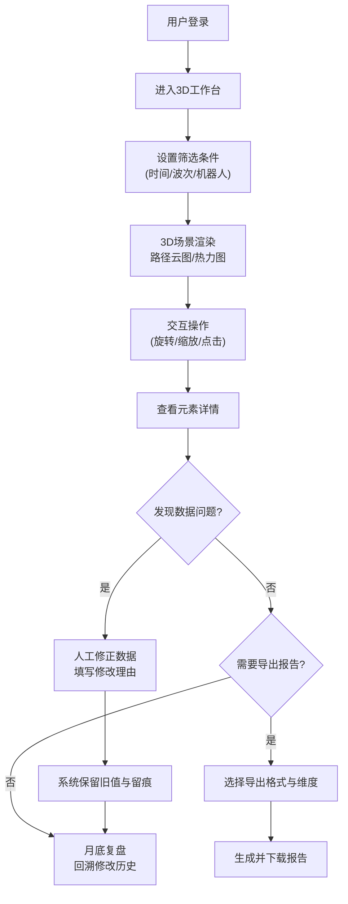

## 1. 产品概述

面向仓储技术组的3D交互式可视化工作台，用于实时分析机器人路径密度、识别拥堵货架、监控充电区排队状态。通过可旋转3D场景、多维度筛选、数据联动与导出能力，将静态数据转化为可交互、可追溯的决策支持工具。

- 核心价值：解决传统报表无法直观呈现空间分布问题，支持仓储运营优化与月底复盘
- 目标用户：仓储技术组、运营分析人员、运维工程师

---

## 2. 核心功能

### 2.1 用户角色

| 角色 | 注册方式 | 核心权限 |
|------|----------|----------|
| 运营分析师 | 企业SSO登录 | 查看3D场景、筛选数据、导出报告 |
| 技术工程师 | 企业SSO登录 | 所有分析师权限 + 人工修正数据 + 查看修改留痕 |
| 管理员 | 企业SSO登录 | 所有工程师权限 + 用户管理、系统配置 |

### 2.2 功能模块

1. **3D仓库工作台**：可旋转3D场景、路径云图渲染、货架/充电区/机器人实体展示
2. **筛选控制中心**：时间轴筛选、机器人筛选、区域筛选、订单波次筛选
3. **拥堵热力分析**：货架拥堵热力图、路径密度云图、充电区排队可视化
4. **数据明细联动**：点击3D元素显示详情、多维度数据比较、修改留痕面板
5. **报告导出中心**：PDF报告生成、Excel数据导出、自定义报告模板
6. **数据修正留痕**：人工修改界面、旧值保留、修改理由记录、历史回溯

### 2.3 页面详情

| 页面名称 | 模块名称 | 功能描述 |
|----------|----------|----------|
| 3D工作台主页面 | 3D场景视图 | 支持鼠标拖拽旋转、滚轮缩放、视角预设（俯视图/侧视图/斜视图），显示仓库楼层、货架、机器人、充电区、路径云图 |
| 3D工作台主页面 | 顶部筛选栏 | 时间轴范围选择、订单波次下拉、机器人组多选、数据类型开关（路径/热力/排队） |
| 3D工作台主页面 | 左侧控制面板 | 图层控制、显示/隐藏元素、颜色映射配置、密度阈值调整 |
| 3D工作台主页面 | 右侧信息面板 | 选中元素详情、数据对比表格、修改历史记录、人工修正按钮 |
| 3D工作台主页面 | 底部状态栏 | 实时数据统计、当前筛选条件、数据刷新时间、缺失数据提示 |
| 报告导出页面 | 导出配置 | 选择报告类型、时间范围、数据维度、格式（PDF/Excel）、自定义模板 |
| 报告导出页面 | 报告预览 | 在线预览报告内容、调整布局、添加备注 |
| 数据管理页面 | 输入源管理 | 仓库模型、机器人轨迹、货架、订单波次、充电区、拥堵报告的数据接入状态 |
| 数据管理页面 | 缺失数据清单 | 显式列出缺失字段、数据质量评分、补录入口 |
| 数据管理页面 | 修改历史回溯 | 按时间/修改人/字段筛选修改记录，支持一键回滚到旧值 |

---

## 3. 核心流程

**主要用户流程说明**：
1. 用户通过企业SSO登录系统，默认进入3D工作台主页面
2. 通过顶部筛选栏选择分析的时间范围、订单波次、机器人组
3. 3D场景自动渲染路径密度云图与拥堵热力图
4. 用户可自由旋转、缩放3D场景，点击货架/机器人/充电区查看详情
5. 发现数据异常时可进行人工修正，系统自动保留旧值和修改理由
6. 需要汇报时可导出PDF或Excel格式的分析报告
7. 月底复盘时可回溯所有人工修改记录，支持对比和回滚

---

## 4. 用户界面设计

### 4.1 设计风格

- **主色调**：深空蓝 (#0F172A) 作为背景主色，科技感强烈，适合长时间监控
- **辅助色**：
  - 路径密度渐变：青色 (#06B6D4) → 橙色 (#F97316) → 红色 (#EF4444)
  - 功能按钮：亮蓝 (#3B82F6)
  - 警告状态：琥珀色 (#F59E0B)
  - 正常状态：绿色 (#10B981)
- **字体**：
  - 标题：JetBrains Mono，等宽字体增强科技感，字号 18-24px
  - 正文：Inter，清晰易读，字号 13-14px
  - 数据数字：JetBrains Mono，等宽对齐，字号 14-16px
- **布局风格**：深色仪表盘风格，3D场景居中占70%区域，两侧信息面板半透明浮动
- **交互风格**：点击高亮、悬浮预览、拖拽流畅、过渡动画自然

### 4.2 页面设计概述

| 页面名称 | 模块名称 | UI元素 |
|----------|----------|----------|
| 3D工作台主页面 | 3D场景视图 | 全屏WebGL画布，网格地板，发光路径线条，半透明热力云团，金属质感货架模型，LED状态指示灯 |
| 3D工作台主页面 | 顶部筛选栏 | 深色玻璃态背景，时间轴滑块带刻度，下拉选择器带搜索，开关按钮带状态指示灯 |
| 3D工作台主页面 | 左侧控制面板 | 可折叠面板，图层列表带眼睛图标，颜色渐变条，滑块控制器，预设视角快捷键 |
| 3D工作台主页面 | 右侧信息面板 | 标签页切换（详情/对比/历史），数据卡片带图标，修改记录时间线，修正按钮带铅笔图标 |
| 3D工作台主页面 | 底部状态栏 | 半透明条，状态徽章，数据质量指示灯，缺失数据预警三角标 |
| 报告导出页面 | 导出配置 | 表单项分组，复选框树形结构，格式选择卡片，进度条动画 |
| 数据管理页面 | 输入源管理 | 数据接入状态卡片，绿色对勾/红色叉号状态，最后同步时间，手动刷新按钮 |
| 数据管理页面 | 缺失数据清单 | 表格带行高亮，缺失字段红色标记，补录按钮带加号图标，数据质量评分条 |

### 4.3 响应性

- **桌面端优先**：针对1920×1080及以上分辨率优化，支持超宽屏多面板布局
- **平板适配**：1024-1280px宽度时自动折叠侧边面板为抽屉式
- **触控优化**：支持双指缩放、单指旋转3D场景，按钮最小尺寸44px
- **性能降级**：低性能设备自动关闭光晕、抗锯齿等后处理效果

### 4.4 3D场景 Guidance

- **环境与氛围**：
  - 背景：深空蓝渐变到近黑色，营造科技感
  - 雾气：轻微指数雾，远处货架渐隐，增强空间纵深感
  - HDRI：工厂车间环境贴图，金属表面有真实反射

- **光照设置**：
  - 主光源：冷白色方向光，模拟仓库顶灯，带软阴影
  - 辅助光：路径发光自照亮，充电区蓝色发光，拥堵区域红色发光
  - 点光源：机器人头顶LED灯，随状态变色（绿=运行，黄=等待，红=故障）

- **相机设置与运动**：
  - 默认视角：45°俯角，距离仓库中心20米
  - 控制方式：OrbitControls，阻尼感0.05，旋转流畅
  - 限制：最小距离5米，最大距离50米，俯仰角限制10°-85°
  - 动画：切换视角时有0.5秒缓动过渡

- **构图与焦点元素**：
  - 路径云图：使用TubeGeometry渲染发光管线，透明度随密度变化
  - 拥堵货架：顶部叠加半透明红色圆柱，高度与拥堵程度成正比
  - 充电区：排队机器人用虚线连接，显示等待时长标签
  - 焦点：选中元素自动升起10cm，边缘高亮发光

- **交互与动画**：
  - 货架点击：上浮+旋转15°展示，右侧面板滑出详情
  - 路径悬停：显示该段路径的机器人通行次数、平均速度
  - 时间轴拖动：3D场景动态回放路径变化，热力图渐变过渡
  - 数据刷新：新数据淡入，旧数据淡出，避免突兀跳变

- **后处理效果**：
  - Bloom泛光：发光路径和LED灯产生柔和光晕
  - FXAA抗锯齿：平滑边缘，减少锯齿感
  - 色调映射：ACES电影级色调，颜色更通透
  - 性能预算：Draw call控制在2000以内，帧率稳定60fps

---

## 5. 边界约束与数据规范

### 5.1 输入数据清单

| 数据类型 | 必填字段 | 缺失处理 |
|----------|----------|----------|
| 仓库模型 | 楼层数、货架坐标、通道宽度、区域划分 | 显式提示"仓库模型不完整"，无法渲染3D场景 |
| 机器人轨迹 | 机器人ID、时间戳、坐标(x/y/z)、楼层、速度、状态 | 断点用虚线连接，标注"轨迹中断"，不计入密度计算 |
| 货架信息 | 货架ID、坐标、楼层、容量、当前库存、SKU列表 | 缺失货架显示为灰色占位，热度计算排除 |
| 订单波次 | 波次ID、时间范围、订单数量、SKU清单、优先级 | 筛选栏禁用缺失波次，报表标注数据不完整 |
| 充电区 | 充电位ID、坐标、楼层、充电桩状态、功率 | 缺失充电区不显示排队信息，单独列入缺失清单 |
| 拥堵报告 | 拥堵ID、货架ID、开始时间、结束时间、拥堵原因、机器人数量 | 人工修正时关联原始报告，修改理由必填 |

### 5.2 边界处理规则

1. **轨迹断点**：同一机器人相邻轨迹点时间差>30秒判定为断点，断点间用50%透明度虚线连接，不计入路径密度统计，详情中标记"数据中断"

2. **楼层混淆**：Z轴坐标误差±0.5米内自动归层，超出阈值标记"楼层异常"，用户可手动修正，修正记录留痕

3. **充电等待重复计数**：同一机器人在同一充电位的连续等待只计1次，重复数据自动去重，去重记录可查

4. **数据一致性**：人工修改时系统自动校验关联数据一致性，如修改拥堵时长需同步更新关联机器人等待时间，冲突时弹窗提示并给出修正建议

### 5.3 修改留痕规范

- 每条修改记录包含：字段名、旧值、新值、修改人、修改时间、修改理由
- 修改理由必填，至少10个字符
- 旧值永久保留，不可删除
- 月底复盘时可按时间范围筛选所有修改，支持新旧值并排对比
- 回滚操作本身也会产生一条新的修改记录
